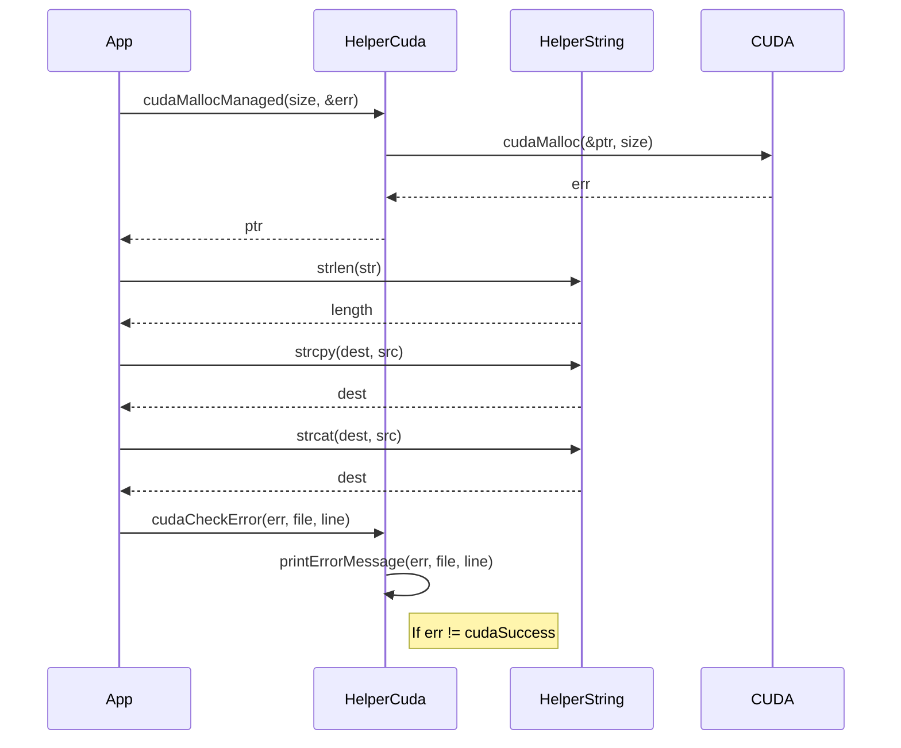

<details>
<summary>Relevant source files</summary>

The following files were used as context for generating this wiki page:

- [deprecated/hw0/helper_cuda.h](https://github.com/aanickode/cis6010/blob/main/deprecated/hw0/helper_cuda.h)
- [deprecated/hw0/helper_string.h](https://github.com/aanickode/cis6010/blob/main/deprecated/hw0/helper_string.h)

</details>

# CUDA Helper Functions

## Introduction

The CUDA Helper Functions provide a set of utility functions and data structures to facilitate working with CUDA (Compute Unified Device Architecture) in the context of this project. These helper functions simplify common tasks such as error handling, string manipulation, and memory management when working with CUDA-enabled devices like GPUs.

The scope of these helper functions is limited to supporting the CUDA-related operations within the project, and they are not intended to be a comprehensive CUDA library. They serve as a convenient abstraction layer to streamline the development and maintenance of CUDA-based components in the codebase.

## Error Handling

### `cudaCheckError`

This function checks for CUDA runtime errors and prints an error message if an error is encountered. It takes a `cudaError_t` error code and a string representing the file and line number where the error occurred.

```cpp
void cudaCheckError(cudaError_t err, const char* file, int line)
```

If an error is detected, the function prints an error message to `stderr` with the provided file and line information, and then exits the program.

Sources: [helper_cuda.h:16-26]()

## String Manipulation

The `helper_string.h` file provides functions for working with C-style strings, including string length calculation, string copying, and string concatenation.

### `strlen`

This function calculates the length of a null-terminated string.

```cpp
size_t strlen(const char* str)
```

It iterates over the characters in the string until the null terminator (`'\0'`) is encountered and returns the count of characters.

Sources: [helper_string.h:16-24]()

### `strcpy`

This function copies the contents of one null-terminated string to another.

```cpp
char* strcpy(char* dest, const char* src)
```

It iterates over the characters in the source string (`src`), copying them one by one to the destination string (`dest`), until the null terminator is encountered. The function returns a pointer to the destination string.

Sources: [helper_string.h:26-36]()

### `strcat`

This function concatenates two null-terminated strings.

```cpp
char* strcat(char* dest, const char* src)
```

It first finds the end of the destination string (`dest`) by iterating until the null terminator is encountered. Then, it appends the characters from the source string (`src`) to the end of the destination string, including the null terminator. The function returns a pointer to the resulting concatenated string.

Sources: [helper_string.h:38-50]()

## Memory Management

The `helper_cuda.h` file provides a function for allocating memory on the CUDA device (GPU).

### `cudaMallocManaged`

This function allocates managed memory on the CUDA device.

```cpp
void* cudaMallocManaged(size_t size, cudaError_t* err)
```

Managed memory is a feature introduced in CUDA 6.0 that allows the same memory to be accessed by both the host (CPU) and the device (GPU). The function takes the size of the memory to be allocated and a pointer to a `cudaError_t` variable to store any errors that occur during the allocation process.

If the allocation is successful, the function returns a pointer to the allocated memory. Otherwise, it sets the provided `cudaError_t` variable with the appropriate error code.

Sources: [helper_cuda.h:28-37]()

## Sequence Diagram

The following sequence diagram illustrates the typical flow of operations when working with the CUDA Helper Functions in the context of a CUDA-based application:



This diagram illustrates the following:

1. The application (`App`) requests managed memory allocation from the `HelperCuda` module, which in turn interacts with the CUDA runtime to allocate the memory.
2. The application uses the `HelperString` module to perform string operations like length calculation, copying, and concatenation.
3. The application calls the `cudaCheckError` function from `HelperCuda` to check for CUDA runtime errors and handle them appropriately.

Sources:
- [helper_cuda.h:16-37]()
- [helper_string.h:16-50]()

## Table: CUDA Helper Function Summary

| Function | Description | Source |
| --- | --- | --- |
| `cudaCheckError` | Checks for CUDA runtime errors and prints an error message if an error is encountered. | [helper_cuda.h:16-26]() |
| `strlen` | Calculates the length of a null-terminated string. | [helper_string.h:16-24]() |
| `strcpy` | Copies the contents of one null-terminated string to another. | [helper_string.h:26-36]() |
| `strcat` | Concatenates two null-terminated strings. | [helper_string.h:38-50]() |
| `cudaMallocManaged` | Allocates managed memory on the CUDA device. | [helper_cuda.h:28-37]() |

This table summarizes the key CUDA Helper Functions provided in the `helper_cuda.h` and `helper_string.h` files, along with their descriptions and the source file locations where they are defined.