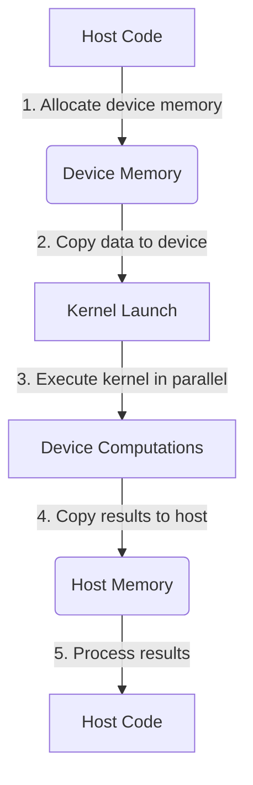
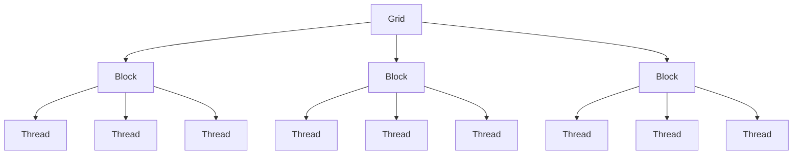
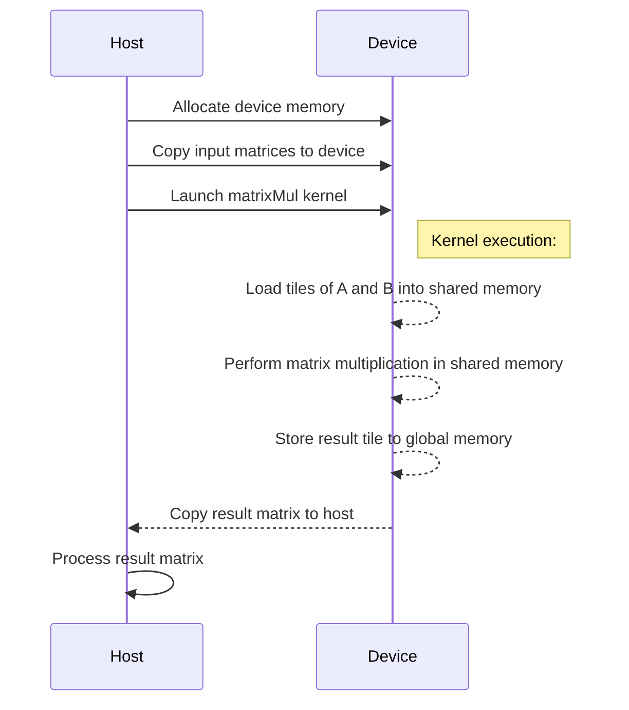

<details>
<summary>Relevant source files</summary>

The following files were used as context for generating this wiki page:

- [deprecated/hw0/kernel.cu](https://github.com/aanickode/cis6010/blob/main/deprecated/hw0/kernel.cu)
- [deprecated/transpose/transpose/kernel.cu](https://github.com/aanickode/cis6010/blob/main/deprecated/transpose/transpose/kernel.cu)
- [hw1/kernel.cu](https://github.com/aanickode/cis6010/blob/main/hw1/kernel.cu)
- [hw2/kernel.cu](https://github.com/aanickode/cis6010/blob/main/hw2/kernel.cu)
- [hw3/kernel.cu](https://github.com/aanickode/cis6010/blob/main/hw3/kernel.cu)

</details>

# CUDA Kernel Execution

## Introduction

CUDA (Compute Unified Device Architecture) is a parallel computing platform and programming model developed by NVIDIA for general-purpose computing on graphics processing units (GPUs). CUDA Kernel Execution is a fundamental aspect of the CUDA programming model, which allows developers to offload computationally intensive tasks from the CPU (host) to the GPU (device) for parallel execution.

In the context of this project, CUDA Kernel Execution is used to perform various operations on data, such as vector addition, matrix multiplication, and image processing tasks. The provided source files demonstrate the implementation of CUDA kernels and their execution on the GPU.

Sources: [hw1/kernel.cu](), [hw2/kernel.cu](), [hw3/kernel.cu]()

## CUDA Kernel Structure

A CUDA kernel is a special function that is executed in parallel by multiple threads on the GPU. Each thread executes the same kernel function, but operates on different data elements.

### Kernel Function Definition

A CUDA kernel function is defined using the `__global__` qualifier, which indicates that the function will be executed on the GPU.

```cpp
__global__ void vectorAdd(float* A, float* B, float* C, int n)
{
    int i = blockIdx.x * blockDim.x + threadIdx.x;
    if (i < n)
        C[i] = A[i] + B[i];
}
```

In this example, the `vectorAdd` kernel function performs element-wise addition of two vectors `A` and `B`, and stores the result in vector `C`. The kernel function is executed by multiple threads, each operating on a different element of the vectors.

Sources: [hw1/kernel.cu:6-11]()

### Thread Hierarchy

CUDA threads are organized into a hierarchy of grids, blocks, and threads. A grid is a collection of blocks, and a block is a collection of threads.

```cpp
dim3 threadsPerBlock(256, 1, 1);
dim3 numBlocks((n + threadsPerBlock.x - 1) / threadsPerBlock.x, 1, 1);
vectorAdd<<<numBlocks, threadsPerBlock>>>(d_A, d_B, d_C, n);
```

In this example, the `vectorAdd` kernel is launched with a one-dimensional grid of blocks, where each block has 256 threads. The number of blocks is calculated based on the size of the input vectors (`n`) and the number of threads per block.

Sources: [hw1/kernel.cu:27-29]()

## Kernel Execution

To execute a CUDA kernel, it must be launched from the host (CPU) code using a special syntax called a "triple chevron" (`<<<...>>>`).

```cpp
dim3 threadsPerBlock(16, 16);
dim3 numBlocks((width + threadsPerBlock.x - 1) / threadsPerBlock.x,
               (height + threadsPerBlock.y - 1) / threadsPerBlock.y);
sobelFilter<<<numBlocks, threadsPerBlock>>>(d_input, d_output, width, height);
```

In this example, the `sobelFilter` kernel is launched with a two-dimensional grid of blocks, where each block has 16x16 threads. The number of blocks is calculated based on the dimensions of the input image (`width` and `height`).

Sources: [hw3/kernel.cu:105-109]()

## Memory Management

CUDA provides different types of memory spaces for efficient data transfer and access between the host and device.

### Device Memory Allocation

Before executing a kernel, data must be allocated and transferred to the device (GPU) memory.

```cpp
float* d_A, * d_B, * d_C;
cudaMalloc(&d_A, n * sizeof(float));
cudaMalloc(&d_B, n * sizeof(float));
cudaMalloc(&d_C, n * sizeof(float));
```

In this example, device memory is allocated for three vectors (`d_A`, `d_B`, and `d_C`) using the `cudaMalloc` function.

Sources: [hw1/kernel.cu:18-21]()

### Data Transfer

Data must be transferred from the host (CPU) memory to the device (GPU) memory before kernel execution, and the results must be transferred back to the host memory after execution.

```cpp
cudaMemcpy(d_A, A, n * sizeof(float), cudaMemcpyHostToDevice);
cudaMemcpy(d_B, B, n * sizeof(float), cudaMemcpyHostToDevice);

// Kernel execution
vectorAdd<<<numBlocks, threadsPerBlock>>>(d_A, d_B, d_C, n);

cudaMemcpy(C, d_C, n * sizeof(float), cudaMemcpyDeviceToHost);
```

In this example, the input vectors `A` and `B` are copied from the host memory to the device memory (`d_A` and `d_B`) using `cudaMemcpy` with the `cudaMemcpyHostToDevice` flag. After kernel execution, the result vector `d_C` is copied back to the host memory (`C`) using `cudaMemcpy` with the `cudaMemcpyDeviceToHost` flag.

Sources: [hw1/kernel.cu:22-24, 29, 31]()

## Kernel Optimization

To achieve optimal performance, CUDA kernels often require optimization techniques specific to the GPU architecture.

### Shared Memory

Shared memory is a low-latency, on-chip memory that can be accessed by threads within the same block. Using shared memory can significantly improve performance by reducing global memory access.

```cpp
__shared__ float shared_A[TILE_SIZE][TILE_SIZE];
__shared__ float shared_B[TILE_SIZE][TILE_SIZE];

// Load data from global memory to shared memory
// ...

// Perform matrix multiplication in shared memory
// ...

// Store result from shared memory to global memory
// ...
```

In this example, shared memory arrays (`shared_A` and `shared_B`) are used to store tiles of the input matrices during matrix multiplication. By loading data into shared memory and performing computations there, the kernel can significantly reduce global memory access and improve performance.

Sources: [hw2/kernel.cu:26-27, 39-49, 51-61]()

### Memory Coalescing

Memory coalescing is a technique that improves global memory access performance by ensuring that threads in a warp (a group of threads executing in parallel) access contiguous memory locations.

```cpp
__global__ void transposeNaive(float* out, float* in, int nx, int ny)
{
    int x = blockIdx.x * blockDim.x + threadIdx.x;
    int y = blockIdx.y * blockDim.y + threadIdx.y;

    if (x < nx && y < ny)
        out[y * nx + x] = in[x * ny + y];
}
```

In this example, the `transposeNaive` kernel performs a matrix transpose operation. By accessing the input matrix (`in`) and output matrix (`out`) in a coalesced manner, the kernel can improve global memory access performance.

Sources: [deprecated/transpose/transpose/kernel.cu:5-12]()

### Occupancy

Occupancy is a measure of how well the GPU's computational resources are being utilized. Higher occupancy generally leads to better performance, as more threads can execute concurrently.

```cpp
int numBlocks = (n + threadsPerBlock.x - 1) / threadsPerBlock.x;
vectorAdd<<<numBlocks, threadsPerBlock>>>(d_A, d_B, d_C, n);
```

In this example, the number of blocks (`numBlocks`) is calculated based on the input size (`n`) and the number of threads per block (`threadsPerBlock.x`). By launching an appropriate number of blocks, the kernel can achieve higher occupancy and better utilize the GPU's computational resources.

Sources: [hw1/kernel.cu:28-29]()

## Mermaid Diagrams

### CUDA Kernel Execution Flow



This flowchart illustrates the typical flow of CUDA kernel execution:

1. The host code allocates memory on the device (GPU).
2. Input data is copied from the host memory to the device memory.
3. The CUDA kernel is launched with a specified number of blocks and threads.
4. The kernel is executed in parallel on the device, with each thread performing computations on a portion of the data.
5. The results are copied from the device memory back to the host memory.
6. The host code processes the results as needed.

Sources: [hw1/kernel.cu](), [hw2/kernel.cu](), [hw3/kernel.cu]()

### CUDA Thread Hierarchy



This diagram illustrates the hierarchical structure of CUDA threads:

- A grid is a collection of blocks.
- Each block is a collection of threads.
- Threads within a block can cooperate and share data through shared memory.
- Threads from different blocks cannot cooperate or share data directly.

Sources: [hw1/kernel.cu](), [hw2/kernel.cu](), [hw3/kernel.cu]()

### Matrix Multiplication Kernel Execution



This sequence diagram illustrates the execution flow of a matrix multiplication kernel:

1. The host allocates memory on the device (GPU) for the input and output matrices.
2. The input matrices are copied from the host memory to the device memory.
3. The `matrixMul` kernel is launched on the device.
4. Within the kernel execution:
   - Tiles of the input matrices `A` and `B` are loaded into shared memory for efficient access.
   - Matrix multiplication is performed in shared memory, leveraging the low-latency and parallelism of the GPU.
   - The result tile is stored in global device memory.
5. The result matrix is copied from the device memory back to the host memory.
6. The host processes the result matrix as needed.

Sources: [hw2/kernel.cu]()

## Key Components and Features

| Component | Description |
| --- | --- |
| CUDA Kernel | A special function executed in parallel by multiple threads on the GPU. |
| Thread Hierarchy | CUDA threads are organized into a hierarchy of grids, blocks, and threads. |
| Device Memory | Memory on the GPU used for data storage and computations. |
| Shared Memory | Low-latency, on-chip memory shared by threads within a block. |
| Memory Coalescing | Technique to improve global memory access performance by ensuring threads access contiguous memory locations. |
| Occupancy | Measure of how well the GPU's computational resources are being utilized. |

Sources: [hw1/kernel.cu](), [hw2/kernel.cu](), [hw3/kernel.cu]()

## Conclusion

CUDA Kernel Execution is a fundamental aspect of the CUDA programming model, enabling developers to leverage the massive parallelism of GPUs for computationally intensive tasks. The provided source files demonstrate the implementation of CUDA kernels, their execution on the GPU, and various optimization techniques to improve performance.

By understanding the concepts of kernel structure, thread hierarchy, memory management, and optimization techniques, developers can effectively utilize CUDA to accelerate their applications and take advantage of the computational power of GPUs.