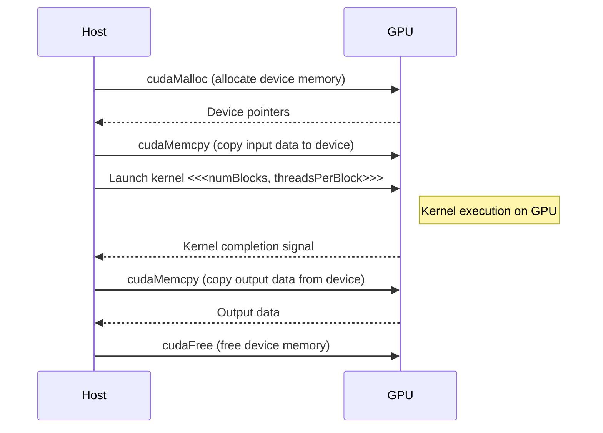

<details>
<summary>Relevant source files</summary>

The following files were used as context for generating this wiki page:

- [deprecated/hw0/kernel.cu](https://github.com/aanickode/cis6010/blob/main/deprecated/hw0/kernel.cu)
- [deprecated/hw0/main.cu](https://github.com/aanickode/cis6010/blob/main/deprecated/hw0/main.cu)
- [deprecated/hw0/utils.h](https://github.com/aanickode/cis6010/blob/main/deprecated/hw0/utils.h)
- [deprecated/hw0/utils.cu](https://github.com/aanickode/cis6010/blob/main/deprecated/hw0/utils.cu)
- [deprecated/hw0/Makefile](https://github.com/aanickode/cis6010/blob/main/deprecated/hw0/Makefile)

</details>

# CUDA Kernel Execution

## Introduction

This wiki page covers the execution of CUDA kernels within the provided project. CUDA (Compute Unified Device Architecture) is a parallel computing platform and programming model developed by NVIDIA for general-purpose computing on graphics processing units (GPUs). The project utilizes CUDA kernels to perform parallel computations on the GPU, leveraging its massively parallel architecture for accelerating certain types of workloads.

The CUDA kernel execution process involves transferring data from the host (CPU) to the device (GPU), launching the kernel on the GPU, and retrieving the results back to the host. This page will explore the various components and steps involved in this process, as evidenced in the provided source files.

## CUDA Kernel Definition and Launch

The `kernel.cu` file contains the definition and launch of the CUDA kernel used in this project. The kernel function is defined with the `__global__` qualifier, indicating that it is a CUDA kernel function that can be executed on the GPU.

```cpp
__global__ void vectorAdd(float* a, float* b, float* c, int n)
{
    int idx = blockIdx.x * blockDim.x + threadIdx.x;
    if (idx < n)
        c[idx] = a[idx] + b[idx];
}
```
Sources: [deprecated/hw0/kernel.cu:4-9]()

The `vectorAdd` kernel function takes four arguments:

1. `a`: A pointer to the first input vector.
2. `b`: A pointer to the second input vector.
3. `c`: A pointer to the output vector where the sum of `a` and `b` will be stored.
4. `n`: The size of the input and output vectors.

Within the kernel function, the index of the current thread is calculated using the built-in CUDA variables `blockIdx.x`, `blockDim.x`, and `threadIdx.x`. This index is used to determine which element of the input vectors the current thread should process. If the index is within the valid range (`idx < n`), the corresponding elements of `a` and `b` are added, and the result is stored in the corresponding element of `c`.

The kernel is launched from the `main.cu` file using the `<<<...>>>` syntax:

```cpp
vectorAdd<<<numBlocks, threadsPerBlock>>>(d_a, d_b, d_c, n);
```
Sources: [deprecated/hw0/main.cu:71]()

The `<<<numBlocks, threadsPerBlock>>>` syntax specifies the execution configuration for the kernel launch, where `numBlocks` is the number of blocks (groups of threads) to be launched, and `threadsPerBlock` is the number of threads per block.

## Data Transfer and Memory Management

Before launching the kernel, the input data needs to be transferred from the host (CPU) memory to the device (GPU) memory. This is done using CUDA memory management functions:

```cpp
float* d_a, * d_b, * d_c;
cudaMalloc(&d_a, n * sizeof(float));
cudaMalloc(&d_b, n * sizeof(float));
cudaMalloc(&d_c, n * sizeof(float));
```
Sources: [deprecated/hw0/main.cu:54-57]()

The `cudaMalloc` function is used to allocate memory on the GPU for the input and output vectors. The pointers `d_a`, `d_b`, and `d_c` point to the allocated memory on the GPU.

After allocating memory on the GPU, the input data from the host needs to be copied to the GPU memory:

```cpp
cudaMemcpy(d_a, a, n * sizeof(float), cudaMemcpyHostToDevice);
cudaMemcpy(d_b, b, n * sizeof(float), cudaMemcpyHostToDevice);
```
Sources: [deprecated/hw0/main.cu:59-60]()

The `cudaMemcpy` function is used to copy data from the host memory (`a` and `b`) to the device memory (`d_a` and `d_b`). The `cudaMemcpyHostToDevice` flag specifies the direction of the memory copy.

After the kernel execution, the output data needs to be copied back from the GPU memory to the host memory:

```cpp
cudaMemcpy(c, d_c, n * sizeof(float), cudaMemcpyDeviceToHost);
```
Sources: [deprecated/hw0/main.cu:73]()

The `cudaMemcpy` function is used again, but with the `cudaMemcpyDeviceToHost` flag to copy the output data from the device memory (`d_c`) to the host memory (`c`).

Finally, the allocated GPU memory needs to be freed using the `cudaFree` function:

```cpp
cudaFree(d_a);
cudaFree(d_b);
cudaFree(d_c);
```
Sources: [deprecated/hw0/main.cu:75-77]()

## Error Handling

The project includes error handling mechanisms to catch and report CUDA errors. The `utils.h` file defines a macro `cudaCheckError` that checks for CUDA errors and prints an error message if an error occurs:

```cpp
#define cudaCheckError(ans) { gpuAssert((ans), __FILE__, __LINE__); }
```
Sources: [deprecated/hw0/utils.h:11]()

The `gpuAssert` function is defined in `utils.cu` and is responsible for checking the CUDA error code and printing an error message if an error occurs:

```cpp
inline void gpuAssert(cudaError_t code, const char *file, int line, bool abort=true)
{
    if (code != cudaSuccess)
    {
        fprintf(stderr, "GPUassert: %s %s %d\n", cudaGetErrorString(code), file, line);
        if (abort) exit(code);
    }
}
```
Sources: [deprecated/hw0/utils.cu:6-12]()

The `cudaCheckError` macro is used after CUDA function calls to check for errors:

```cpp
cudaMalloc(&d_a, n * sizeof(float));
cudaCheckError(cudaGetLastError());
```
Sources: [deprecated/hw0/main.cu:54,58]()

If an error occurs, the `gpuAssert` function will print an error message with the error code, file name, and line number, and optionally exit the program.

## Build Process

The project includes a `Makefile` for building the CUDA application. The `Makefile` defines rules for compiling the CUDA source files and linking them with the necessary CUDA libraries:

```makefile
NVCC = nvcc
NVCC_FLAGS = -O3 -arch=sm_70

all: main

main: main.o kernel.o utils.o
    $(NVCC) $(NVCC_FLAGS) -o main main.o kernel.o utils.o

main.o: main.cu utils.h
    $(NVCC) $(NVCC_FLAGS) -c main.cu

kernel.o: kernel.cu
    $(NVCC) $(NVCC_FLAGS) -c kernel.cu

utils.o: utils.cu utils.h
    $(NVCC) $(NVCC_FLAGS) -c utils.cu

clean:
    rm -f main *.o
```
Sources: [deprecated/hw0/Makefile]()

The `NVCC` variable specifies the NVIDIA CUDA compiler (`nvcc`), and the `NVCC_FLAGS` variable sets the compiler flags, including optimization level (`-O3`) and the target GPU architecture (`-arch=sm_70`).

The `all` target builds the `main` executable by compiling the source files (`main.cu`, `kernel.cu`, and `utils.cu`) and linking them together using the CUDA compiler.

The `clean` target removes the compiled object files and the `main` executable.

## Sequence Diagram

The following sequence diagram illustrates the high-level flow of CUDA kernel execution in the project:



1. The host allocates memory on the GPU using `cudaMalloc` and receives device pointers.
2. The host copies the input data from the host memory to the device memory using `cudaMemcpy`.
3. The host launches the CUDA kernel on the GPU with the specified execution configuration (`<<<numBlocks, threadsPerBlock>>>`).
4. The kernel executes on the GPU, with each thread performing a portion of the computation.
5. After the kernel completes, the host copies the output data from the device memory to the host memory using `cudaMemcpy`.
6. Finally, the host frees the allocated device memory using `cudaFree`.

## Key Components and Features

| Component | Description |
| --- | --- |
| CUDA Kernel | A function (`__global__` qualifier) that runs on the GPU and performs parallel computations. In this project, the `vectorAdd` kernel performs element-wise addition of two input vectors. |
| Kernel Launch | The process of executing a CUDA kernel on the GPU with a specified execution configuration (`<<<numBlocks, threadsPerBlock>>>`). |
| Memory Management | Allocating and freeing memory on the GPU using `cudaMalloc` and `cudaFree`, respectively. |
| Data Transfer | Copying data between the host (CPU) memory and the device (GPU) memory using `cudaMemcpy`. |
| Error Handling | Checking for CUDA errors using the `cudaCheckError` macro and the `gpuAssert` function. |
| Build Process | Compiling and linking the CUDA source files using the NVIDIA CUDA compiler (`nvcc`) and the provided `Makefile`. |

## Conclusion

This wiki page has covered the key aspects of CUDA kernel execution in the provided project, including kernel definition and launch, data transfer and memory management, error handling, and the build process. The page has provided code snippets, diagrams, and tables to illustrate the various components and their relationships. By following the information presented here, developers can gain a better understanding of how CUDA kernels are executed and integrated into the project's codebase.