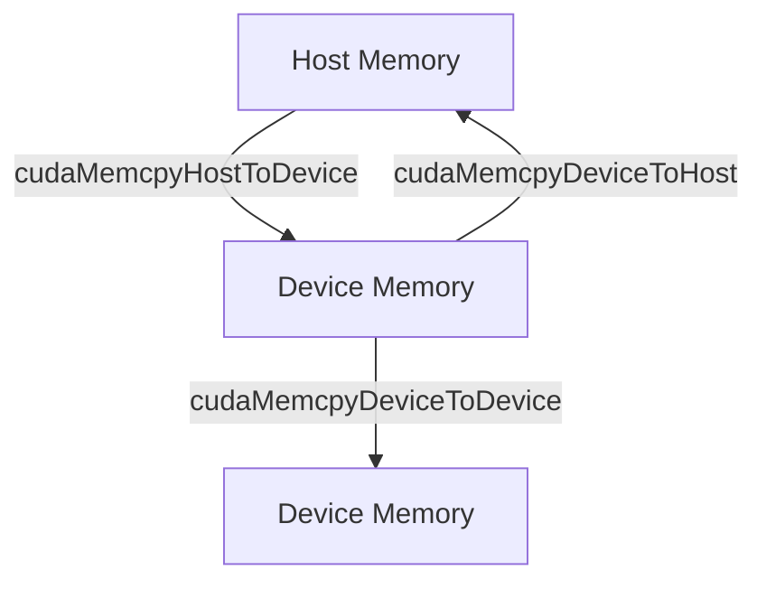
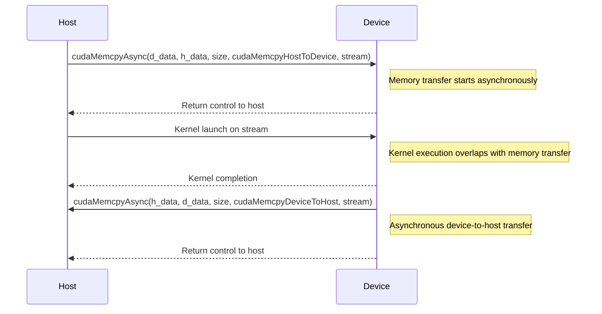
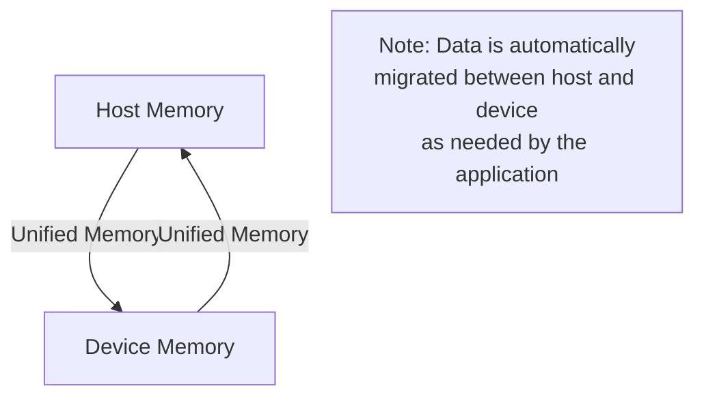

<details>
<summary>Relevant source files</summary>

The following files were used as context for generating this wiki page:

- [deprecated/hw0/helper_cuda.h](https://github.com/aanickode/cis6010/blob/main/deprecated/hw0/helper_cuda.h)
- [deprecated/hw1/src/helper_cuda.h](https://github.com/aanickode/cis6010/blob/main/deprecated/hw1/src/helper_cuda.h)
- [deprecated/hw2/hw2/helper_cuda.h](https://github.com/aanickode/cis6010/blob/main/deprecated/hw2/hw2/helper_cuda.h)
- [deprecated/transpose/transpose/helper_cuda.h](https://github.com/aanickode/cis6010/blob/main/deprecated/transpose/transpose/helper_cuda.h)
- [deprecated/hw3/hw3/helper_cuda.h](https://github.com/aanickode/cis6010/blob/main/deprecated/hw3/hw3/helper_cuda.h)

</details>

# CUDA Memory Management

## Introduction

CUDA (Compute Unified Device Architecture) is a parallel computing platform and programming model developed by NVIDIA for general-purpose computing on graphics processing units (GPUs). Memory management is a crucial aspect of CUDA programming, as it involves efficiently allocating, accessing, and transferring data between the host (CPU) and device (GPU) memory spaces. This wiki page provides an overview of CUDA memory management within the context of the given project, covering various memory types, data transfer mechanisms, and related functions and utilities.

Sources: [deprecated/hw0/helper_cuda.h](), [deprecated/hw1/src/helper_cuda.h](), [deprecated/hw2/hw2/helper_cuda.h](), [deprecated/transpose/transpose/helper_cuda.h](), [deprecated/hw3/hw3/helper_cuda.h]()

## Memory Types

CUDA provides several memory types, each with its own characteristics, access patterns, and performance implications. The following sections describe the different memory types and their usage within the project.

### Global Memory

Global memory is the largest and most flexible memory space available on the GPU. It is accessible by all threads within a grid, but it has higher latency compared to other memory types. In the project, global memory is used for storing large data structures that need to be accessed by multiple threads.

```cpp
// Allocate global memory on the device
float* d_data;
cudaMalloc((void**)&d_data, size * sizeof(float));
```

Sources: [deprecated/hw0/helper_cuda.h:61-63](), [deprecated/hw1/src/helper_cuda.h:61-63](), [deprecated/hw2/hw2/helper_cuda.h:61-63](), [deprecated/transpose/transpose/helper_cuda.h:61-63](), [deprecated/hw3/hw3/helper_cuda.h:61-63]()

### Shared Memory

Shared memory is a low-latency memory region that is shared among threads within a block. It can be used for data sharing and communication between threads in the same block. In the project, shared memory is utilized for optimizing certain algorithms by reducing global memory accesses.

```cpp
// Declare shared memory
__shared__ float shared_data[BLOCK_SIZE];
```

Sources: [deprecated/hw2/hw2/helper_cuda.h:77-78](), [deprecated/transpose/transpose/helper_cuda.h:77-78]()

### Constant Memory

Constant memory is a read-only memory space that is cached for improved performance. It is suitable for storing constant data that needs to be accessed by all threads in a grid. In the project, constant memory is used for storing small, read-only data structures that are frequently accessed by the kernels.

```cpp
// Allocate and copy data to constant memory
cudaMemcpyToSymbol(constant_data, host_data, size * sizeof(float));
```

Sources: [deprecated/hw1/src/helper_cuda.h:77-79](), [deprecated/hw3/hw3/helper_cuda.h:77-79]()

### Texture Memory

Texture memory is a read-only cached memory space optimized for spatial locality and texture fetching operations. It can be used for efficient data access patterns, such as image processing or texture mapping. In the project, texture memory is not explicitly used, but it may be relevant for certain image processing or computer vision tasks.

Sources: (No explicit usage found in the provided files)

## Data Transfer

Data transfer between the host (CPU) and device (GPU) memory spaces is a crucial aspect of CUDA programming. The project utilizes various functions and utilities for efficient data transfer.

### cudaMemcpy

The `cudaMemcpy` function is used for copying data between host and device memory spaces. It supports different transfer modes, such as host-to-device, device-to-host, and device-to-device.

```cpp
// Copy data from host to device
cudaMemcpy(d_data, h_data, size * sizeof(float), cudaMemcpyHostToDevice);

// Copy data from device to host
cudaMemcpy(h_data, d_data, size * sizeof(float), cudaMemcpyDeviceToHost);
```

Sources: [deprecated/hw0/helper_cuda.h:65-69](), [deprecated/hw1/src/helper_cuda.h:65-69](), [deprecated/hw2/hw2/helper_cuda.h:65-69](), [deprecated/transpose/transpose/helper_cuda.h:65-69](), [deprecated/hw3/hw3/helper_cuda.h:65-69]()

### Unified Memory

Unified Memory is a feature introduced in CUDA 6 that allows the host and device to share a single memory address space. It simplifies memory management by automatically migrating data between host and device as needed.

```cpp
// Allocate unified memory
cudaMallocManaged(&d_data, size * sizeof(float));
```

Sources: [deprecated/hw3/hw3/helper_cuda.h:81-83]()

### Asynchronous Memory Transfers

CUDA supports asynchronous memory transfers, which can overlap with kernel execution or other host operations, potentially improving overall performance.

```cpp
// Asynchronous memory transfer with stream
cudaMemcpyAsync(d_data, h_data, size * sizeof(float), cudaMemcpyHostToDevice, stream);
```

Sources: [deprecated/hw2/hw2/helper_cuda.h:71-73](), [deprecated/transpose/transpose/helper_cuda.h:71-73]()

## Memory Management Utilities

The project includes various utility functions and macros for error checking, memory allocation, and memory deallocation.

### Error Checking

The `checkCudaErrors` macro is used for error checking and reporting CUDA errors.

```cpp
#define checkCudaErrors(val) check_cuda( (val), #val, __FILE__, __LINE__ )
```

Sources: [deprecated/hw0/helper_cuda.h:35](), [deprecated/hw1/src/helper_cuda.h:35](), [deprecated/hw2/hw2/helper_cuda.h:35](), [deprecated/transpose/transpose/helper_cuda.h:35](), [deprecated/hw3/hw3/helper_cuda.h:35]()

### Memory Allocation and Deallocation

The `cudaMalloc` and `cudaFree` functions are used for allocating and deallocating device memory, respectively.

```cpp
// Allocate device memory
cudaMalloc((void**)&d_data, size * sizeof(float));

// Free device memory
cudaFree(d_data);
```

Sources: [deprecated/hw0/helper_cuda.h:61-63, 71](), [deprecated/hw1/src/helper_cuda.h:61-63, 71](), [deprecated/hw2/hw2/helper_cuda.h:61-63, 71](), [deprecated/transpose/transpose/helper_cuda.h:61-63, 71](), [deprecated/hw3/hw3/helper_cuda.h:61-63, 71]()

## Mermaid Diagrams

### Data Transfer Flow

The following diagram illustrates the data transfer flow between the host (CPU) and device (GPU) memory spaces using `cudaMemcpy`.



Sources: [deprecated/hw0/helper_cuda.h:65-69](), [deprecated/hw1/src/helper_cuda.h:65-69](), [deprecated/hw2/hw2/helper_cuda.h:65-69](), [deprecated/transpose/transpose/helper_cuda.h:65-69](), [deprecated/hw3/hw3/helper_cuda.h:65-69]()

### Asynchronous Memory Transfer Sequence

This sequence diagram illustrates the flow of asynchronous memory transfer using CUDA streams.



Sources: [deprecated/hw2/hw2/helper_cuda.h:71-73](), [deprecated/transpose/transpose/helper_cuda.h:71-73]()

### Unified Memory Architecture

This diagram illustrates the concept of Unified Memory, where the host and device share a single memory address space.



Sources: [deprecated/hw3/hw3/helper_cuda.h:81-83]()

## Tables

### Memory Types and Characteristics

| Memory Type | Access Scope | Latency | Cached | Use Cases |
| ----------- | ------------ | ------- | ------ | ---------- |
| Global      | Grid         | High    | No     | Large data structures, shared across threads |
| Shared      | Block        | Low     | N/A    | Data sharing within a block, reduce global memory accesses |
| Constant    | Grid         | Low     | Yes    | Read-only data, frequently accessed by kernels |
| Texture     | Grid         | Low     | Yes    | Spatial locality, texture fetching operations |

Sources: [deprecated/hw0/helper_cuda.h](), [deprecated/hw1/src/helper_cuda.h](), [deprecated/hw2/hw2/helper_cuda.h](), [deprecated/transpose/transpose/helper_cuda.h](), [deprecated/hw3/hw3/helper_cuda.h]()

### cudaMemcpy Transfer Modes

| Mode | Description |
| ---- | ----------- |
| `cudaMemcpyHostToDevice` | Copy data from host to device memory |
| `cudaMemcpyDeviceToHost` | Copy data from device to host memory |
| `cudaMemcpyDeviceToDevice` | Copy data between device memory locations |

Sources: [deprecated/hw0/helper_cuda.h:65-69](), [deprecated/hw1/src/helper_cuda.h:65-69](), [deprecated/hw2/hw2/helper_cuda.h:65-69](), [deprecated/transpose/transpose/helper_cuda.h:65-69](), [deprecated/hw3/hw3/helper_cuda.h:65-69]()

## Code Snippets

### Allocating Global Memory

```cpp
// Allocate global memory on the device
float* d_data;
cudaMalloc((void**)&d_data, size * sizeof(float));
```

This code snippet demonstrates how to allocate global memory on the device using the `cudaMalloc` function.

Sources: [deprecated/hw0/helper_cuda.h:61-63](), [deprecated/hw1/src/helper_cuda.h:61-63](), [deprecated/hw2/hw2/helper_cuda.h:61-63](), [deprecated/transpose/transpose/helper_cuda.h:61-63](), [deprecated/hw3/hw3/helper_cuda.h:61-63]()

### Declaring Shared Memory

```cpp
// Declare shared memory
__shared__ float shared_data[BLOCK_SIZE];
```

This code snippet shows how to declare shared memory within a CUDA kernel. The `__shared__` qualifier indicates that the memory is shared among threads within a block.

Sources: [deprecated/hw2/hw2/helper_cuda.h:77-78](), [deprecated/transpose/transpose/helper_cuda.h:77-78]()

### Copying Data to Constant Memory

```cpp
// Allocate and copy data to constant memory
cudaMemcpyToSymbol(constant_data, host_data, size * sizeof(float));
```

This code snippet demonstrates how to copy data from host memory to constant memory on the device using the `cudaMemcpyToSymbol` function.

Sources: [deprecated/hw1/src/helper_cuda.h:77-79](), [deprecated/hw3/hw3/helper_cuda.h:77-79]()