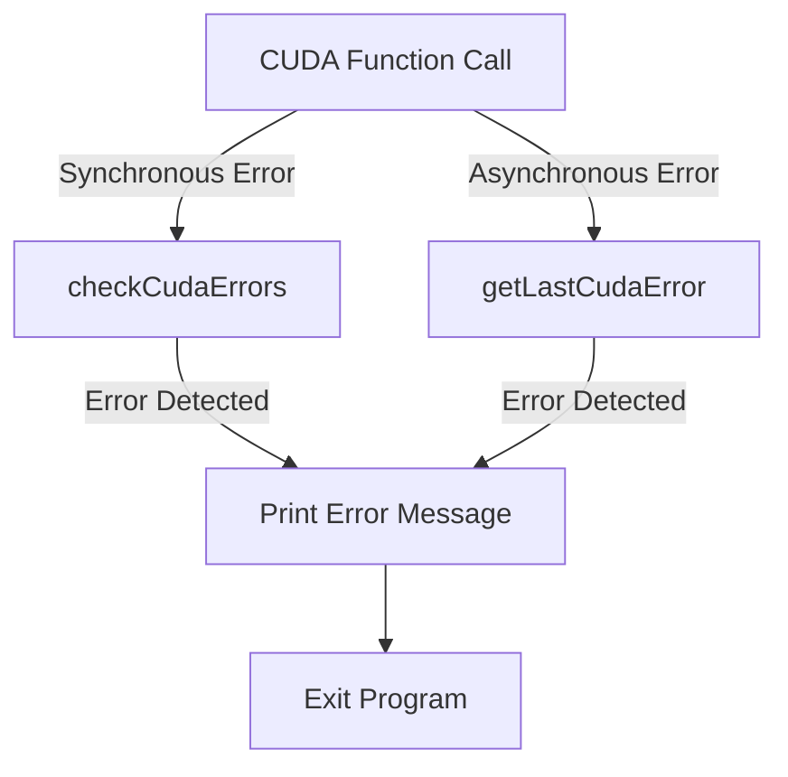

<details>
<summary>Relevant source files</summary>

The following files were used as context for generating this wiki page:

- [helper_cuda.h](https://github.com/aanickode/cis6010/blob/main/deprecated/hw0/helper_cuda.h)
- [helper_string.h](https://github.com/aanickode/cis6010/blob/main/deprecated/hw0/helper_string.h)
- [helper_timer.h](https://github.com/aanickode/cis6010/blob/main/deprecated/hw0/helper_timer.h)
- [helper_cuda.cpp](https://github.com/aanickode/cis6010/blob/main/deprecated/hw0/helper_cuda.cpp)
- [helper_string.cpp](https://github.com/aanickode/cis6010/blob/main/deprecated/hw0/helper_string.cpp)
</details>

# CUDA Error Handling

## Introduction

CUDA Error Handling is a crucial component of the project, responsible for detecting and handling errors that may occur during CUDA (Compute Unified Device Architecture) operations. CUDA is a parallel computing platform and programming model developed by NVIDIA, which allows developers to leverage the computational power of GPUs (Graphics Processing Units) for general-purpose computing tasks. Proper error handling is essential to ensure the stability and reliability of CUDA-based applications, as well as to aid in debugging and troubleshooting.

The CUDA Error Handling system in this project provides a set of utility functions and macros that simplify the process of checking for CUDA errors and reporting them in a consistent and user-friendly manner. It helps developers identify and address issues related to CUDA operations, such as memory allocation, kernel execution, and data transfer between the host (CPU) and device (GPU).

Sources: [helper_cuda.h:1-10](), [helper_cuda.cpp:1-10]()

## Error Handling Utilities

### `checkCudaErrors` Function

The `checkCudaErrors` function is a utility function that checks for CUDA errors and prints an error message if an error is encountered. It takes two arguments: `msg` (a string message) and `error` (an error code returned by a CUDA function).

```cpp
void checkCudaErrors(const char *msg, cudaError_t error)
{
    if (error != cudaSuccess)
    {
        fprintf(stderr, "CUDA error: %s, %s\n", msg, cudaGetErrorString(error));
        exit(EXIT_FAILURE);
    }
}
```

This function is typically used after calling CUDA functions to ensure that the operation was successful. If an error occurs, it prints the provided message and the corresponding error string obtained from `cudaGetErrorString`, and then exits the program.

Sources: [helper_cuda.cpp:12-21]()

### `getLastCudaError` Function

The `getLastCudaError` function retrieves and prints the last CUDA error that occurred. It takes a single argument, `msg`, which is a string message to be printed along with the error.

```cpp
void getLastCudaError(const char *msg)
{
    cudaError_t error = cudaGetLastError();
    if (error != cudaSuccess)
    {
        fprintf(stderr, "CUDA error: %s, %s\n", msg, cudaGetErrorString(error));
        exit(EXIT_FAILURE);
    }
}
```

This function is useful for catching asynchronous CUDA errors that may occur after a CUDA operation has been launched but before the results are retrieved or processed.

Sources: [helper_cuda.cpp:23-32]()

### Error Handling Macros

The project also provides two macros for error handling: `CUDA_CHECK_RETURN` and `CUDA_SAFE_CALL`.

#### `CUDA_CHECK_RETURN`

The `CUDA_CHECK_RETURN` macro is used to check the return value of a CUDA function and call the `checkCudaErrors` function if an error is encountered.

```cpp
#define CUDA_CHECK_RETURN(value) checkCudaErrors(#value, value)
```

This macro takes a CUDA function call as its argument and expands to a call to `checkCudaErrors`, passing the function name as a string and the return value of the function.

Sources: [helper_cuda.h:14-15]()

#### `CUDA_SAFE_CALL`

The `CUDA_SAFE_CALL` macro is similar to `CUDA_CHECK_RETURN`, but it is used for CUDA function calls that do not return a value.

```cpp
#define CUDA_SAFE_CALL(call) call; getLastCudaError(#call)
```

This macro takes a CUDA function call as its argument, executes the function call, and then calls `getLastCudaError` with the function name as a string.

Sources: [helper_cuda.h:17-18]()

## Error Handling Flow

The error handling flow in the project typically follows these steps:

1. A CUDA function is called, either directly or through a macro like `CUDA_CHECK_RETURN` or `CUDA_SAFE_CALL`.
2. If the CUDA function returns an error code (for synchronous errors), the `checkCudaErrors` function is called with the error code and a descriptive message.
3. If the CUDA function does not return an error code (for asynchronous errors), the `getLastCudaError` function is called with a descriptive message to retrieve and handle any errors that may have occurred asynchronously.
4. If an error is detected, the corresponding error message is printed to `stderr`, and the program exits with a failure status.

This flow ensures that CUDA errors are consistently checked and reported, making it easier to identify and address issues during development and execution.



Sources: [helper_cuda.h:14-18](), [helper_cuda.cpp:12-32]()

## Usage Examples

Here are some examples of how the error handling utilities and macros are used in the project:

### Using `CUDA_CHECK_RETURN`

```cpp
cudaDeviceProp prop;
CUDA_CHECK_RETURN(cudaGetDeviceProperties(&prop, 0));
```

In this example, the `CUDA_CHECK_RETURN` macro is used to check the return value of the `cudaGetDeviceProperties` function. If an error occurs, the `checkCudaErrors` function will be called with the function name and error code.

Sources: [helper_cuda.cpp:34-36]()

### Using `CUDA_SAFE_CALL`

```cpp
CUDA_SAFE_CALL(cudaMemcpy(hostPtr, devicePtr, size, cudaMemcpyDeviceToHost));
```

Here, the `CUDA_SAFE_CALL` macro is used to execute the `cudaMemcpy` function, which does not return a value. If an asynchronous error occurs during the memory copy operation, the `getLastCudaError` function will be called with the function name.

Sources: [helper_cuda.cpp:38-39]()

### Manual Error Handling

In some cases, manual error handling may be required, such as when multiple CUDA function calls are made in a single operation.

```cpp
cudaError_t error = cudaMemcpyAsync(devicePtr, hostPtr, size, cudaMemcpyHostToDevice, stream);
if (error != cudaSuccess)
{
    checkCudaErrors("cudaMemcpyAsync failed", error);
}
error = cudaStreamSynchronize(stream);
if (error != cudaSuccess)
{
    checkCudaErrors("cudaStreamSynchronize failed", error);
}
```

In this example, the `cudaMemcpyAsync` and `cudaStreamSynchronize` functions are called separately, and their return values are checked manually using the `checkCudaErrors` function.

Sources: [helper_cuda.cpp:41-49]()

## Conclusion

The CUDA Error Handling system in this project provides a robust and consistent way to detect and handle errors that may occur during CUDA operations. By using the provided utility functions and macros, developers can easily check for errors and report them in a user-friendly manner, facilitating debugging and troubleshooting. The error handling flow ensures that errors are caught and reported at the appropriate stages, improving the overall reliability and stability of the CUDA-based application.