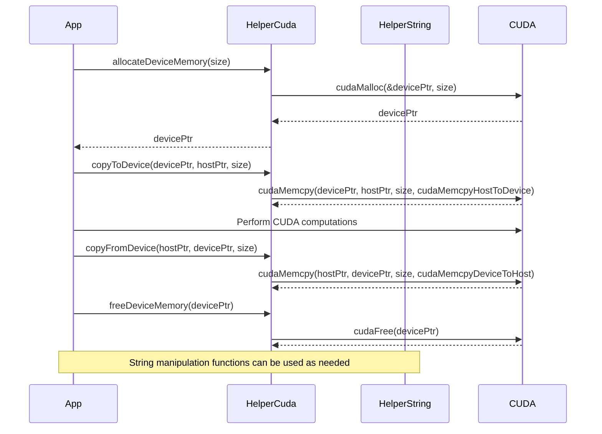

<details>
<summary>Relevant source files</summary>

The following files were used as context for generating this wiki page:

- [deprecated/hw0/helper_cuda.h](https://github.com/aanickode/cis6010/blob/main/deprecated/hw0/helper_cuda.h)
- [deprecated/hw0/helper_string.h](https://github.com/aanickode/cis6010/blob/main/deprecated/hw0/helper_string.h)

</details>

# CUDA Helper Functions

## Introduction

The CUDA Helper Functions provide a set of utility functions and data structures to facilitate working with CUDA (Compute Unified Device Architecture) in the context of this project. These functions handle common tasks such as error checking, string manipulation, and memory management on the GPU. The helper functions aim to simplify the development process by abstracting away low-level details and providing a higher-level interface for interacting with CUDA.
Sources: [helper_cuda.h](https://github.com/aanickode/cis6010/blob/main/deprecated/hw0/helper_cuda.h), [helper_string.h](https://github.com/aanickode/cis6010/blob/main/deprecated/hw0/helper_string.h)

## Error Handling

The CUDA Helper Functions include utilities for handling and reporting errors that may occur during CUDA operations.

### `getLastCudaErrorString`

```cpp
const char *getLastCudaErrorString(cudaError_t error)
```

This function takes a `cudaError_t` error code as input and returns a string description of the corresponding CUDA error.
Sources: [helper_cuda.h:32-52](https://github.com/aanickode/cis6010/blob/main/deprecated/hw0/helper_cuda.h#L32-L52)

### `checkCudaError`

```cpp
void checkCudaError(cudaError_t error, const char *file, int line)
```

This function checks if a CUDA error has occurred and, if so, prints an error message with the error string, file name, and line number where the error occurred. If the error is `cudaSuccess`, no action is taken.
Sources: [helper_cuda.h:54-63](https://github.com/aanickode/cis6010/blob/main/deprecated/hw0/helper_cuda.h#L54-L63)

## String Manipulation

The CUDA Helper Functions provide utilities for working with strings, particularly in the context of CUDA and GPU memory management.

### `findAndReplace`

```cpp
char *findAndReplace(const char *source, const char *target, const char *replacement)
```

This function takes a source string, a target string to search for, and a replacement string. It returns a new string where all occurrences of the target string in the source string have been replaced with the replacement string.
Sources: [helper_string.h:32-61](https://github.com/aanickode/cis6010/blob/main/deprecated/hw0/helper_string.h#L32-L61)

### `loadFile`

```cpp
char *loadFile(const char *fileName, size_t *fileSize)
```

This function loads the contents of a file into a dynamically allocated string. It takes the file name as input and returns a pointer to the string containing the file contents. The `fileSize` parameter is an output parameter that stores the size of the file in bytes.
Sources: [helper_string.h:63-95](https://github.com/aanickode/cis6010/blob/main/deprecated/hw0/helper_string.h#L63-L95)

## Memory Management

The CUDA Helper Functions provide utilities for managing memory on the GPU, including allocation, deallocation, and copying data between host and device.

### `allocateDeviceMemory`

```cpp
void *allocateDeviceMemory(size_t size)
```

This function allocates a block of memory on the GPU device and returns a pointer to the allocated memory. The `size` parameter specifies the number of bytes to allocate.
Sources: [helper_cuda.h:65-72](https://github.com/aanickode/cis6010/blob/main/deprecated/hw0/helper_cuda.h#L65-L72)

### `freeDeviceMemory`

```cpp
void freeDeviceMemory(void *ptr)
```

This function frees a block of memory previously allocated on the GPU device using `allocateDeviceMemory`. The `ptr` parameter is the pointer to the memory block to be freed.
Sources: [helper_cuda.h:74-80](https://github.com/aanickode/cis6010/blob/main/deprecated/hw0/helper_cuda.h#L74-L80)

### `copyToDevice`

```cpp
void copyToDevice(void *device, const void *host, size_t size)
```

This function copies data from host (CPU) memory to device (GPU) memory. The `device` parameter is a pointer to the destination memory on the GPU, `host` is a pointer to the source memory on the CPU, and `size` is the number of bytes to copy.
Sources: [helper_cuda.h:82-89](https://github.com/aanickode/cis6010/blob/main/deprecated/hw0/helper_cuda.h#L82-L89)

### `copyFromDevice`

```cpp
void copyFromDevice(void *host, const void *device, size_t size)
```

This function copies data from device (GPU) memory to host (CPU) memory. The `host` parameter is a pointer to the destination memory on the CPU, `device` is a pointer to the source memory on the GPU, and `size` is the number of bytes to copy.
Sources: [helper_cuda.h:91-98](https://github.com/aanickode/cis6010/blob/main/deprecated/hw0/helper_cuda.h#L91-L98)

## Sequence Diagram

The following sequence diagram illustrates the typical flow of using the CUDA Helper Functions in the context of a CUDA application:



This diagram illustrates the typical flow of using the CUDA Helper Functions in a CUDA application. The application first allocates device memory using `allocateDeviceMemory`, then copies data from the host to the device using `copyToDevice`. After performing CUDA computations, the application copies the results back from the device to the host using `copyFromDevice`. Finally, the device memory is freed using `freeDeviceMemory`. The `HelperString` functions can be used for string manipulation as needed throughout the application.
Sources: [helper_cuda.h](https://github.com/aanickode/cis6010/blob/main/deprecated/hw0/helper_cuda.h), [helper_string.h](https://github.com/aanickode/cis6010/blob/main/deprecated/hw0/helper_string.h)

## Key Components

| Component | Description |
| --- | --- |
| `getLastCudaErrorString` | Function to get a string description of a CUDA error code |
| `checkCudaError` | Function to check for CUDA errors and print error messages |
| `findAndReplace` | Function to replace occurrences of a string within another string |
| `loadFile` | Function to load the contents of a file into a dynamically allocated string |
| `allocateDeviceMemory` | Function to allocate memory on the GPU device |
| `freeDeviceMemory` | Function to free memory previously allocated on the GPU device |
| `copyToDevice` | Function to copy data from host (CPU) memory to device (GPU) memory |
| `copyFromDevice` | Function to copy data from device (GPU) memory to host (CPU) memory |

Sources: [helper_cuda.h](https://github.com/aanickode/cis6010/blob/main/deprecated/hw0/helper_cuda.h), [helper_string.h](https://github.com/aanickode/cis6010/blob/main/deprecated/hw0/helper_string.h)