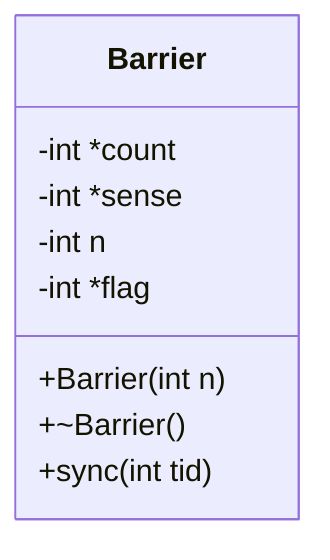

<details>
<summary>Relevant source files</summary>

The following files were used as context for generating this wiki page:

- [deprecated/hw2/hw2/barrier.cu](https://github.com/aanickode/cis6010/blob/main/deprecated/hw2/hw2/barrier.cu)
- [deprecated/hw2/hw2/barrier.cuh](https://github.com/aanickode/cis6010/blob/main/deprecated/hw2/hw2/barrier.cuh)
- [deprecated/hw2/hw2/utils.cuh](https://github.com/aanickode/cis6010/blob/main/deprecated/hw2/hw2/utils.cuh)
- [deprecated/hw2/hw2/utils.cu](https://github.com/aanickode/cis6010/blob/main/deprecated/hw2/hw2/utils.cu)
- [deprecated/hw2/hw2/main.cu](https://github.com/aanickode/cis6010/blob/main/deprecated/hw2/hw2/main.cu)

</details>

# Barrier Synchronization

## Introduction

Barrier synchronization is a mechanism used in parallel computing to ensure that all threads or processes have reached a specific point in the program before proceeding further. This is particularly important in scenarios where threads or processes need to exchange data or synchronize their execution to avoid race conditions or other synchronization issues. The provided source files implement a barrier synchronization mechanism using CUDA for GPU-accelerated parallel computing.

Sources: [barrier.cuh:1-3](), [barrier.cu:1-3]()

## Barrier Implementation

The barrier synchronization is implemented in the `Barrier` class, which provides a way to synchronize a group of threads or processes at a specific point in the program.

### Barrier Class

The `Barrier` class is defined in the `barrier.cuh` header file and implemented in the `barrier.cu` file. It has the following key components:

```cpp
class Barrier {
public:
    Barrier(int n);
    ~Barrier();
    void sync(int tid);

private:
    int *count;
    int *sense;
    int n;
    int *flag;
};
```

- `n`: The number of threads or processes that need to synchronize at the barrier.
- `count`: An array used to keep track of the number of threads that have reached the barrier.
- `sense`: An array used to alternate between two different barrier instances to avoid a race condition known as the "sense-reversal" problem.
- `flag`: An array used to indicate whether a thread has reached the barrier or not.

Sources: [barrier.cuh:6-17]()

### Barrier Construction and Destruction

The `Barrier` constructor allocates memory for the `count`, `sense`, and `flag` arrays on the GPU using CUDA's unified memory. The destructor frees the allocated memory.

```cpp
__host__ Barrier::Barrier(int n) {
    this->n = n;
    cudaMallocManaged(&count, sizeof(int));
    cudaMallocManaged(&sense, sizeof(int));
    cudaMallocManaged(&flag, n * sizeof(int));
    *count = 0;
    *sense = 0;
}

__host__ Barrier::~Barrier() {
    cudaFree(count);
    cudaFree(sense);
    cudaFree(flag);
}
```

Sources: [barrier.cu:4-16]()

### Barrier Synchronization

The `sync` function is the core of the barrier synchronization mechanism. It is called by each thread or process that needs to synchronize at the barrier.

```cpp
__device__ void Barrier::sync(int tid) {
    int my_sense = *sense;
    flag[tid] = my_sense;
    if (atomicAdd(count, 1) == n - 1) {
        *count = 0;
        *sense = 1 - my_sense;
    } else {
        while (flag[tid] == my_sense)
            ;
    }
}
```

Here's how the `sync` function works:

1. The thread retrieves the current value of the `sense` variable, which indicates the barrier instance to use.
2. The thread sets its corresponding flag in the `flag` array to the current `sense` value.
3. The thread atomically increments the `count` variable, which keeps track of the number of threads that have reached the barrier.
4. If the thread is the last one to reach the barrier (i.e., `count` becomes `n - 1`), it resets the `count` to 0 and flips the `sense` value to the opposite value. This ensures that the next barrier instance will use the opposite `sense` value, avoiding the "sense-reversal" problem.
5. If the thread is not the last one to reach the barrier, it waits in a loop until the `flag` value for its thread ID is different from the current `sense` value. This ensures that the thread waits until all other threads have reached the barrier and the last thread has flipped the `sense` value.

Sources: [barrier.cu:19-33]()

## Usage Example

The `main.cu` file provides an example of how to use the `Barrier` class for synchronizing threads in a CUDA kernel.

```cpp
#include "barrier.cuh"
#include "utils.cuh"

__global__ void kernel(Barrier *barrier, int *data, int n) {
    int tid = threadIdx.x + blockIdx.x * blockDim.x;
    if (tid < n) {
        // Do some work before the barrier
        data[tid] = tid;

        barrier->sync(tid);

        // Do some work after the barrier
        data[tid] += n;
    }
}

int main() {
    const int n = 1024;
    int *data;
    cudaMallocManaged(&data, n * sizeof(int));

    Barrier barrier(n);

    kernel<<<(n + 255) / 256, 256>>>(&barrier, data, n);
    cudaDeviceSynchronize();

    // Verify the results
    for (int i = 0; i < n; i++) {
        printf("data[%d] = %d\n", i, data[i]);
    }

    cudaFree(data);
    return 0;
}
```

In this example, the `kernel` function performs some work before and after the barrier synchronization. The `Barrier` instance is passed to the kernel, and each thread calls the `sync` function to synchronize at the barrier.

Sources: [main.cu]()

## Mermaid Diagrams

### Barrier Synchronization Flow

```mermaid
flowchart TD
    subgraph Barrier Synchronization
        start[Start] --> get_sense[Get current sense value]
        get_sense --> set_flag[Set flag for current thread]
        set_flag --> increment_count[Atomically increment count]
        increment_count --> last_thread{Is this the last thread?}
        last_thread -->|Yes| reset_count[Reset count to 0]
        reset_count --> flip_sense[Flip sense value]
        flip_sense --> wait_loop[Wait until flag changes]
        last_thread -->|No| wait_loop
        wait_loop --> end[End]
    end
```

This diagram illustrates the flow of the `sync` function in the `Barrier` class. Each thread retrieves the current `sense` value, sets its flag, and increments the `count`. If the thread is the last one to reach the barrier, it resets the `count` and flips the `sense` value. Otherwise, the thread waits until its flag changes, indicating that all other threads have reached the barrier and the last thread has flipped the `sense` value.

Sources: [barrier.cu:19-33]()

### Barrier Class Diagram



This diagram shows the structure of the `Barrier` class, including its private member variables (`count`, `sense`, `n`, and `flag`) and public methods (`Barrier` constructor, destructor, and `sync` function).

Sources: [barrier.cuh:6-17](), [barrier.cu:4-16](), [barrier.cu:19-33]()

## Tables

### Barrier Class Member Variables

| Variable | Type   | Description                                                  |
|----------|--------|--------------------------------------------------------------|
| `count`  | `int*` | Keeps track of the number of threads that have reached the barrier. |
| `sense`  | `int*` | Alternates between two different barrier instances to avoid the "sense-reversal" problem. |
| `n`      | `int`  | The number of threads or processes that need to synchronize at the barrier. |
| `flag`   | `int*` | An array indicating whether a thread has reached the barrier or not. |

Sources: [barrier.cuh:9-13]()

### Barrier Class Methods

| Method             | Description                                                  |
|--------------------|------------------------------------------------------------|
| `Barrier(int n)`   | Constructor that allocates memory for the barrier synchronization data structures. |
| `~Barrier()`       | Destructor that frees the allocated memory.                 |
| `sync(int tid)`    | The core function that implements the barrier synchronization mechanism for a given thread ID. |

Sources: [barrier.cuh:15-17](), [barrier.cu:4-16](), [barrier.cu:19-33]()

## Code Snippets (Optional)

```cpp
__device__ void Barrier::sync(int tid) {
    int my_sense = *sense;
    flag[tid] = my_sense;
    if (atomicAdd(count, 1) == n - 1) {
        *count = 0;
        *sense = 1 - my_sense;
    } else {
        while (flag[tid] == my_sense)
            ;
    }
}
```

This code snippet shows the implementation of the `sync` function, which is the core of the barrier synchronization mechanism. It retrieves the current `sense` value, sets the thread's flag, and atomically increments the `count`. If the thread is the last one to reach the barrier, it resets the `count` and flips the `sense` value. Otherwise, the thread waits until its flag changes, indicating that all other threads have reached the barrier and the last thread has flipped the `sense` value.

Sources: [barrier.cu:19-33]()