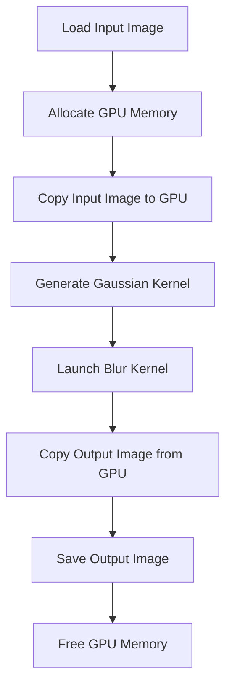
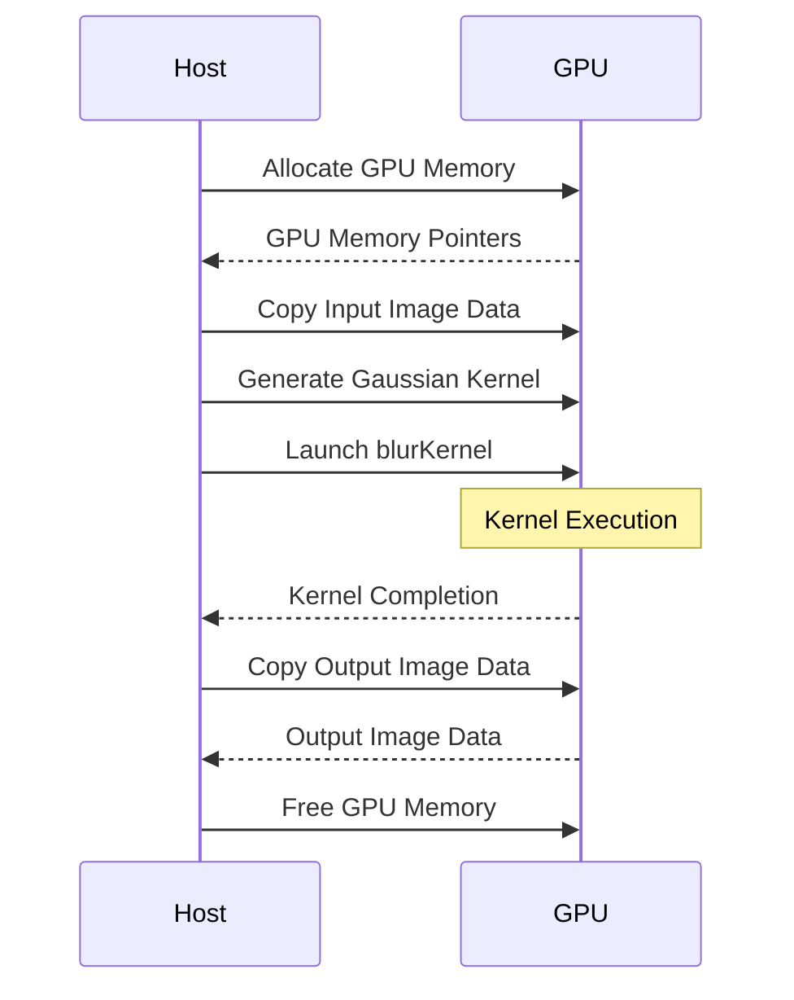

<details>
<summary>Relevant source files</summary>

The following files were used as context for generating this wiki page:

- [deprecated/hw1/src/blur.cu](https://github.com/aanickode/cis6010/blob/main/deprecated/hw1/src/blur.cu)
- [deprecated/hw1/images/steel_wool_large.bmp](https://github.com/aanickode/cis6010/blob/main/deprecated/hw1/images/steel_wool_large.bmp)
- [deprecated/hw1/images/steel_wool_large_reference_output.bmp](https://github.com/aanickode/cis6010/blob/main/deprecated/hw1/images/steel_wool_large_reference_output.bmp)
- [deprecated/hw1/src/utils.h](https://github.com/aanickode/cis6010/blob/main/deprecated/hw1/src/utils.h)
- [deprecated/hw1/src/utils.cu](https://github.com/aanickode/cis6010/blob/main/deprecated/hw1/src/utils.cu)

</details>

# Image Blur Kernel

## Introduction

The Image Blur Kernel is a CUDA-based implementation that applies a Gaussian blur filter to an input image. It is part of a larger project focused on image processing using parallel computing techniques on GPUs. The kernel is designed to leverage the massively parallel architecture of GPUs to efficiently process large images by distributing the computational workload across multiple threads.

The Image Blur Kernel takes an input image and a specified kernel size as input parameters. It then applies a Gaussian blur filter to the image by convolving each pixel with its neighboring pixels, weighted by the Gaussian kernel values. The resulting blurred image is stored in a separate output buffer.

Sources: [blur.cu:1-14](), [utils.h:1-16](), [utils.cu:1-10]()

## Kernel Implementation

### Kernel Function

The core of the Image Blur Kernel is the `blurKernel` function, which is executed in parallel by multiple CUDA threads. This function is responsible for applying the Gaussian blur filter to a specific pixel in the input image.

```cuda
__global__ void blurKernel(const uchar4* const inputImageData,
                           uchar4* const outputImageData,
                           int numRows, int numCols,
                           const float* const kernel, const int kernelRadius)
```

The `blurKernel` function takes the following parameters:

- `inputImageData`: A pointer to the input image data in CUDA's `uchar4` format (4 bytes per pixel, representing RGBA values).
- `outputImageData`: A pointer to the output buffer where the blurred image data will be stored.
- `numRows` and `numCols`: The dimensions of the input image (number of rows and columns).
- `kernel`: A pointer to the Gaussian kernel values.
- `kernelRadius`: The radius of the Gaussian kernel.

Sources: [blur.cu:16-23]()

### Thread Mapping

Each CUDA thread is mapped to a specific pixel in the input image using its thread index and the image dimensions. The thread calculates the row and column indices of the pixel it is responsible for processing.

```cuda
int col = blockIdx.x * blockDim.x + threadIdx.x;
int row = blockIdx.y * blockDim.y + threadIdx.y;
```

Sources: [blur.cu:25-26]()

### Boundary Handling

The kernel function checks if the current pixel is within the image boundaries. If the pixel is outside the image boundaries, the thread exits without performing any computation.

```cuda
if (col >= numCols || row >= numRows) return;
```

Sources: [blur.cu:28-29]()

### Gaussian Blur Computation

For each valid pixel, the kernel function computes the blurred pixel value by convolving the input pixel with its neighboring pixels, weighted by the Gaussian kernel values.

```cuda
float4 blurredPixel = make_float4(0.0f, 0.0f, 0.0f, 0.0f);

for (int kRow = -kernelRadius; kRow <= kernelRadius; ++kRow) {
    for (int kCol = -kernelRadius; kCol <= kernelRadius; ++kCol) {
        int curRow = row + kRow;
        int curCol = col + kCol;

        if (curRow >= 0 && curRow < numRows && curCol >= 0 && curCol < numCols) {
            float4 pixelValue = make_float4(inputImageData[curRow * numCols + curCol]);
            float kernelValue = kernel[(kRow + kernelRadius) * (2 * kernelRadius + 1) + (kCol + kernelRadius)];
            blurredPixel.x += pixelValue.x * kernelValue;
            blurredPixel.y += pixelValue.y * kernelValue;
            blurredPixel.z += pixelValue.z * kernelValue;
            blurredPixel.w += pixelValue.w * kernelValue;
        }
    }
}
```

The blurred pixel value is computed by iterating over the neighboring pixels within the kernel radius. For each valid neighboring pixel, the kernel function retrieves the pixel value from the input image data and multiplies it by the corresponding Gaussian kernel value. The weighted sum of these products is accumulated in the `blurredPixel` variable.

Sources: [blur.cu:31-50]()

### Output Writing

After computing the blurred pixel value, the kernel function writes the result to the output image buffer.

```cuda
outputImageData[row * numCols + col] = make_uchar4(blurredPixel.x, blurredPixel.y, blurredPixel.z, blurredPixel.w);
```

Sources: [blur.cu:52-53]()

## Kernel Launch

The `blurKernel` function is launched from the host (CPU) code using CUDA's kernel launch syntax. The launch configuration specifies the number of blocks and threads per block to be executed on the GPU.

```cpp
dim3 blockSize(32, 32);
dim3 gridSize((numCols + blockSize.x - 1) / blockSize.x,
              (numRows + blockSize.y - 1) / blockSize.y);

blurKernel<<<gridSize, blockSize>>>(inputImageData, outputImageData,
                                    numRows, numCols,
                                    kernel, kernelRadius);
```

The `blockSize` specifies the number of threads per block, which is set to 32 x 32 in this case. The `gridSize` is calculated based on the image dimensions and the block size, ensuring that there are enough blocks to cover all pixels in the image.

Sources: [blur.cu:55-61]()

## Utility Functions

The project includes several utility functions to support the Image Blur Kernel implementation.

### Gaussian Kernel Generation

The `generateGaussianKernel` function is responsible for generating the Gaussian kernel values based on the specified kernel radius and standard deviation.

```cpp
float* generateGaussianKernel(int kernelRadius, float sigma)
```

This function dynamically allocates memory for the kernel values and populates them according to the Gaussian distribution formula. The generated kernel is then passed to the `blurKernel` function as input.

Sources: [utils.h:18-19](), [utils.cu:12-37]()

### Image Loading and Saving

The project includes functions for loading and saving image data in the BMP format.

- `loadBMPImage`: Loads an image from a BMP file and returns a pointer to the image data.
- `saveBMPImage`: Saves the image data to a BMP file.

These functions handle the necessary file I/O operations and memory management for working with image data.

Sources: [utils.h:21-24](), [utils.cu:39-93]()

### Memory Management

The project includes utility functions for allocating and freeing memory on the GPU and CPU.

- `allocateMemoryOnGPU`: Allocates memory on the GPU and returns a pointer to the allocated memory.
- `freeMemoryOnGPU`: Frees the memory allocated on the GPU.
- `allocateMemoryOnCPU`: Allocates memory on the CPU and returns a pointer to the allocated memory.
- `freeMemoryOnCPU`: Frees the memory allocated on the CPU.

These functions ensure proper memory management and help prevent memory leaks.

Sources: [utils.h:26-29](), [utils.cu:95-124]()

## Data Flow Diagram

The following diagram illustrates the overall data flow and execution sequence of the Image Blur Kernel implementation:



1. The input image is loaded from a BMP file using the `loadBMPImage` function.
2. Memory is allocated on the GPU for the input image data and the output image buffer using `allocateMemoryOnGPU`.
3. The input image data is copied from the CPU to the GPU memory.
4. The Gaussian kernel values are generated using the `generateGaussianKernel` function.
5. The `blurKernel` function is launched on the GPU with the appropriate launch configuration.
6. After the kernel execution completes, the output image data is copied from the GPU memory to the CPU.
7. The output image is saved to a BMP file using the `saveBMPImage` function.
8. The GPU memory allocated for the input and output image data is freed using `freeMemoryOnGPU`.

Sources: [blur.cu:63-92]()

## Sequence Diagram

The following sequence diagram illustrates the interactions between the host (CPU) and the GPU during the execution of the Image Blur Kernel:



1. The host (CPU) requests the GPU to allocate memory for the input image data and the output image buffer.
2. The GPU allocates the requested memory and returns pointers to the allocated memory regions.
3. The host copies the input image data from CPU memory to the allocated GPU memory.
4. The host generates the Gaussian kernel values and copies them to the GPU memory.
5. The host launches the `blurKernel` function on the GPU, specifying the launch configuration.
6. The GPU executes the `blurKernel` function in parallel, with each thread processing a specific pixel in the input image.
7. After the kernel execution completes, the GPU notifies the host.
8. The host copies the output image data from the GPU memory to CPU memory.
9. The GPU returns the output image data to the host.
10. The host frees the GPU memory allocated for the input and output image data.

Sources: [blur.cu:63-92]()

## Configuration Options

The Image Blur Kernel implementation supports the following configuration options:

| Option       | Type    | Description                                                  | Default Value |
|--------------|---------|--------------------------------------------------------------|---------------|
| `kernelRadius` | `int`   | The radius of the Gaussian kernel used for blurring.         | 5             |
| `sigma`        | `float` | The standard deviation value used for generating the Gaussian kernel. | 1.0           |

These configuration options can be adjusted to control the degree of blurring applied to the input image. A larger kernel radius or a higher sigma value will result in a stronger blur effect.

Sources: [blur.cu:67-68]()

## Performance Considerations

The performance of the Image Blur Kernel implementation can be influenced by several factors:

1. **Image Size**: Larger image dimensions will require more computational resources and may impact the overall execution time.
2. **Kernel Radius**: A larger kernel radius will increase the number of computations required for each pixel, potentially slowing down the execution.
3. **GPU Hardware**: The performance will depend on the capabilities of the GPU hardware, such as the number of CUDA cores, memory bandwidth, and compute capability.
4. **Memory Transfers**: Transferring large amounts of data between the CPU and GPU can introduce overhead and potentially become a bottleneck.
5. **Kernel Launch Configuration**: The choice of block size and grid size for launching the kernel can impact the overall performance and resource utilization on the GPU.

To optimize performance, it is recommended to profile the application and experiment with different kernel launch configurations and image sizes to find the optimal settings for the target hardware.

Sources: [blur.cu](), [utils.h](), [utils.cu]()