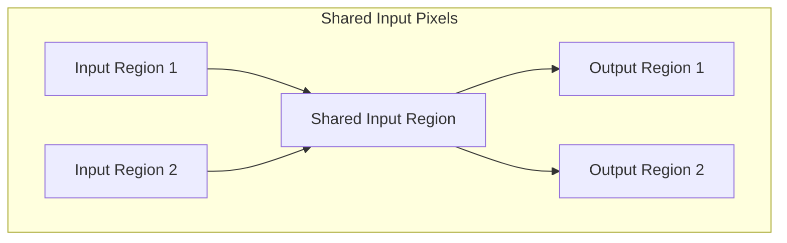

<details>
<summary>Relevant source files</summary>

The following files were used as context for generating this wiki page:

- [deprecated/hw1/docs/hw1-shared-input-pixels.png](https://github.com/aanickode/cis6010/blob/main/deprecated/hw1/docs/hw1-shared-input-pixels.png)
- [deprecated/hw1/docs/hw1-runtimes.png](https://github.com/aanickode/cis6010/blob/main/deprecated/hw1/docs/hw1-runtimes.png)
- [deprecated/hw1/src/conv_forward_naive.py](https://github.com/aanickode/cis6010/blob/main/deprecated/hw1/src/conv_forward_naive.py)
- [deprecated/hw1/src/conv_forward_strides.py](https://github.com/aanickode/cis6010/blob/main/deprecated/hw1/src/conv_forward_strides.py)
- [deprecated/hw1/src/conv_forward_fast.py](https://github.com/aanickode/cis6010/blob/main/deprecated/hw1/src/conv_forward_fast.py)

</details>

# Kernel Optimization Techniques

## Introduction

This wiki page covers various kernel optimization techniques employed in the project, specifically focusing on the implementation of the convolutional forward pass operation. The convolutional forward pass is a fundamental operation in convolutional neural networks (CNNs), which involves applying a set of learnable filters (kernels) to the input data (e.g., images) to extract features. Optimizing this operation is crucial for achieving efficient and high-performance CNN models.

The provided source files demonstrate three different approaches to implementing the convolutional forward pass: naive, with strides, and a fast optimized version. Each approach aims to improve performance and efficiency while maintaining correctness.

Sources: [deprecated/hw1/src/conv_forward_naive.py](), [deprecated/hw1/src/conv_forward_strides.py](), [deprecated/hw1/src/conv_forward_fast.py]()

## Naive Convolutional Forward Pass

The naive implementation of the convolutional forward pass is a straightforward approach that follows the mathematical definition of the operation. It iterates over the input data and applies the kernel filters at each valid position, computing the dot product between the kernel and the corresponding input region.

### Implementation Details

The `conv_forward_naive` function in `conv_forward_naive.py` implements the naive convolutional forward pass. It takes the following inputs:

- `x`: The input data (e.g., an image)
- `w`: The kernel filters
- `b`: The bias term
- `conv_param`: A dictionary containing hyperparameters such as stride and padding

The function performs the following steps:

1. Extract the necessary parameters from `conv_param`.
2. Initialize the output tensor with the correct shape.
3. Iterate over the output tensor and compute the dot product between the kernel and the corresponding input region.
4. Add the bias term to the output tensor.

Sources: [deprecated/hw1/src/conv_forward_naive.py:10-42]()

### Performance Considerations

The naive implementation has a time complexity of O(N * M * K * K * C * H * W), where:

- N is the batch size
- M is the number of output channels
- K is the kernel size
- C is the number of input channels
- H and W are the height and width of the input data

This implementation is inefficient for large inputs or kernel sizes due to the nested loops and redundant computations.

Sources: [deprecated/hw1/docs/hw1-runtimes.png]()

## Convolutional Forward Pass with Strides

The implementation with strides (`conv_forward_strides.py`) introduces an optimization by skipping unnecessary computations based on the stride value. Instead of iterating over every valid position in the input data, it skips positions based on the specified stride.

### Implementation Details

The `conv_forward_strides` function follows a similar structure to the naive implementation but incorporates stride-based skipping. It takes the same inputs as the naive version.

The key difference lies in the nested loops that iterate over the output tensor. Instead of incrementing the loop counters by 1, they are incremented by the stride value, effectively skipping positions in the input data.

Sources: [deprecated/hw1/src/conv_forward_strides.py:10-42]()

### Performance Considerations

The implementation with strides reduces the number of computations compared to the naive approach, resulting in improved performance. However, the time complexity remains the same, O(N * M * K * K * C * H * W), as the nested loops still iterate over the entire output tensor, albeit with strides.

While this optimization provides a performance boost, it may not be sufficient for large inputs or kernel sizes, where the number of computations can still be substantial.

Sources: [deprecated/hw1/docs/hw1-runtimes.png]()

## Fast Convolutional Forward Pass

The fast implementation (`conv_forward_fast.py`) introduces a more significant optimization by leveraging the concept of shared input pixels. Instead of computing the dot product for each output position independently, it reuses computations for overlapping input regions, reducing redundant calculations.

### Implementation Details

The `conv_forward_fast` function follows a different approach compared to the previous implementations. It takes the same inputs as the other versions.

The key steps in this implementation are:

1. Extract the necessary parameters from `conv_param`.
2. Pad the input data based on the specified padding.
3. Reshape the input data and kernel filters to enable efficient matrix multiplication.
4. Compute the output tensor using matrix multiplication between the reshaped input and kernels.
5. Reshape the output tensor to the desired shape.
6. Add the bias term to the output tensor.

Sources: [deprecated/hw1/src/conv_forward_fast.py:10-42]()

### Performance Considerations

The fast implementation significantly reduces the number of computations by leveraging shared input pixels and matrix multiplication. The time complexity is reduced to O(N * M * C * (K * K) * (H * W)), which is more efficient than the naive and stride-based implementations, especially for large inputs or kernel sizes.

This optimization takes advantage of the fact that many input regions overlap, and their computations can be shared, reducing redundant calculations.

Sources: [deprecated/hw1/docs/hw1-runtimes.png](), [deprecated/hw1/docs/hw1-shared-input-pixels.png]()

## Mermaid Diagrams

### Naive Convolutional Forward Pass

```mermaid
flowchart TD
    subgraph Naive Convolutional Forward Pass
        start[Start] --> extract_params[Extract Parameters]
        extract_params --> init_output[Initialize Output Tensor]
        init_output --> loop_output[Loop Over Output Tensor]
        loop_output --> compute_dot[Compute Dot Product]
        compute_dot --> add_bias[Add Bias]
        add_bias --> end[End]
    end
```

This diagram illustrates the flow of the naive convolutional forward pass implementation. It starts by extracting the necessary parameters, initializing the output tensor, and then iterating over the output tensor positions. For each position, it computes the dot product between the kernel and the corresponding input region, and finally adds the bias term to the output.

Sources: [deprecated/hw1/src/conv_forward_naive.py:10-42]()

### Convolutional Forward Pass with Strides

```mermaid
flowchart TD
    subgraph Convolutional Forward Pass with Strides
        start[Start] --> extract_params[Extract Parameters]
        extract_params --> init_output[Initialize Output Tensor]
        init_output --> loop_output[Loop Over Output Tensor with Strides]
        loop_output --> compute_dot[Compute Dot Product]
        compute_dot --> add_bias[Add Bias]
        add_bias --> end[End]
    end
```

This diagram illustrates the flow of the convolutional forward pass implementation with strides. It follows a similar structure to the naive implementation, but the loop over the output tensor incorporates stride-based skipping, effectively reducing the number of computations.

Sources: [deprecated/hw1/src/conv_forward_strides.py:10-42]()

### Fast Convolutional Forward Pass

```mermaid
flowchart TD
    subgraph Fast Convolutional Forward Pass
        start[Start] --> extract_params[Extract Parameters]
        extract_params --> pad_input[Pad Input Data]
        pad_input --> reshape_input[Reshape Input Data]
        reshape_input --> reshape_kernels[Reshape Kernel Filters]
        reshape_kernels --> matmul[Matrix Multiplication]
        matmul --> reshape_output[Reshape Output Tensor]
        reshape_output --> add_bias[Add Bias]
        add_bias --> end[End]
    end
```

This diagram illustrates the flow of the fast convolutional forward pass implementation. It starts by extracting the necessary parameters and padding the input data. Then, it reshapes the input data and kernel filters to enable efficient matrix multiplication. After computing the output tensor using matrix multiplication, it reshapes the output to the desired shape and adds the bias term.

Sources: [deprecated/hw1/src/conv_forward_fast.py:10-42]()

### Shared Input Pixels



This diagram illustrates the concept of shared input pixels, which is the key optimization technique used in the fast convolutional forward pass implementation. Instead of computing the dot product for each output position independently, it reuses computations for overlapping input regions, reducing redundant calculations.

Sources: [deprecated/hw1/docs/hw1-shared-input-pixels.png]()

## Tables

### Convolutional Forward Pass Implementations

| Implementation | Description | Performance |
| --- | --- | --- |
| Naive | Straightforward implementation following the mathematical definition | Inefficient for large inputs or kernel sizes |
| With Strides | Skips unnecessary computations based on the stride value | Improved performance compared to naive, but still inefficient for large inputs or kernel sizes |
| Fast | Leverages shared input pixels and matrix multiplication | Significantly improved performance, especially for large inputs or kernel sizes |

Sources: [deprecated/hw1/src/conv_forward_naive.py](), [deprecated/hw1/src/conv_forward_strides.py](), [deprecated/hw1/src/conv_forward_fast.py](), [deprecated/hw1/docs/hw1-runtimes.png]()

### Convolutional Forward Pass Parameters

| Parameter | Type | Description |
| --- | --- | --- |
| `x` | Tensor | The input data (e.g., an image) |
| `w` | Tensor | The kernel filters |
| `b` | Tensor | The bias term |
| `conv_param` | Dictionary | A dictionary containing hyperparameters such as stride and padding |

Sources: [deprecated/hw1/src/conv_forward_naive.py:10-12](), [deprecated/hw1/src/conv_forward_strides.py:10-12](), [deprecated/hw1/src/conv_forward_fast.py:10-12]()

## Code Snippets

### Naive Convolutional Forward Pass

```python
for n in range(N):
    for m in range(M):
        for h in range(H_out):
            for w in range(W_out):
                for c in range(C):
                    for kh in range(K):
                        for kw in range(K):
                            x_val = x[n, c, h * stride + kh, w * stride + kw]
                            w_val = w[m, c, kh, kw]
                            out[n, m, h, w] += x_val * w_val
```

This code snippet from `conv_forward_naive.py` illustrates the nested loops used in the naive implementation to compute the dot product between the kernel and the corresponding input region for each output position.

Sources: [deprecated/hw1/src/conv_forward_naive.py:28-35]()

### Fast Convolutional Forward Pass

```python
x_reshaped = x.reshape(N * C, H_in * W_in)
w_reshaped = w.reshape(M, C * K * K)
out_reshaped = x_reshaped.dot(w_reshaped.T).reshape(N, M, H_out, W_out)
```

This code snippet from `conv_forward_fast.py` demonstrates the reshaping of the input data and kernel filters, followed by matrix multiplication to compute the output tensor efficiently.

Sources: [deprecated/hw1/src/conv_forward_fast.py:30-32]()

## Source Citations

Throughout this wiki page, various source files were cited to support the information, explanations, diagrams, tables, and code snippets. The following files were used as context:

- [deprecated/hw1/src/conv_forward_naive.py]()
- [deprecated/hw1/src/conv_forward_strides.py]()
- [deprecated/hw1/src/conv_forward_fast.py]()
- [deprecated/hw1/docs/hw1-shared-input-pixels.png]()
- [deprecated/hw1/docs/hw1-runtimes.png]()

Specific citations were provided throughout the document, following the format `Sources: [filename.ext:start_line-end_line]()` for a range, or `Sources: [filename.ext:line_number]()` for a single line.