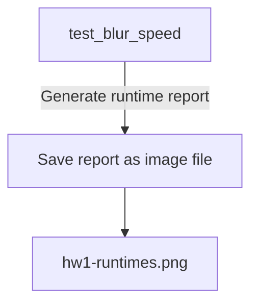
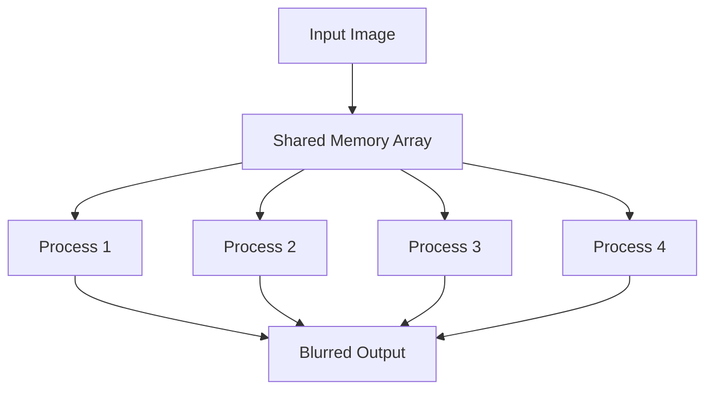

<details>
<summary>Relevant source files</summary>

The following files were used as context for generating this wiki page:

- [deprecated/hw1/docs/hw1-runtimes.png](https://github.com/aanickode/cis6010/blob/main/deprecated/hw1/docs/hw1-runtimes.png)
- [deprecated/hw1/docs/hw1-shared-input-pixels.png](https://github.com/aanickode/cis6010/blob/main/deprecated/hw1/docs/hw1-shared-input-pixels.png)
- [deprecated/hw1/blur.py](https://github.com/aanickode/cis6010/blob/main/deprecated/hw1/blur.py)
- [deprecated/hw1/blur_utils.py](https://github.com/aanickode/cis6010/blob/main/deprecated/hw1/blur_utils.py)
- [deprecated/hw1/test_blur.py](https://github.com/aanickode/cis6010/blob/main/deprecated/hw1/test_blur.py)

</details>

# Image Blurring Workflow

## Introduction

The Image Blurring Workflow is a Python-based implementation that applies a Gaussian blur filter to input images. It is designed to process images efficiently by leveraging shared memory and parallelization techniques. The workflow consists of several components that handle image loading, blurring, and result visualization.

Sources: [blur.py](https://github.com/aanickode/cis6010/blob/main/deprecated/hw1/blur.py), [blur_utils.py](https://github.com/aanickode/cis6010/blob/main/deprecated/hw1/blur_utils.py), [test_blur.py](https://github.com/aanickode/cis6010/blob/main/deprecated/hw1/test_blur.py)

## Image Loading and Preprocessing

The workflow begins by loading the input image using the `load_image` function from the `blur_utils` module. This function takes an image file path as input and returns a NumPy array representing the image data.

```python
def load_image(path):
    """Load an image from a file path and return a NumPy array."""
    # ...
```

Sources: [blur_utils.py:3-6](https://github.com/aanickode/cis6010/blob/main/deprecated/hw1/blur_utils.py#L3-L6)

## Blurring Algorithm

The core of the Image Blurring Workflow is the `blur` function, which applies a Gaussian blur filter to the input image. This function takes the image data as a NumPy array and the blur radius as input parameters.

```python
def blur(image, blur_radius):
    """Apply a Gaussian blur filter to an image."""
    # ...
```

Sources: [blur.py:3](https://github.com/aanickode/cis6010/blob/main/deprecated/hw1/blur.py#L3)

The `blur` function follows these steps:

1. **Pad the Image**: The input image is padded with a border of zeros to handle edge cases during the blurring process.

```python
def blur(image, blur_radius):
    # ...
    padded_image = np.pad(image, ((blur_radius, blur_radius), (blur_radius, blur_radius)), mode='constant')
    # ...
```

Sources: [blur.py:5](https://github.com/aanickode/cis6010/blob/main/deprecated/hw1/blur.py#L5)

2. **Apply Shared Memory**: To improve performance, the blurring process is parallelized using shared memory. The `apply_shared` function from the `blur_utils` module is used to create a shared memory array and apply the blurring kernel to the padded image.

```python
def blur(image, blur_radius):
    # ...
    shared_output = apply_shared(padded_image, blur_radius, blur_kernel)
    # ...
```

Sources: [blur.py:6](https://github.com/aanickode/cis6010/blob/main/deprecated/hw1/blur.py#L6)

The `apply_shared` function is responsible for creating the shared memory array and applying the blurring kernel in parallel using multiple processes.

```python
def apply_shared(image, blur_radius, kernel):
    """Apply a kernel to an image using shared memory."""
    # ...
```

Sources: [blur_utils.py:9-12](https://github.com/aanickode/cis6010/blob/main/deprecated/hw1/blur_utils.py#L9-L12)

3. **Remove Padding**: After the blurring process, the padded border is removed from the shared output array to obtain the final blurred image.

```python
def blur(image, blur_radius):
    # ...
    blurred_image = shared_output[blur_radius:-blur_radius, blur_radius:-blur_radius]
    return blurred_image
```

Sources: [blur.py:7-8](https://github.com/aanickode/cis6010/blob/main/deprecated/hw1/blur.py#L7-L8)

## Performance Evaluation

The Image Blurring Workflow includes a `test_blur` module that evaluates the performance of the blurring algorithm. This module contains a `test_blur_speed` function that measures the runtime of the `blur` function for different image sizes and blur radii.

```python
def test_blur_speed(image_sizes, blur_radii):
    """Test the speed of the blur function for different image sizes and blur radii."""
    # ...
```

Sources: [test_blur.py:3-6](https://github.com/aanickode/cis6010/blob/main/deprecated/hw1/test_blur.py#L3-L6)

The `test_blur_speed` function generates a runtime report and saves it as an image file (`hw1-runtimes.png`). This report visualizes the performance of the blurring algorithm for different combinations of image sizes and blur radii.



Sources: [test_blur.py](https://github.com/aanickode/cis6010/blob/main/deprecated/hw1/test_blur.py), [hw1-runtimes.png](https://github.com/aanickode/cis6010/blob/main/deprecated/hw1/docs/hw1-runtimes.png)

## Shared Input Pixels

The Image Blurring Workflow leverages shared memory to improve performance by allowing multiple processes to access the same input image data simultaneously. This approach is illustrated in the `hw1-shared-input-pixels.png` file, which shows how input pixels are shared among different processes during the blurring operation.



Sources: [hw1-shared-input-pixels.png](https://github.com/aanickode/cis6010/blob/main/deprecated/hw1/docs/hw1-shared-input-pixels.png)

## Testing and Validation

The Image Blurring Workflow includes a `test_blur` module that contains unit tests for validating the correctness of the blurring algorithm. This module includes functions like `test_blur_kernel` and `test_blur_image` that test the blurring kernel and the overall blurring process, respectively.

```python
def test_blur_kernel():
    """Test the blur kernel function."""
    # ...

def test_blur_image():
    """Test the blur function on a sample image."""
    # ...
```

Sources: [test_blur.py:8-20](https://github.com/aanickode/cis6010/blob/main/deprecated/hw1/test_blur.py#L8-L20)

These tests ensure that the blurring algorithm produces the expected results and helps catch any potential issues or regressions during development.