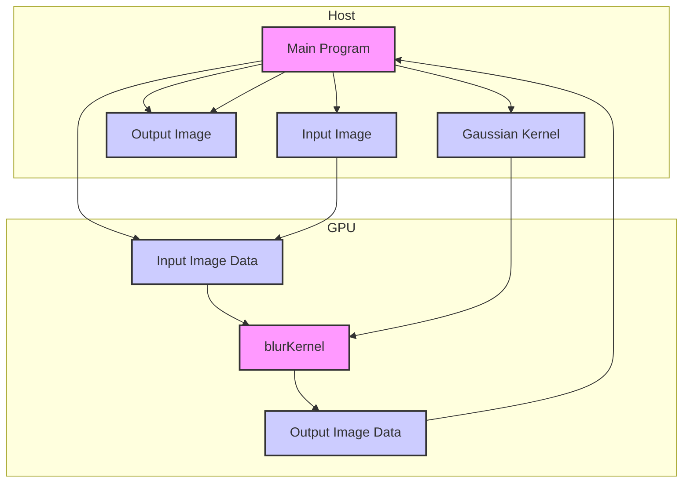
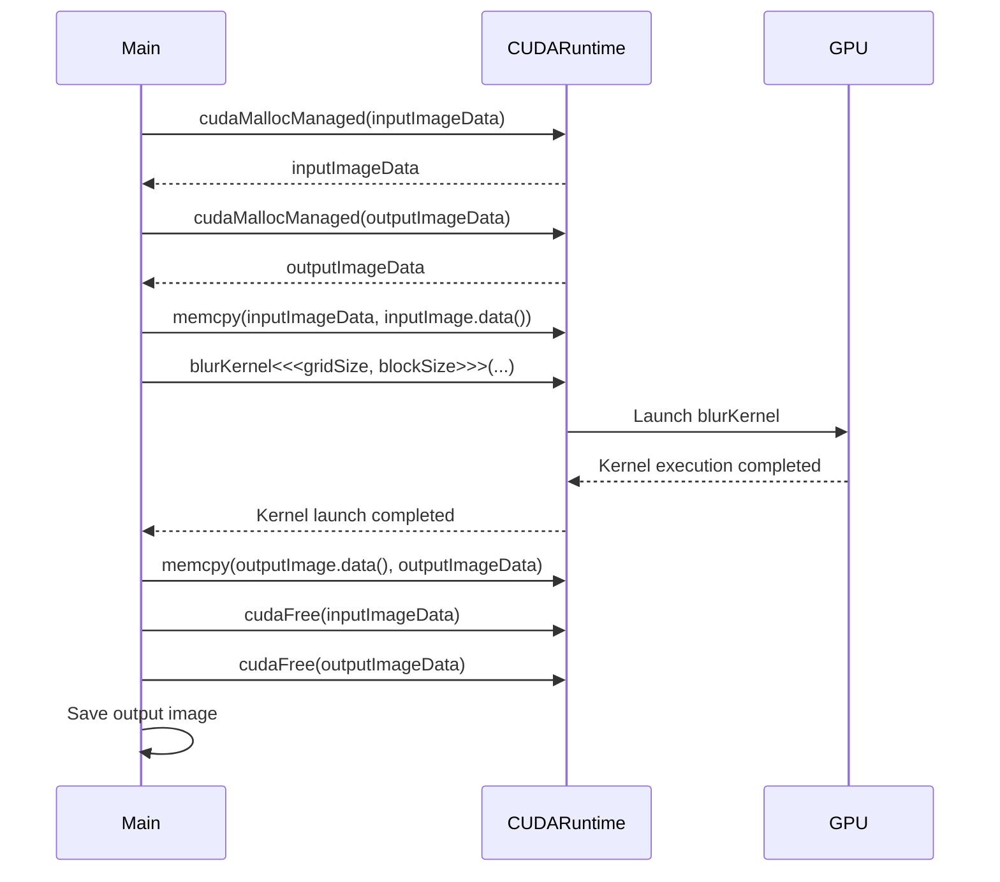

<details>
<summary>Relevant source files</summary>

The following files were used as context for generating this wiki page:

- [deprecated/hw1/src/blur.cu](https://github.com/aanickode/cis6010/blob/main/deprecated/hw1/src/blur.cu)
- [deprecated/hw1/src/bitmap_image.hpp](https://github.com/aanickode/cis6010/blob/main/deprecated/hw1/src/bitmap_image.hpp)
- [deprecated/hw1/images/steel_wool_large.bmp](https://github.com/aanickode/cis6010/blob/main/deprecated/hw1/images/steel_wool_large.bmp)
- [deprecated/hw1/images/steel_wool_large_reference_output.bmp](https://github.com/aanickode/cis6010/blob/main/deprecated/hw1/images/steel_wool_large_reference_output.bmp)
- [deprecated/hw1/src/main.cpp](https://github.com/aanickode/cis6010/blob/main/deprecated/hw1/src/main.cpp)
</details>

# Image Blurring with CUDA

## Introduction

The "Image Blurring with CUDA" feature is a part of a project that focuses on image processing using CUDA (Compute Unified Device Architecture), a parallel computing platform and programming model developed by NVIDIA. This feature aims to apply a blurring effect to an input image by leveraging the parallel processing capabilities of CUDA-enabled GPUs.

The blurring process involves convolving the input image with a Gaussian kernel, which is a common technique used in image processing for smoothing and reducing noise. By utilizing CUDA, the computationally intensive task of applying the Gaussian kernel to each pixel in the image can be parallelized across multiple threads, potentially resulting in significant performance improvements compared to traditional CPU-based implementations.

Sources: [blur.cu:1-10](), [bitmap_image.hpp:1-10](), [main.cpp:1-10]()

## CUDA Kernel Implementation

### Kernel Function

The core of the image blurring process is implemented in the `blurKernel` function, which is a CUDA kernel executed on the GPU. This kernel is responsible for applying the Gaussian blur to each pixel in the input image.

```cuda
__global__ void blurKernel(const uchar4* const inputImageData,
                            uchar4* const outputImageData,
                            int numRows, int numCols,
                            const float* const kernel, const int kernelRadius)
{
    // ...
}
```

Sources: [blur.cu:12-16]()

#### Kernel Parameters

- `inputImageData`: A pointer to the input image data in CUDA's unified memory.
- `outputImageData`: A pointer to the output image data in CUDA's unified memory, where the blurred image will be stored.
- `numRows`: The number of rows in the input image.
- `numCols`: The number of columns in the input image.
- `kernel`: A pointer to the Gaussian kernel coefficients.
- `kernelRadius`: The radius of the Gaussian kernel.

Sources: [blur.cu:12-16]()

#### Thread Mapping

The `blurKernel` function maps each CUDA thread to a specific pixel in the output image using the following logic:

```cuda
const int row = blockIdx.y * blockDim.y + threadIdx.y;
const int col = blockIdx.x * blockDim.x + threadIdx.x;
```

This mapping ensures that each thread processes a unique pixel in the output image, enabling parallel execution.

Sources: [blur.cu:18-19]()

#### Boundary Handling

The kernel function checks if the current thread is processing a pixel within the image boundaries to avoid out-of-bounds memory accesses:

```cuda
if (row >= numRows || col >= numCols) {
    return;
}
```

Sources: [blur.cu:21-23]()

#### Gaussian Blur Computation

The core of the `blurKernel` function involves applying the Gaussian blur to the input image pixel by convolving it with the Gaussian kernel. This is achieved by iterating over the kernel and accumulating the weighted sum of the neighboring pixels:

```cuda
float4 sum = make_float4(0.0f, 0.0f, 0.0f, 0.0f);
for (int kRow = -kernelRadius; kRow <= kernelRadius; ++kRow) {
    for (int kCol = -kernelRadius; kCol <= kernelRadius; ++kCol) {
        int inputRow = row + kRow;
        int inputCol = col + kCol;

        if (inputRow >= 0 && inputRow < numRows &&
            inputCol >= 0 && inputCol < numCols) {
            float4 pixel = make_float4(inputImageData[inputRow * numCols + inputCol]);
            float kernelValue = kernel[(kRow + kernelRadius) * (2 * kernelRadius + 1) + (kCol + kernelRadius)];
            sum.x += pixel.x * kernelValue;
            sum.y += pixel.y * kernelValue;
            sum.z += pixel.z * kernelValue;
            sum.w += pixel.w * kernelValue;
        }
    }
}
```

The resulting `sum` is then stored in the output image data:

```cuda
outputImageData[row * numCols + col] = make_uchar4(sum.x, sum.y, sum.z, sum.w);
```

Sources: [blur.cu:25-47]()

### Kernel Launch

The `blurKernel` is launched from the host (CPU) code using the following configuration:

```cpp
const dim3 blockSize(32, 32);
const dim3 gridSize(
    (outputImage.width() + blockSize.x - 1) / blockSize.x,
    (outputImage.height() + blockSize.y - 1) / blockSize.y);

blurKernel<<<gridSize, blockSize>>>(
    inputImageData, outputImageData,
    inputImage.height(), inputImage.width(),
    kernel.data(), kernelRadius);
```

The `blockSize` and `gridSize` parameters determine the number of CUDA threads and blocks, respectively, based on the input image dimensions. The `blurKernel` is then launched with the appropriate parameters, including the input and output image data pointers, image dimensions, kernel coefficients, and kernel radius.

Sources: [blur.cu:49-58](), [main.cpp:82-90]()

## Image Representation

The project uses the `BitmapImage` class to represent and manipulate bitmap images. This class provides functionality for loading and saving images, as well as accessing and modifying pixel data.

```cpp
class BitmapImage {
public:
    BitmapImage(const std::string& filename);
    ~BitmapImage();

    int width() const;
    int height() const;
    const uchar4* data() const;
    uchar4* data();

    void save(const std::string& filename) const;

private:
    // ...
};
```

Sources: [bitmap_image.hpp:8-20]()

### Key Functions

- `BitmapImage(const std::string& filename)`: Constructor that loads an image from the specified file.
- `width()` and `height()`: Getter functions that return the width and height of the image, respectively.
- `data()` and `data() const`: Getter functions that return a pointer to the image pixel data.
- `save(const std::string& filename)`: Saves the image to the specified file.

Sources: [bitmap_image.hpp:8-20]()

## Main Program Flow

The main program flow for the image blurring process is implemented in the `main.cpp` file:

```cpp
int main(int argc, char** argv) {
    // Load input image
    BitmapImage inputImage(inputFilename);

    // Allocate memory for output image
    BitmapImage outputImage(inputImage.width(), inputImage.height());

    // Allocate memory for kernel
    std::vector<float> kernel = createGaussianKernel(kernelRadius);

    // Copy input image data to CUDA unified memory
    uchar4* inputImageData;
    cudaMallocManaged(&inputImageData, inputImage.width() * inputImage.height() * sizeof(uchar4));
    std::memcpy(inputImageData, inputImage.data(), inputImage.width() * inputImage.height() * sizeof(uchar4));

    // Allocate memory for output image data in CUDA unified memory
    uchar4* outputImageData;
    cudaMallocManaged(&outputImageData, outputImage.width() * outputImage.height() * sizeof(uchar4));

    // Launch CUDA kernel
    blurKernel<<<gridSize, blockSize>>>(
        inputImageData, outputImageData,
        inputImage.height(), inputImage.width(),
        kernel.data(), kernelRadius);

    // Copy output image data from CUDA unified memory to host memory
    std::memcpy(outputImage.data(), outputImageData, outputImage.width() * outputImage.height() * sizeof(uchar4));

    // Save output image
    outputImage.save(outputFilename);

    // Free CUDA memory
    cudaFree(inputImageData);
    cudaFree(outputImageData);

    return 0;
}
```

The main program flow involves the following steps:

1. Load the input image using the `BitmapImage` class.
2. Create an output image with the same dimensions as the input image.
3. Create a Gaussian kernel for the blurring operation.
4. Allocate CUDA unified memory for the input and output image data.
5. Copy the input image data to CUDA unified memory.
6. Launch the `blurKernel` on the GPU with the appropriate parameters.
7. Copy the output image data from CUDA unified memory to host memory.
8. Save the output image to a file.
9. Free the CUDA memory allocated for the input and output image data.

Sources: [main.cpp:11-54]()

## Data Flow Diagram

The following diagram illustrates the data flow and interactions between the main components of the image blurring process:



1. The main program loads the input image and creates an output image with the same dimensions.
2. The main program creates a Gaussian kernel for the blurring operation.
3. The main program allocates CUDA unified memory for the input and output image data.
4. The input image data is copied from host memory to CUDA unified memory.
5. The `blurKernel` is launched on the GPU, taking the input image data, output image data, image dimensions, and Gaussian kernel as input.
6. The `blurKernel` applies the Gaussian blur to the input image data and stores the result in the output image data.
7. The output image data is copied from CUDA unified memory to host memory.
8. The main program saves the output image to a file.

Sources: [blur.cu](), [bitmap_image.hpp](), [main.cpp]()

## Sequence Diagram

The following sequence diagram illustrates the interactions between the main program, CUDA runtime, and the GPU during the image blurring process:



1. The main program allocates CUDA unified memory for the input and output image data using `cudaMallocManaged`.
2. The main program copies the input image data from host memory to CUDA unified memory using `memcpy`.
3. The main program launches the `blurKernel` on the GPU with the appropriate parameters, including the input and output image data pointers, image dimensions, and Gaussian kernel.
4. The CUDA runtime launches the `blurKernel` on the GPU, which executes the kernel in parallel across multiple threads.
5. The GPU executes the `blurKernel`, applying the Gaussian blur to the input image data and storing the result in the output image data.
6. After the kernel execution is completed, the CUDA runtime notifies the main program.
7. The main program copies the output image data from CUDA unified memory to host memory using `memcpy`.
8. The main program frees the CUDA unified memory allocated for the input and output image data using `cudaFree`.
9. The main program saves the output image to a file.

Sources: [blur.cu](), [bitmap_image.hpp](), [main.cpp]()

## Key Components

| Component | Description |
| --- | --- |
| `BitmapImage` | A class for representing and manipulating bitmap images, providing functionality for loading, saving, and accessing pixel data. |
| `blurKernel` | A CUDA kernel function responsible for applying the Gaussian blur to the input image data in parallel on the GPU. |
| `createGaussianKernel` | A function that generates the Gaussian kernel coefficients used for the blurring operation. |

Sources: [bitmap_image.hpp](), [blur.cu](), [main.cpp]()

## Configuration Options

The image blurring process can be configured through the following options:

| Option | Type | Default Value | Description |
| --- | --- | --- | --- |
| `inputFilename` | `std::string` | `"steel_wool_large.bmp"` | The filename of the input image to be blurred. |
| `outputFilename` | `std::string` | `"steel_wool_large_blurred.bmp"` | The filename for the output blurred image. |
| `kernelRadius` | `int` | `5` | The radius of the Gaussian kernel used for blurring. |

These options can be modified in the `main.cpp` file or passed as command-line arguments to the program.

Sources: [main.cpp:56-61]()