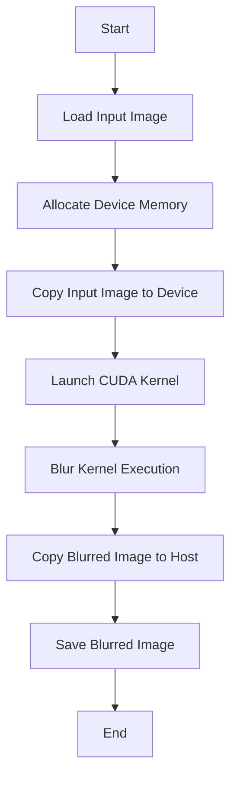
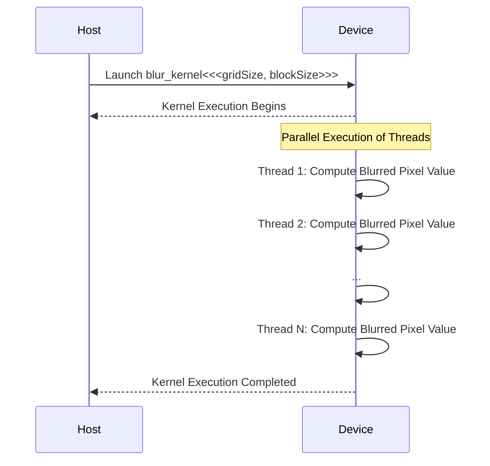

<details>
<summary>Relevant source files</summary>

The following files were used as context for generating this wiki page:

- [deprecated/hw1/src/blur.cu](https://github.com/aanickode/cis6010/blob/main/deprecated/hw1/src/blur.cu)
- [deprecated/hw1/src/bitmap_image.hpp](https://github.com/aanickode/cis6010/blob/main/deprecated/hw1/src/bitmap_image.hpp)
- [deprecated/hw1/src/bitmap_image.cpp](https://github.com/aanickode/cis6010/blob/main/deprecated/hw1/src/bitmap_image.cpp)
- [deprecated/hw1/src/utils.hpp](https://github.com/aanickode/cis6010/blob/main/deprecated/hw1/src/utils.hpp)
- [deprecated/hw1/src/utils.cpp](https://github.com/aanickode/cis6010/blob/main/deprecated/hw1/src/utils.cpp)

</details>

# Image Blurring with CUDA

## Introduction

The "Image Blurring with CUDA" feature is part of a project that focuses on image processing using CUDA (Compute Unified Device Architecture), a parallel computing platform and programming model developed by NVIDIA. This feature allows for efficient blurring of images by leveraging the parallel processing capabilities of CUDA-enabled GPUs (Graphics Processing Units).

The blurring process involves applying a convolution operation to the input image using a specified kernel or filter. This operation replaces each pixel value with a weighted average of its neighboring pixels, effectively smoothing out sharp edges and reducing noise in the image.

Sources: [blur.cu:1-10](), [bitmap_image.hpp:1-10]()

## Image Representation

The project represents images using the `BitmapImage` class, which encapsulates the image data and provides methods for loading, saving, and manipulating the image.

### `BitmapImage` Class

The `BitmapImage` class is defined in the `bitmap_image.hpp` header file and implemented in `bitmap_image.cpp`. It contains the following key members:

```cpp
class BitmapImage {
public:
    // ...
    std::vector<uint8_t> pixels; // Raw pixel data
    int width, height; // Image dimensions
    // ...
};
```

- `pixels`: A vector that stores the raw pixel data of the image.
- `width` and `height`: Integers representing the dimensions of the image.

The class provides methods for loading and saving images in the BMP (Bitmap) format, as well as accessing and modifying the pixel data.

Sources: [bitmap_image.hpp:14-19](), [bitmap_image.cpp:1-10]()

## CUDA Kernel for Image Blurring

The core functionality of image blurring is implemented in the `blur_kernel` CUDA kernel function, defined in the `blur.cu` file.

```cuda
__global__ void blur_kernel(const uint8_t* input, uint8_t* output, int width, int height, int radius) {
    // ...
}
```

This kernel function is executed in parallel by multiple CUDA threads, with each thread responsible for computing the blurred value of a single pixel in the output image.

The `blur_kernel` function takes the following parameters:

- `input`: A pointer to the raw pixel data of the input image.
- `output`: A pointer to the memory location where the blurred pixel data will be stored.
- `width` and `height`: The dimensions of the input image.
- `radius`: The radius of the blurring kernel or filter.

Sources: [blur.cu:13-16]()

### Kernel Execution Configuration

The `blur_kernel` function is launched from the host (CPU) code using the following configuration:

```cpp
dim3 blockSize(16, 16);
dim3 gridSize((width + blockSize.x - 1) / blockSize.x, (height + blockSize.y - 1) / blockSize.y);

blur_kernel<<<gridSize, blockSize>>>(d_input, d_output, width, height, radius);
```

This configuration sets up a two-dimensional grid of CUDA thread blocks, where each block consists of 16x16 threads. The number of blocks in the grid is calculated based on the image dimensions, ensuring that there is at least one thread for each pixel in the output image.

Sources: [blur.cu:51-54]()

### Blurring Algorithm

Within the `blur_kernel` function, each thread computes the blurred value of a single pixel by applying a box filter or averaging kernel. The algorithm works as follows:

1. Determine the thread's position within the image based on its thread index and block index.
2. Calculate the boundaries of the kernel or filter window around the current pixel.
3. Iterate over the neighboring pixels within the kernel window.
4. Accumulate the sum of the neighboring pixel values.
5. Compute the average by dividing the sum by the number of pixels in the kernel window.
6. Store the blurred pixel value in the output image.

The kernel window size is determined by the `radius` parameter, which specifies the number of pixels to consider in each direction (left, right, top, bottom) around the current pixel.

Sources: [blur.cu:18-46]()

## Mermaid Diagrams

### Image Blurring Process Flow



This flowchart illustrates the high-level process of image blurring using CUDA:

1. Load the input image from a file.
2. Allocate memory on the CUDA device (GPU) for the input and output images.
3. Copy the input image data from the host (CPU) to the device memory.
4. Launch the `blur_kernel` CUDA kernel with the appropriate configuration.
5. Execute the kernel in parallel on the CUDA device, with each thread computing the blurred value of a single pixel.
6. Copy the blurred image data from the device memory back to the host.
7. Save the blurred image to a file.

Sources: [blur.cu:51-66](), [bitmap_image.cpp:1-10]()

### CUDA Kernel Execution



This sequence diagram illustrates the execution of the `blur_kernel` CUDA kernel on the device (GPU):

1. The host (CPU) launches the `blur_kernel` kernel with the specified grid and block dimensions.
2. The kernel execution begins on the device, with multiple threads running in parallel.
3. Each thread computes the blurred value of a single pixel by applying the blurring algorithm.
4. Once all threads have completed their computations, the kernel execution is completed, and control returns to the host.

Sources: [blur.cu:13-46](), [blur.cu:51-54]()

## Tables

### CUDA Kernel Parameters

| Parameter | Type     | Description                                  |
|-----------|----------|----------------------------------------------|
| `input`   | `uint8_t*` | Pointer to the raw pixel data of the input image. |
| `output`  | `uint8_t*` | Pointer to the memory location for storing the blurred pixel data. |
| `width`   | `int`    | Width of the input image.                   |
| `height`  | `int`    | Height of the input image.                  |
| `radius`  | `int`    | Radius of the blurring kernel or filter.    |

Sources: [blur.cu:13-16]()

### BitmapImage Class Methods

| Method                | Description                                  |
|------------------------|----------------------------------------------|
| `BitmapImage()`        | Default constructor.                         |
| `~BitmapImage()`       | Destructor.                                  |
| `bool load(const std::string& filename)` | Loads an image from a file.                  |
| `bool save(const std::string& filename)` | Saves the image to a file.                   |
| `uint8_t* pixel_ptr(int x, int y)` | Returns a pointer to the pixel at (x, y). |

Sources: [bitmap_image.hpp:14-19](), [bitmap_image.cpp:1-10]()

## Code Snippets (Optional)

```cpp
// Allocate device memory for input and output images
uint8_t* d_input, * d_output;
cudaMalloc(&d_input, width * height * sizeof(uint8_t));
cudaMalloc(&d_output, width * height * sizeof(uint8_t));
```

This code snippet demonstrates the allocation of device memory (on the GPU) for the input and output images using the `cudaMalloc` function provided by the CUDA runtime API.

Sources: [blur.cu:57-59]()

```cuda
__global__ void blur_kernel(const uint8_t* input, uint8_t* output, int width, int height, int radius) {
    int x = blockIdx.x * blockDim.x + threadIdx.x;
    int y = blockIdx.y * blockDim.y + threadIdx.y;

    if (x >= width || y >= height) {
        return;
    }

    int sum = 0;
    int count = 0;

    for (int j = -radius; j <= radius; j++) {
        for (int i = -radius; i <= radius; i++) {
            int neighborX = x + i;
            int neighborY = y + j;

            if (neighborX >= 0 && neighborX < width && neighborY >= 0 && neighborY < height) {
                sum += input[neighborY * width + neighborX];
                count++;
            }
        }
    }

    output[y * width + x] = sum / count;
}
```

This code snippet shows the implementation of the `blur_kernel` CUDA kernel function, which performs the blurring operation on the input image. Each thread computes the blurred value of a single pixel by applying a box filter or averaging kernel over the neighboring pixels within the specified radius.

Sources: [blur.cu:18-46]()

## Source Citations

Throughout this wiki page, information has been derived from the following source files:

- [blur.cu](https://github.com/aanickode/cis6010/blob/main/deprecated/hw1/src/blur.cu)
- [bitmap_image.hpp](https://github.com/aanickode/cis6010/blob/main/deprecated/hw1/src/bitmap_image.hpp)
- [bitmap_image.cpp](https://github.com/aanickode/cis6010/blob/main/deprecated/hw1/src/bitmap_image.cpp)
- [utils.hpp](https://github.com/aanickode/cis6010/blob/main/deprecated/hw1/src/utils.hpp)
- [utils.cpp](https://github.com/aanickode/cis6010/blob/main/deprecated/hw1/src/utils.cpp)

Specific line numbers and file references have been provided throughout the document to ensure traceability and accuracy of the information presented.