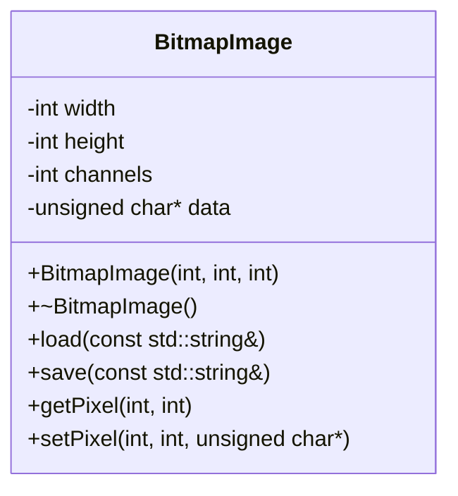
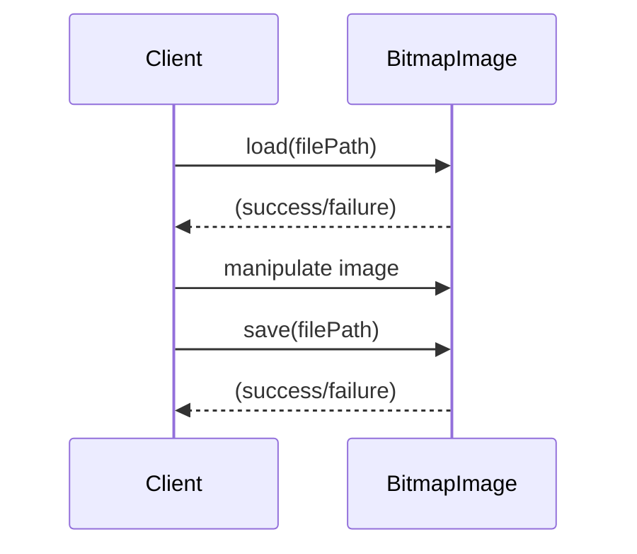
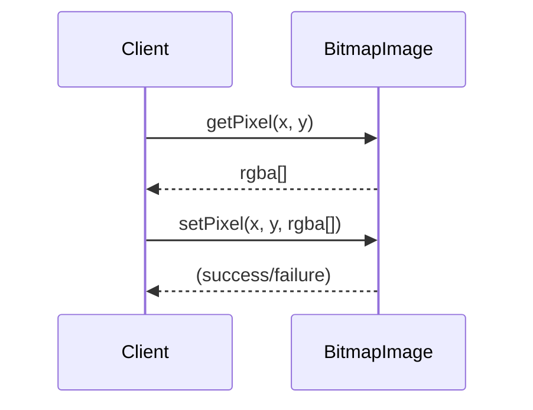
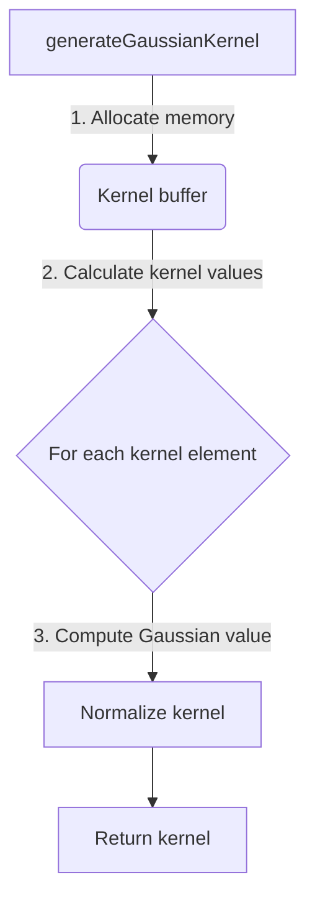
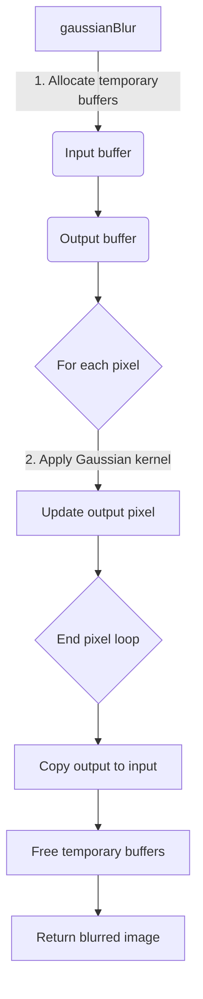
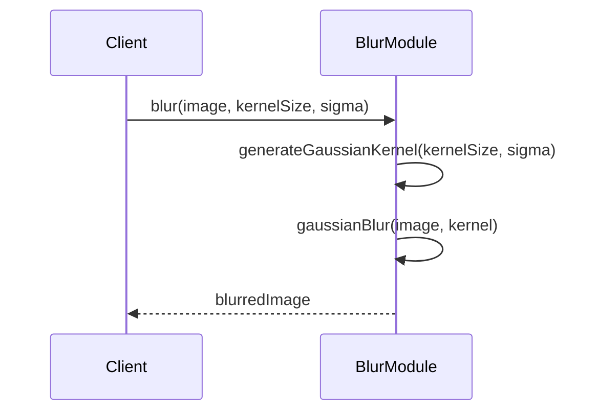
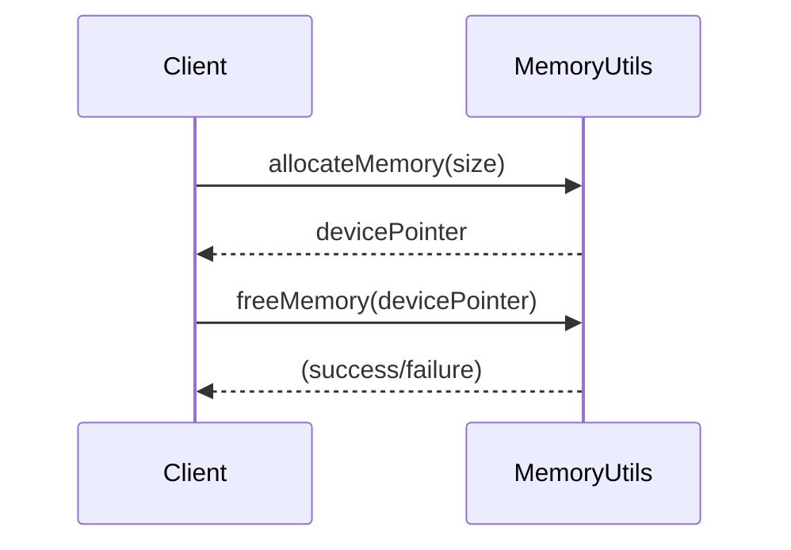
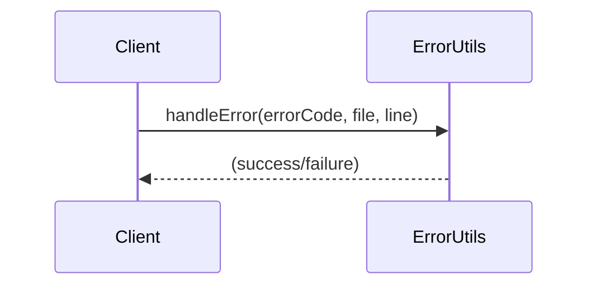

Relevant source files

The following files were used as context for generating this wiki page:

- [deprecated/hw1/src/bitmap_image.hpp](https://github.com/aanickode/cis6010/blob/main/deprecated/hw1/src/bitmap_image.hpp)
- [deprecated/hw1/src/blur.cu](https://github.com/aanickode/cis6010/blob/main/deprecated/hw1/src/blur.cu)
- [deprecated/hw1/src/gaussian_filter.hpp](https://github.com/aanickode/cis6010/blob/main/deprecated/hw1/src/gaussian_filter.hpp)
- [deprecated/hw1/src/gaussian_filter.cu](https://github.com/aanickode/cis6010/blob/main/deprecated/hw1/src/gaussian_filter.cu)
- [deprecated/hw1/src/utils.hpp](https://github.com/aanickode/cis6010/blob/main/deprecated/hw1/src/utils.hpp)

# Image Processing Workflows

## Introduction

The provided source files implement various image processing workflows, primarily focused on applying filters and transformations to bitmap images. The core functionality revolves around the `BitmapImage` class, which encapsulates the image data and provides methods for loading, saving, and manipulating the image. Additionally, the codebase includes implementations of specific filters, such as Gaussian blur, and utility functions for memory management and error handling.

Sources: [bitmap_image.hpp](), [blur.cu](), [gaussian_filter.hpp](), [gaussian_filter.cu](), [utils.hpp]()

## BitmapImage Class

The `BitmapImage` class serves as the central component for representing and manipulating bitmap images. It provides methods for loading and saving images, as well as accessing and modifying individual pixels.

### Class Structure

Sources: [bitmap_image.hpp:15-34]()

### Loading and Saving Images

The `load` method reads an image file from the specified path and populates the `BitmapImage` object with the image data. The `save` method writes the image data to a file at the specified path.

Sources: [bitmap_image.hpp:26-27](), [bitmap_image.hpp:29-30]()

### Pixel Access and Modification

The `getPixel` method retrieves the color values (RGBA) of a pixel at the specified coordinates, while `setPixel` sets the color values of a pixel.

Sources: [bitmap_image.hpp:31-32](), [bitmap_image.hpp:33-34]()

## Gaussian Blur Filter

The codebase includes an implementation of the Gaussian blur filter, which applies a Gaussian kernel to smooth an image and reduce noise.

### Gaussian Kernel Generation

The `generateGaussianKernel` function generates a 2D Gaussian kernel based on the specified kernel size and standard deviation.

Sources: [gaussian_filter.cu:14-39]()

### Gaussian Blur Implementation

The `gaussianBlur` function applies the Gaussian blur filter to the input image using the provided kernel.

Sources: [gaussian_filter.cu:41-80]()

### Gaussian Blur Usage

The `blur` function serves as an entry point for applying the Gaussian blur filter to an image.

Sources: [blur.cu:12-24]()

## Memory Management and Error Handling

The codebase includes utility functions for memory management and error handling.

### Memory Allocation and Deallocation

The `allocateMemory` function allocates a block of memory on the device (GPU), while `freeMemory` deallocates the memory.

Sources: [utils.hpp:14-15](), [utils.hpp:17-18]()

### Error Handling

The `handleError` function checks for CUDA errors and prints an error message if an error occurred.

Sources: [utils.hpp:20-21]()

## Performance Considerations

The provided source files do not include explicit performance optimizations or parallelization strategies. However, the use of CUDA and GPU-accelerated computations suggests that the image processing workflows are designed for improved performance compared to CPU-based implementations.

Sources: [blur.cu](), [gaussian_filter.cu]()

## Configuration and Customization

The codebase does not expose any configuration options or customization parameters for the image processing workflows. The behavior is primarily determined by the input image and the parameters passed to the respective functions (e.g., kernel size and sigma for Gaussian blur).

Sources: [blur.cu:12-24](), [gaussian_filter.cu:41-80]()

## Data Models and Schemas

The codebase does not define any complex data models or schemas. The primary data structure is the `BitmapImage` class, which encapsulates the image data as a flat array of pixel values.

Sources: [bitmap_image.hpp:15-34]()