<details>
<summary>Relevant source files</summary>

The following files were used as context for generating this wiki page:

- [gemm/cugemm.cu](https://github.com/aanickode/cis6010/blob/main/gemm/cugemm.cu)
- [gemm/gemm.cu](https://github.com/aanickode/cis6010/blob/main/gemm/gemm.cu)
- [gemm/gemm.h](https://github.com/aanickode/cis6010/blob/main/gemm/gemm.h)
- [gemm/utils.h](https://github.com/aanickode/cis6010/blob/main/gemm/utils.h)
- [gemm/utils.cu](https://github.com/aanickode/cis6010/blob/main/gemm/utils.cu)
</details>

# CUDA GEMM Implementation

## Introduction

The CUDA GEMM Implementation is a parallel matrix multiplication implementation using NVIDIA's CUDA framework for GPU computing. It performs the general matrix multiplication operation (GEMM) on two input matrices, A and B, to produce an output matrix C, where C = A * B. This implementation leverages the massively parallel architecture of GPUs to accelerate the computationally intensive matrix multiplication operation.

Sources: [gemm/cugemm.cu](), [gemm/gemm.cu](), [gemm/gemm.h]()

## Architecture Overview

The CUDA GEMM Implementation follows a hierarchical design, where the matrix multiplication is divided into smaller sub-problems that can be executed in parallel on the GPU's streaming multiprocessors (SMs).

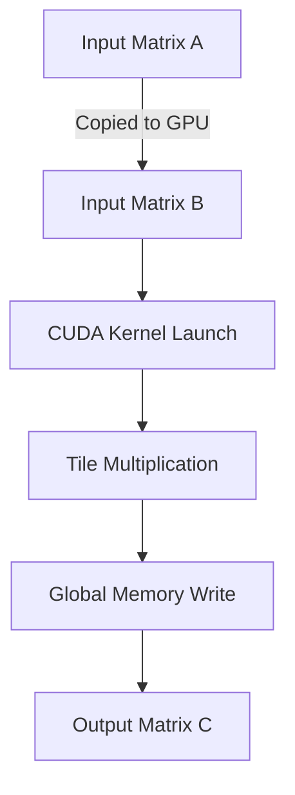

The main steps in the CUDA GEMM Implementation are:

1. Copy input matrices A and B from host (CPU) memory to device (GPU) memory.
2. Launch the CUDA kernel, which performs the matrix multiplication in parallel on the GPU.
3. Within the kernel, divide the matrices into smaller tiles and perform tile multiplication in parallel.
4. Write the computed tile results to the output matrix C in global memory.
5. Copy the output matrix C from device memory back to host memory.

Sources: [gemm/cugemm.cu:28-50](), [gemm/gemm.cu:14-25]()

## CUDA Kernel

The CUDA kernel is the core of the GEMM implementation, where the actual matrix multiplication is performed in parallel on the GPU.

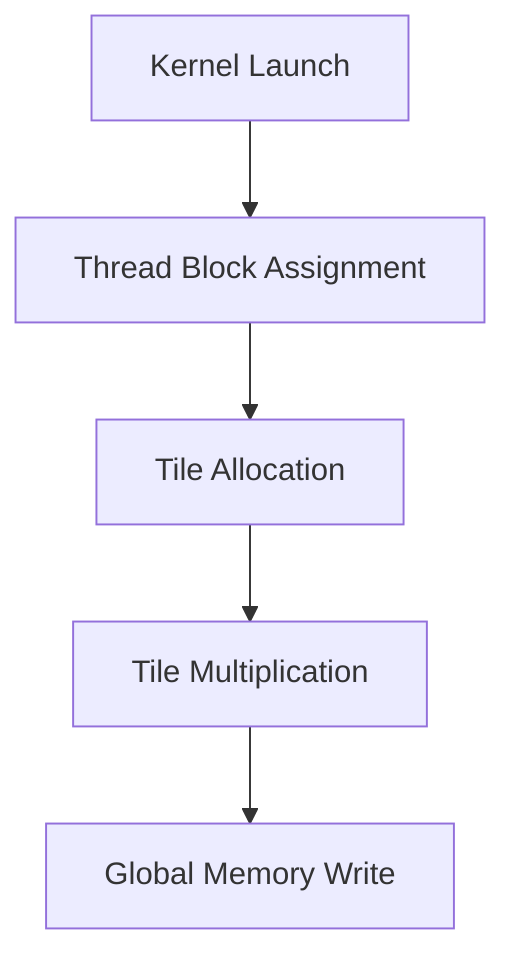

1. The kernel is launched with a specific grid and block configuration, which determines the number of thread blocks and threads per block.
2. Each thread block is assigned a specific tile of the output matrix C to compute.
3. Within each thread block, threads are further divided to compute sub-tiles of the assigned tile.
4. Threads load the required elements from input matrices A and B into shared memory for efficient access.
5. Threads perform the tile multiplication using the loaded elements in shared memory.
6. The computed tile results are written to the corresponding locations in the output matrix C in global memory.

Sources: [gemm/cugemm.cu:52-130](), [gemm/gemm.cu:27-49]()

### Kernel Configuration

The CUDA kernel is launched with a specific grid and block configuration, which determines the number of thread blocks and threads per block. The configuration is based on the dimensions of the input matrices and the tile size.

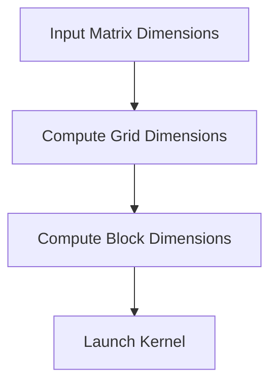

The grid dimensions are computed based on the output matrix dimensions and the tile size, ensuring that each thread block is assigned a unique tile of the output matrix. The block dimensions are chosen to maximize the utilization of the GPU's resources while considering the shared memory constraints.

Sources: [gemm/cugemm.cu:132-146](), [gemm/gemm.cu:51-63]()

### Tile Multiplication

The tile multiplication is the core computation performed within each thread block. Threads are organized in a hierarchical manner to efficiently compute the tile multiplication.

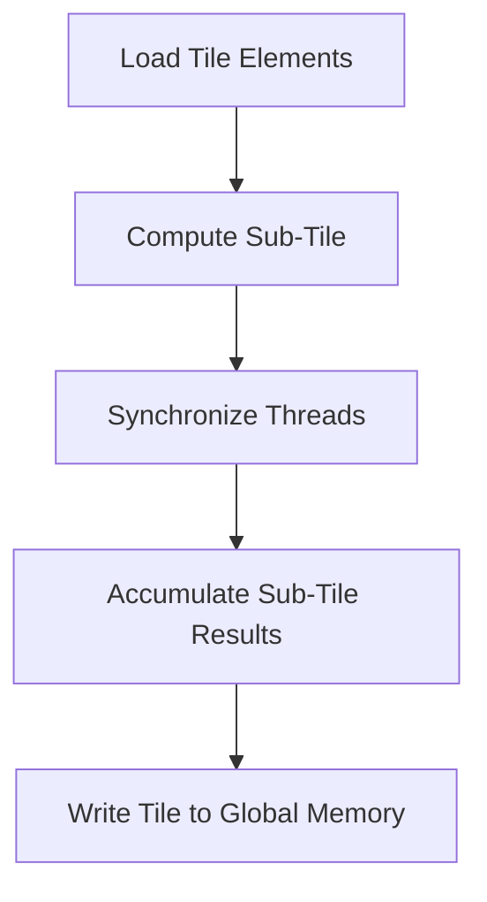

1. Threads within a thread block cooperatively load the required elements from input matrices A and B into shared memory for efficient access.
2. Threads are further divided into sub-tiles, and each sub-tile computes its part of the tile multiplication.
3. Threads within a sub-tile synchronize to ensure all required elements are loaded before computation.
4. Each thread computes its part of the sub-tile multiplication and accumulates the results.
5. The computed tile results are written to the corresponding locations in the output matrix C in global memory.

Sources: [gemm/cugemm.cu:148-214](), [gemm/gemm.cu:65-102]()

## Memory Management

Efficient memory management is crucial for achieving high performance in the CUDA GEMM Implementation. The implementation utilizes various memory spaces available on the GPU, including global memory, shared memory, and registers.

### Global Memory

Global memory is used to store the input and output matrices on the GPU. It is a large but relatively slow memory space accessible by all threads.

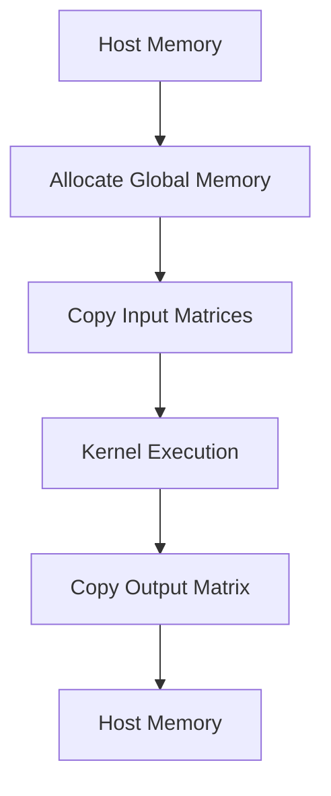

1. Global memory is allocated on the GPU to store the input and output matrices.
2. The input matrices A and B are copied from host memory to the allocated global memory on the GPU.
3. The CUDA kernel is executed, which reads the input matrices from global memory and writes the output matrix to global memory.
4. After kernel execution, the output matrix C is copied from global memory on the GPU to host memory.

Sources: [gemm/cugemm.cu:216-233](), [gemm/gemm.cu:104-117]()

### Shared Memory

Shared memory is a low-latency, on-chip memory shared among threads within a thread block. It is used to cache frequently accessed data from global memory, improving memory access performance.

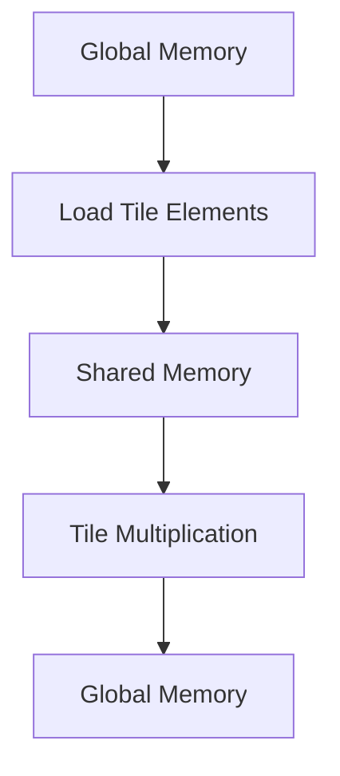

1. Threads within a thread block cooperatively load the required elements from input matrices A and B from global memory into shared memory.
2. Tile multiplication is performed using the elements loaded in shared memory, reducing global memory access and improving performance.
3. The computed tile results are written back to global memory.

Sources: [gemm/cugemm.cu:148-214](), [gemm/gemm.cu:65-102]()

### Registers

Registers are the fastest memory space available on the GPU, but they are limited in size and private to each thread. The CUDA GEMM Implementation utilizes registers to store intermediate results during the tile multiplication.

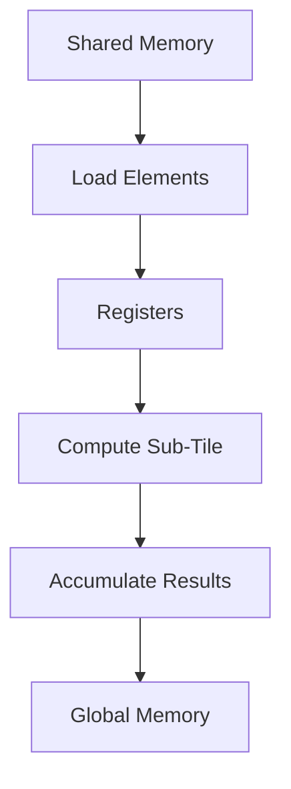

1. Threads load the required elements from shared memory into registers.
2. Threads perform the sub-tile multiplication using the elements stored in registers.
3. Intermediate results are accumulated in registers.
4. The final computed results are written from registers to global memory.

Sources: [gemm/cugemm.cu:148-214](), [gemm/gemm.cu:65-102]()

## Performance Considerations

The CUDA GEMM Implementation incorporates several optimization techniques to achieve high performance on the GPU.

### Tiling

The implementation employs a tiling strategy, where the input matrices are divided into smaller tiles that can fit into the GPU's shared memory. This approach reduces global memory access and improves data reuse, leading to better performance.

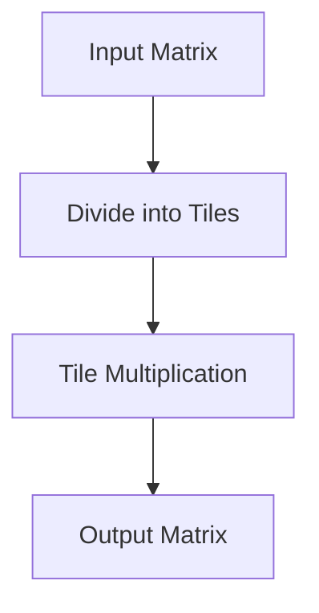

The tile size is chosen based on the GPU's shared memory capacity and the dimensions of the input matrices, balancing the trade-off between shared memory usage and global memory access.

Sources: [gemm/cugemm.cu:52-130](), [gemm/gemm.cu:27-49]()

### Thread Hierarchy

Threads are organized in a hierarchical manner, with thread blocks and sub-tiles, to efficiently utilize the GPU's resources and maximize parallelism.

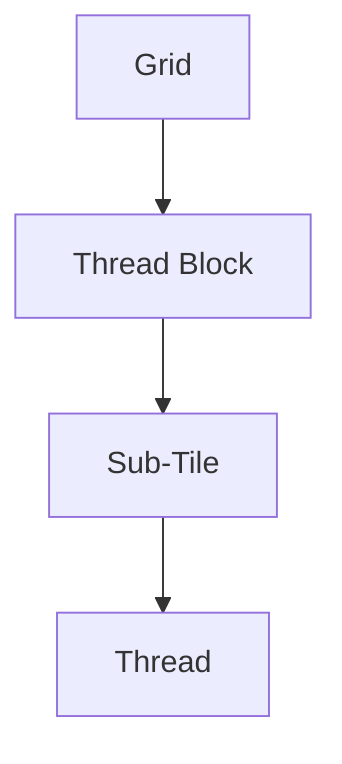

This hierarchical organization allows for efficient load balancing, synchronization, and data sharing among threads, leading to better performance and resource utilization.

Sources: [gemm/cugemm.cu:52-130](), [gemm/gemm.cu:27-49]()

### Coalesced Memory Access

The implementation ensures coalesced memory access patterns, where threads within a warp (a group of threads executing in lockstep) access contiguous memory locations. This optimization reduces memory access latency and improves overall performance.

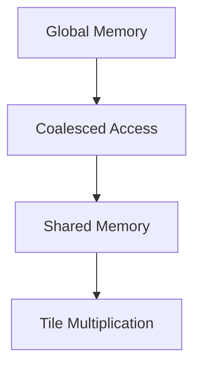

Threads within a warp cooperatively load data from global memory into shared memory in a coalesced manner, minimizing memory access overhead.

Sources: [gemm/cugemm.cu:148-214](), [gemm/gemm.cu:65-102]()

### Synchronization

Proper synchronization among threads is essential for correctness and performance. The implementation uses synchronization barriers (`__syncthreads()`) to ensure that all threads within a thread block have completed their tasks before proceeding to the next step.

```mermaid
sequenceDiagram
    participant Thread1
    participant Thread2
    participant Thread3
    Thread1->>Thread2: Load data
    Thread2-->>Thread1: Data loaded
    Note over Thread1,Thread2: __syncthreads()
    Thread1->>Thread3: Compute
    Thread2->>Thread3: Compute
    Thread3-->>Thread1: Computation done
    Note over Thread1,Thread2,Thread3: __syncthreads()
```

Synchronization barriers are used at strategic points, such as after loading data into shared memory and before writing results to global memory, to ensure correct execution and avoid race conditions.

Sources: [gemm/cugemm.cu:148-214](), [gemm/gemm.cu:65-102]()

## Utility Functions

The CUDA GEMM Implementation includes several utility functions for memory allocation, initialization, and error handling.

| Function | Description |
| --- | --- |
| `allocateDeviceMemory` | Allocates memory on the GPU for input and output matrices. |
| `initializeMatrices` | Initializes the input matrices with random values. |
| `copyMatrixToDevice` | Copies a matrix from host memory to device memory. |
| `copyMatrixFromDevice` | Copies a matrix from device memory to host memory. |
| `freeDeviceMemory` | Frees the allocated memory on the GPU. |
| `checkCudaError` | Checks for CUDA errors and prints error messages. |

These utility functions are used throughout the implementation to manage memory, initialize data, and handle errors.

Sources: [gemm/utils.cu](), [gemm/utils.h]()

## Performance Benchmarking

The CUDA GEMM Implementation includes a performance benchmarking feature that measures the execution time of the matrix multiplication operation for different matrix sizes.

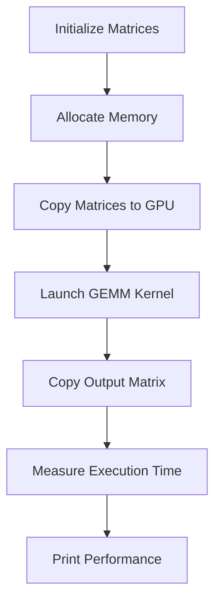

1. Input matrices are initialized with random values.
2. Memory is allocated on the GPU for input and output matrices.
3. Input matrices are copied from host memory to device memory.
4. The CUDA GEMM kernel is launched to perform the matrix multiplication.
5. The output matrix is copied from device memory to host memory.
6. The execution time is measured and used to calculate the performance in GFLOPS (Giga Floating-Point Operations per Second).
7. The performance results are printed for different matrix sizes.

This benchmarking feature allows for evaluating the performance of the CUDA GEMM Implementation and comparing it with other implementations or hardware configurations.

Sources: [gemm/cugemm.cu:236-280]()

## Example Usage

To use the CUDA GEMM Implementation, follow these steps:

1. Include the required header files:

```cpp
#include "gemm.h"
#include "utils.h"
```

2. Initialize the input matrices with desired dimensions and values.
3. Allocate memory on the GPU for input and output matrices:

```cpp
float *d_A, *d_B, *d_C;
allocateDeviceMemory(&d_A, &d_B, &d_C, M, N, K);
```

4. Copy the input matrices from host memory to device memory:

```cpp
copyMatrixToDevice(d_A, A, M, K);
copyMatrixToDevice(d_B, B, K, N);
```

5. Launch the CUDA GEMM kernel:

```cpp
cugemm(d_A, d_B, d_C, M, N, K);
```

6. Copy the output matrix from device memory to host memory:

```cpp
copyMatrixFromDevice(C, d_C, M, N);
```

7. Free the allocated memory on the GPU:

```cpp
freeDeviceMemory(d_A, d_B, d_C);
```

For a complete example, refer to the `main` function in `gemm/cugemm.cu`.

Sources: [gemm/cugemm.cu:282-314]()