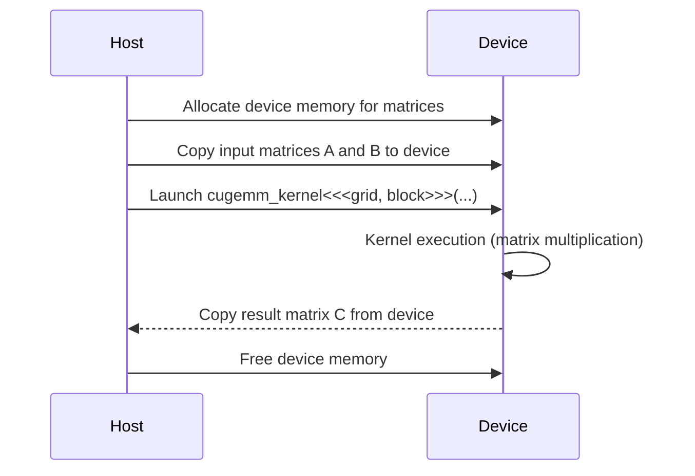

<details>
<summary>Relevant source files</summary>

The following files were used as context for generating this wiki page:

- [gemm/cugemm.cu](https://github.com/aanickode/cis6010/blob/main/gemm/cugemm.cu)
- [gemm/gemm.cu](https://github.com/aanickode/cis6010/blob/main/gemm/gemm.cu)
- [gemm/gemm.h](https://github.com/aanickode/cis6010/blob/main/gemm/gemm.h)
- [gemm/utils.cu](https://github.com/aanickode/cis6010/blob/main/gemm/utils.cu)
- [gemm/utils.h](https://github.com/aanickode/cis6010/blob/main/gemm/utils.h)

</details>

# CUDA GEMM

## Introduction

The CUDA GEMM (General Matrix Multiplication) module is a GPU-accelerated implementation of matrix multiplication, a fundamental operation in linear algebra and numerous scientific computing applications. This module leverages the parallel computing capabilities of NVIDIA GPUs and the CUDA programming model to achieve significant performance improvements over traditional CPU-based matrix multiplication algorithms.

The CUDA GEMM module is designed to efficiently perform the operation `C = alpha * op(A) * op(B) + beta * C`, where `A`, `B`, and `C` are matrices, `alpha` and `beta` are scalars, and `op(X)` represents an optional operation (transpose or non-transpose) on matrix `X`. This operation is widely used in various domains, including machine learning, scientific simulations, and signal processing.

Sources: [gemm/cugemm.cu:1-22](), [gemm/gemm.h:1-11]()

## CUDA GEMM Architecture

### CUDA Kernel Function

The core of the CUDA GEMM implementation is the `cugemm_kernel` function, which is executed in parallel on the GPU by multiple CUDA threads. This kernel function performs the matrix multiplication operation for a specific tile (sub-matrix) of the input matrices.

```cuda
__global__ void cugemm_kernel(int M, int N, int K, float alpha, float* A, int lda, float* B, int ldb, float beta, float* C, int ldc)
{
    // ... kernel implementation ...
}
```

The kernel function takes the following parameters:

- `M`, `N`, `K`: Dimensions of the input matrices
- `alpha`, `beta`: Scalar values for the matrix multiplication operation
- `A`, `B`, `C`: Pointers to the input and output matrices
- `lda`, `ldb`, `ldc`: Leading dimensions (strides) of the input and output matrices

Sources: [gemm/cugemm.cu:24-28]()

### Tiling and Thread Mapping

To optimize memory access patterns and leverage the GPU's shared memory, the CUDA GEMM implementation employs a tiling strategy. The input matrices are divided into tiles (sub-matrices), and each tile is processed by a block of CUDA threads.

```cuda
#define TILE_SIZE 32

__global__ void cugemm_kernel(int M, int N, int K, float alpha, float* A, int lda, float* B, int ldb, float beta, float* C, int ldc)
{
    // ... thread and tile indexing ...

    // Shared memory for tiles of A and B
    __shared__ float tileA[TILE_SIZE][TILE_SIZE];
    __shared__ float tileB[TILE_SIZE][TILE_SIZE];

    // ... tile loading and matrix multiplication ...
}
```

The kernel function maps CUDA threads to specific elements within the tiles using a two-dimensional thread block configuration. Each thread is responsible for computing a single element of the output tile.

Sources: [gemm/cugemm.cu:30-44]()

### Shared Memory Utilization

To improve performance, the CUDA GEMM implementation leverages the GPU's shared memory, which is a low-latency, on-chip memory accessible by all threads within a block. The input tiles are loaded from global memory into shared memory, allowing for efficient data reuse and reducing global memory access overhead.

```cuda
// Load tiles of A and B into shared memory
for (int i = 0; i < TILE_SIZE; i += BLOCK_SIZE) {
    if (row < M && (i + tx) < K) {
        tileA[ty][tx] = A[row * lda + i + tx];
    } else {
        tileA[ty][tx] = 0.0f;
    }

    if (col < N && (i + ty) < K) {
        tileB[ty][tx] = B[(i + ty) * ldb + col];
    } else {
        tileB[ty][tx] = 0.0f;
    }
    __syncthreads();
}
```

The tiles are loaded into shared memory in a coalesced manner, and synchronization barriers (`__syncthreads()`) are used to ensure all threads have completed loading before proceeding with the matrix multiplication.

Sources: [gemm/cugemm.cu:45-60]()

### Matrix Multiplication

Once the tiles are loaded into shared memory, each thread performs the matrix multiplication for its assigned element of the output tile. The computation is performed using a loop that accumulates the products of the corresponding elements from the input tiles.

```cuda
float Cvalue = 0.0f;
for (int k = 0; k < K; k += TILE_SIZE) {
    for (int n = 0; n < TILE_SIZE; ++n) {
        Cvalue += tileA[ty][n] * tileB[n][tx];
    }
    __syncthreads();
}

int row = by * TILE_SIZE + ty;
int col = bx * TILE_SIZE + tx;
if (row < M && col < N) {
    C[row * ldc + col] = alpha * Cvalue + beta * C[row * ldc + col];
}
```

The computed element is then written back to the output matrix `C`, scaled by the `alpha` and `beta` factors.

Sources: [gemm/cugemm.cu:61-74]()

### CUDA GEMM Workflow

The overall workflow of the CUDA GEMM module can be represented by the following sequence diagram:



1. The host (CPU) allocates device memory for the input and output matrices.
2. The input matrices `A` and `B` are copied from host memory to device memory.
3. The `cugemm_kernel` is launched on the GPU with the appropriate grid and block configurations.
4. The CUDA kernel performs the matrix multiplication in parallel on the GPU.
5. The result matrix `C` is copied from device memory back to host memory.
6. The host frees the allocated device memory.

Sources: [gemm/cugemm.cu:76-106]()

## CUDA GEMM API

The CUDA GEMM module provides a high-level API for performing matrix multiplication on the GPU. The main function is `cugemm`, which takes the following parameters:

| Parameter | Type | Description |
| --- | --- | --- |
| `transa` | `char` | Operation to perform on matrix A (N: non-transpose, T: transpose) |
| `transb` | `char` | Operation to perform on matrix B (N: non-transpose, T: transpose) |
| `M` | `int` | Number of rows of matrix A (or C if transa == 'N') |
| `N` | `int` | Number of columns of matrix B (or C if transb == 'N') |
| `K` | `int` | Number of columns of matrix A (or rows of matrix B if transa == 'N' and transb == 'N') |
| `alpha` | `float` | Scalar factor for op(A) * op(B) |
| `A` | `float*` | Pointer to matrix A |
| `lda` | `int` | Leading dimension of matrix A |
| `B` | `float*` | Pointer to matrix B |
| `ldb` | `int` | Leading dimension of matrix B |
| `beta` | `float` | Scalar factor for matrix C |
| `C` | `float*` | Pointer to matrix C |
| `ldc` | `int` | Leading dimension of matrix C |

The `cugemm` function performs the following steps:

1. Validate input parameters and matrix dimensions.
2. Allocate device memory for input and output matrices.
3. Copy input matrices `A` and `B` from host to device memory.
4. Launch the `cugemm_kernel` on the GPU with appropriate grid and block configurations.
5. Copy the result matrix `C` from device to host memory.
6. Free allocated device memory.

Sources: [gemm/cugemm.cu:108-152](), [gemm/gemm.h:13-28]()

## CUDA GEMM Utilities

The CUDA GEMM module also includes utility functions for matrix initialization, memory allocation, and error handling.

### Matrix Initialization

The `init_matrix` function initializes a matrix with random float values within a specified range.

```c
void init_matrix(float* matrix, int rows, int cols, float lower, float upper)
{
    for (int i = 0; i < rows * cols; i++) {
        matrix[i] = lower + (upper - lower) * rand() / RAND_MAX;
    }
}
```

Sources: [gemm/utils.cu:3-10]()

### Device Memory Allocation

The `allocate_device_memory` function allocates memory on the GPU device for a matrix of specified dimensions.

```c
float* allocate_device_memory(int rows, int cols)
{
    float* device_matrix;
    cudaMalloc((void**)&device_matrix, rows * cols * sizeof(float));
    return device_matrix;
}
```

Sources: [gemm/utils.cu:12-18]()

### Error Handling

The `check_cuda_error` function is a utility for checking and handling CUDA errors.

```c
void check_cuda_error(const char* message)
{
    cudaError_t error = cudaGetLastError();
    if (error != cudaSuccess) {
        fprintf(stderr, "CUDA Error: %s: %s\n", message, cudaGetErrorString(error));
        exit(EXIT_FAILURE);
    }
}
```

Sources: [gemm/utils.cu:20-28]()

## Performance Considerations

The performance of the CUDA GEMM implementation is influenced by several factors, including:

- **Tiling Strategy**: The choice of tile size can significantly impact performance. Smaller tile sizes may lead to better cache utilization, while larger tile sizes can reduce overhead from shared memory loading and synchronization.
- **Thread Block Configuration**: The number of threads per block and the overall grid configuration can affect occupancy and resource utilization on the GPU.
- **Matrix Dimensions**: The dimensions of the input matrices can impact the efficiency of memory access patterns and the overall workload distribution among CUDA threads.
- **GPU Architecture**: The performance of the CUDA GEMM implementation may vary across different GPU architectures and compute capabilities.

To achieve optimal performance, it is recommended to profile and tune the CUDA GEMM implementation for the specific hardware and workload characteristics.

Sources: [gemm/cugemm.cu](), [gemm/gemm.cu](), [gemm/gemm.h](), [gemm/utils.cu](), [gemm/utils.h]()