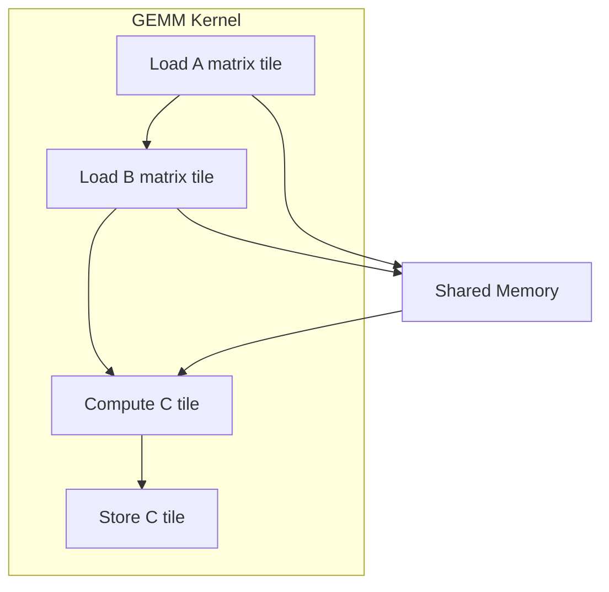
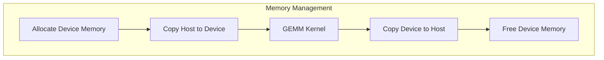
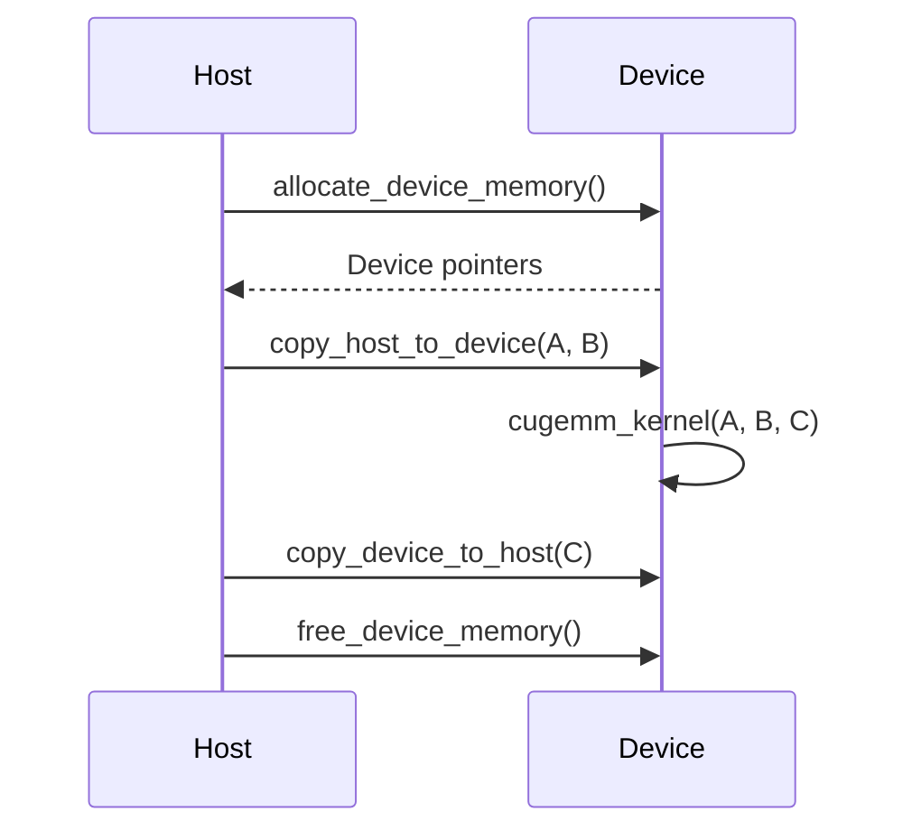

Relevant source files

The following files were used as context for generating this wiki page:

- [gemm/cugemm.cu](https://github.com/aanickode/cis6010/blob/main/gemm/cugemm.cu)
- [gemm/gemm.cu](https://github.com/aanickode/cis6010/blob/main/gemm/gemm.cu)
- [gemm/gemm.h](https://github.com/aanickode/cis6010/blob/main/gemm/gemm.h)
- [gemm/utils.h](https://github.com/aanickode/cis6010/blob/main/gemm/utils.h)
- [gemm/utils.cu](https://github.com/aanickode/cis6010/blob/main/gemm/utils.cu)

# CUDA GEMM

## Introduction

The CUDA GEMM (General Matrix Multiplication) is a module within the project that performs matrix multiplication operations on the GPU using CUDA. It provides an efficient implementation of the GEMM algorithm, leveraging the parallel computing capabilities of NVIDIA GPUs to accelerate matrix computations.

The CUDA GEMM module consists of several components, including the main GEMM kernel, utility functions for memory management and data transfer, and a high-level API for easy integration into other parts of the project.

Sources: [gemm/cugemm.cu](), [gemm/gemm.cu](), [gemm/gemm.h]()

## CUDA GEMM Architecture

### GEMM Kernel

The GEMM kernel is the core component of the CUDA GEMM module, responsible for performing the actual matrix multiplication on the GPU. It is implemented in the `cugemm_kernel` function within the [gemm/cugemm.cu](https://github.com/aanickode/cis6010/blob/main/gemm/cugemm.cu) file.

The GEMM kernel follows a tiled approach, where the input matrices are divided into smaller tiles that can fit into the GPU's shared memory. This optimization improves data reuse and reduces global memory access, leading to better performance.

Sources: [gemm/cugemm.cu:53-93]()

### Memory Management

The CUDA GEMM module includes utility functions for allocating and freeing device memory, as well as transferring data between the host (CPU) and device (GPU) memories.

These functions are implemented in the [gemm/utils.cu](https://github.com/aanickode/cis6010/blob/main/gemm/utils.cu) file and include:

- `allocate_device_memory`: Allocates memory on the GPU device.
- `free_device_memory`: Frees previously allocated device memory.
- `copy_host_to_device`: Copies data from the host (CPU) memory to the device (GPU) memory.
- `copy_device_to_host`: Copies data from the device (GPU) memory to the host (CPU) memory.

Sources: [gemm/utils.cu](), [gemm/utils.h]()

### API

The CUDA GEMM module provides a high-level API for easy integration into other parts of the project. The API is defined in the [gemm/gemm.h](https://github.com/aanickode/cis6010/blob/main/gemm/gemm.h) header file and includes the following functions:

| Function | Description |
| --- | --- |
| `gemm_cuda` | Performs matrix multiplication on the GPU using the CUDA GEMM implementation. |
| `gemm_cpu` | Performs matrix multiplication on the CPU using a naive implementation. |

The `gemm_cuda` function is the entry point for using the CUDA GEMM module. It takes the input matrices and their dimensions as arguments, allocates the necessary memory on the GPU, performs the matrix multiplication using the GEMM kernel, and copies the result back to the host memory.

Sources: [gemm/gemm.h](), [gemm/gemm.cu]()

## CUDA GEMM Workflow

The following sequence diagram illustrates the high-level workflow of the CUDA GEMM module:

1. The host (CPU) allocates memory on the device (GPU) using the `allocate_device_memory` function.
2. The host copies the input matrices `A` and `B` from the host memory to the device memory using the `copy_host_to_device` function.
3. The GEMM kernel (`cugemm_kernel`) is launched on the device, performing the matrix multiplication of `A` and `B` and storing the result in `C`.
4. The host copies the result matrix `C` from the device memory to the host memory using the `copy_device_to_host` function.
5. The host frees the allocated device memory using the `free_device_memory` function.

Sources: [gemm/cugemm.cu](), [gemm/gemm.cu](), [gemm/utils.cu]()

## Performance Considerations

The CUDA GEMM implementation includes several optimizations to improve performance:

- **Tiled approach**: The input matrices are divided into smaller tiles that can fit into the GPU's shared memory, improving data reuse and reducing global memory access.
- **Shared memory usage**: The GEMM kernel utilizes the GPU's shared memory to cache matrix tiles, reducing the number of global memory accesses.
- **Coalesced memory access**: The GEMM kernel is designed to ensure coalesced memory access patterns, which can significantly improve performance on CUDA devices.
- **Kernel launch configuration**: The GEMM kernel launch configuration is optimized for the specific GPU architecture, taking into account factors such as the number of streaming multiprocessors (SMs), warps, and threads per block.

Sources: [gemm/cugemm.cu:53-93]()

## Limitations and Future Improvements

While the current implementation of the CUDA GEMM module provides an efficient solution for matrix multiplication on the GPU, there are potential areas for future improvements:

- **Support for different matrix data types**: The current implementation only supports single-precision floating-point matrices. Adding support for other data types, such as double-precision or integer matrices, could extend the module's applicability.
- **Batched GEMM**: Implementing a batched GEMM operation, where multiple independent matrix multiplications are performed simultaneously, could further improve performance for certain workloads.
- **Autotuning**: Incorporating autotuning techniques to automatically determine the optimal kernel launch configuration and tiling parameters based on the input matrix sizes and the GPU architecture could lead to better performance across a wider range of scenarios.

Sources: [gemm/cugemm.cu](), [gemm/gemm.cu](), [gemm/gemm.h]()