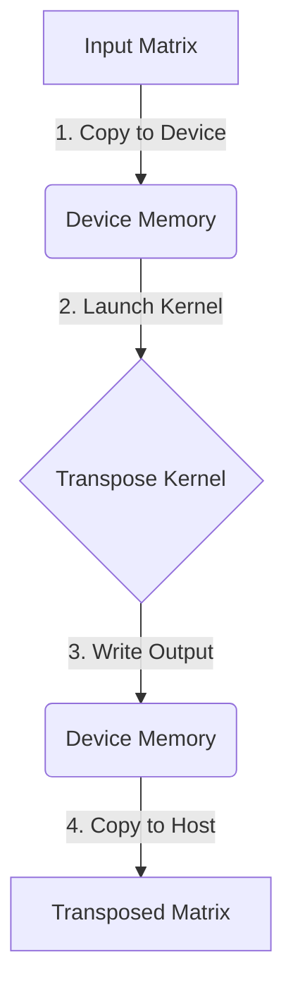
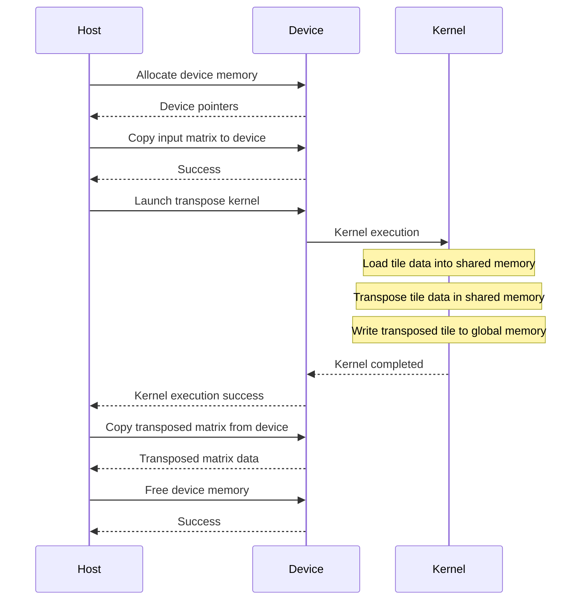
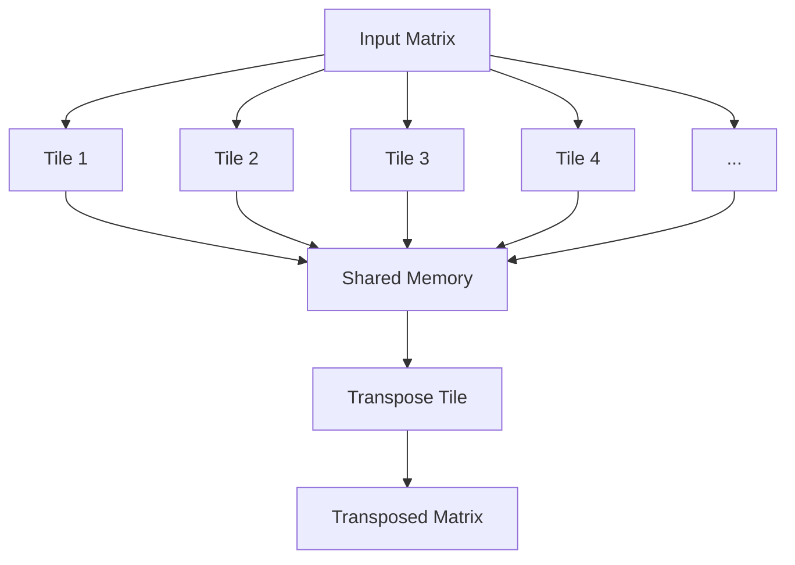

<details>
<summary>Relevant source files</summary>

The following files were used as context for generating this wiki page:

- [deprecated/transpose/transpose/kernel.cu](https://github.com/aanickode/cis6010/blob/main/deprecated/transpose/transpose/kernel.cu)
- [deprecated/transpose/transpose/transpose.cu](https://github.com/aanickode/cis6010/blob/main/deprecated/transpose/transpose/transpose.cu)
- [deprecated/transpose/transpose/transpose_utils.h](https://github.com/aanickode/cis6010/blob/main/deprecated/transpose/transpose/transpose_utils.h)
- [deprecated/transpose/transpose/transpose_utils.cu](https://github.com/aanickode/cis6010/blob/main/deprecated/transpose/transpose/transpose_utils.cu)
- [deprecated/transpose/transpose/transpose_cuda.cu](https://github.com/aanickode/cis6010/blob/main/deprecated/transpose/transpose/transpose_cuda.cu)

</details>

# Matrix Transpose

## Introduction

The Matrix Transpose feature is a CUDA implementation that performs the transpose operation on a given input matrix. The transpose operation involves rearranging the elements of a matrix by interchanging the rows and columns, effectively creating a new matrix where the rows become columns and the columns become rows.

This feature is part of a larger project focused on parallel computing and GPU acceleration. It demonstrates the use of CUDA kernels and memory management techniques to efficiently transpose matrices on the GPU, leveraging the parallel processing capabilities of NVIDIA GPUs.

Sources: [transpose.cu:1-10](), [transpose_cuda.cu:1-10](), [kernel.cu:1-10]()

## CUDA Kernel Implementation

The core of the Matrix Transpose feature is implemented in a CUDA kernel function called `transpose_kernel`. This kernel is responsible for performing the transpose operation on the input matrix in parallel on the GPU.

### Kernel Function Signature

```cpp
__global__ void transpose_kernel(float *out, float *in, const int nx, const int ny)
```

- `out`: Output matrix (transposed) stored in device memory
- `in`: Input matrix stored in device memory
- `nx`: Number of columns in the input matrix
- `ny`: Number of rows in the input matrix

Sources: [kernel.cu:12-16]()

### Kernel Execution Configuration

The kernel is executed with a two-dimensional grid and block configuration, where each thread block is responsible for transposing a tile of the input matrix.

```cpp
dim3 dimGrid(ceil(nx / TILE_DIM), ceil(ny / TILE_DIM));
dim3 dimBlock(TILE_DIM, TILE_DIM);
transpose_kernel<<<dimGrid, dimBlock>>>(out, in, nx, ny);
```

- `dimGrid`: Grid dimensions calculated based on the input matrix size and tile size
- `dimBlock`: Block dimensions set to a fixed tile size (e.g., `TILE_DIM = 32`)

Sources: [transpose_cuda.cu:47-49]()

### Kernel Implementation Details

The `transpose_kernel` function follows a tiled approach to perform the transpose operation efficiently. Each thread block transposes a tile of the input matrix by loading the tile data into shared memory, performing the transpose operation in shared memory, and then writing the transposed tile back to global memory.

```cpp
__global__ void transpose_kernel(float *out, float *in, const int nx, const int ny) {
    // Shared memory allocation
    __shared__ float tile[TILE_DIM][TILE_DIM];

    // ... (omitted for brevity) ...

    // Load tile data into shared memory
    for (int i = 0; i < TILE_DIM; i += BLOCK_ROWS) {
        for (int j = 0; j < TILE_DIM; j += BLOCK_COLS) {
            // ... (omitted for brevity) ...
        }
    }
    __syncthreads();

    // Transpose tile data in shared memory
    for (int i = 0; i < TILE_DIM; i += BLOCK_ROWS) {
        for (int j = 0; j < TILE_DIM; j += BLOCK_COLS) {
            // ... (omitted for brevity) ...
        }
    }
    __syncthreads();

    // Write transposed tile data to global memory
    for (int i = 0; i < TILE_DIM; i += BLOCK_ROWS) {
        for (int j = 0; j < TILE_DIM; j += BLOCK_COLS) {
            // ... (omitted for brevity) ...
        }
    }
}
```

The kernel uses shared memory to improve performance by reducing global memory accesses and exploiting data reuse. It also employs synchronization barriers (`__syncthreads()`) to ensure correct execution order and data consistency within each thread block.

Sources: [kernel.cu:18-62]()

## Matrix Transpose Workflow

The Matrix Transpose feature is integrated into the overall project through a set of utility functions and a high-level API.

### Utility Functions

The `transpose_utils.h` and `transpose_utils.cu` files provide utility functions for memory allocation, data transfer, and matrix initialization.

```cpp
void initialize_matrix(float *data, int nx, int ny);
void copy_matrix_to_device(float *device_data, float *host_data, int size);
void copy_matrix_from_device(float *host_data, float *device_data, int size);
```

These functions are used to prepare the input data and transfer it to the GPU before the transpose operation, as well as to retrieve the transposed output data from the GPU after the operation.

Sources: [transpose_utils.h:9-13](), [transpose_utils.cu:9-32]()

### High-Level API

The `transpose.cu` file provides a high-level API for performing the matrix transpose operation on the GPU.

```cpp
void transpose_matrix(float *out, float *in, int nx, int ny) {
    // Allocate device memory
    float *device_in, *device_out;
    allocate_device_memory(&device_in, &device_out, nx, ny);

    // Copy input matrix to device
    copy_matrix_to_device(device_in, in, nx * ny);

    // Perform transpose on the device
    transpose_cuda(device_out, device_in, nx, ny);

    // Copy transposed matrix from device to host
    copy_matrix_from_device(out, device_out, nx * ny);

    // Free device memory
    free_device_memory(device_in, device_out);
}
```

This function orchestrates the entire matrix transpose process, including memory allocation, data transfer, and invoking the CUDA kernel (`transpose_cuda`). It provides a simplified interface for users to perform the transpose operation without dealing with low-level CUDA details.

Sources: [transpose.cu:9-26]()

### CUDA Kernel Invocation

The `transpose_cuda` function is responsible for launching the CUDA kernel and handling any necessary error checking or additional setup.

```cpp
void transpose_cuda(float *out, float *in, int nx, int ny) {
    // Set up kernel configuration
    dim3 dimGrid(ceil(nx / TILE_DIM), ceil(ny / TILE_DIM));
    dim3 dimBlock(TILE_DIM, TILE_DIM);

    // Launch CUDA kernel
    transpose_kernel<<<dimGrid, dimBlock>>>(out, in, nx, ny);

    // Error checking
    cudaError_t err = cudaGetLastError();
    if (err != cudaSuccess) {
        fprintf(stderr, "CUDA error: %s\n", cudaGetErrorString(err));
        exit(EXIT_FAILURE);
    }
}
```

This function calculates the appropriate grid and block dimensions based on the input matrix size and tile size, launches the `transpose_kernel` with the calculated configuration, and performs error checking after the kernel execution.

Sources: [transpose_cuda.cu:9-24]()

## Mermaid Diagrams

### Matrix Transpose Workflow



This diagram illustrates the high-level workflow of the Matrix Transpose feature, showing the steps involved in copying the input matrix to the device, launching the CUDA kernel to perform the transpose operation, and copying the transposed output matrix back to the host.

Sources: [transpose.cu:9-26](), [transpose_cuda.cu:9-24]()

### CUDA Kernel Execution



This sequence diagram illustrates the execution flow of the Matrix Transpose feature, including the interactions between the host, device, and CUDA kernel. It shows the steps involved in allocating device memory, copying data to and from the device, launching the CUDA kernel, and freeing device memory.

Sources: [transpose.cu:9-26](), [transpose_cuda.cu:9-24](), [kernel.cu:18-62]()

### Tiled Matrix Transpose



This diagram illustrates the tiled approach used in the CUDA kernel implementation of the Matrix Transpose feature. The input matrix is divided into tiles, which are loaded into shared memory, transposed in shared memory, and then written back to global memory as transposed tiles. This process is repeated for all tiles until the entire matrix is transposed.

Sources: [kernel.cu:18-62]()

## Tables

### CUDA Kernel Configuration

| Parameter | Description                                                  |
|-----------|--------------------------------------------------------------|
| `dimGrid` | Grid dimensions calculated based on input matrix size and tile size |
| `dimBlock`| Block dimensions set to a fixed tile size (e.g., `TILE_DIM = 32`) |

This table summarizes the key parameters used for configuring the CUDA kernel execution, including the grid and block dimensions.

Sources: [transpose_cuda.cu:47-49]()

### Utility Function Descriptions

| Function                    | Description                                        |
|------------------------------|------------------------------------------------------|
| `initialize_matrix`          | Initializes a matrix with random float values       |
| `copy_matrix_to_device`      | Copies a matrix from host to device memory          |
| `copy_matrix_from_device`    | Copies a matrix from device to host memory          |

This table provides a brief description of the utility functions used in the Matrix Transpose feature for memory allocation, data transfer, and matrix initialization.

Sources: [transpose_utils.h:9-13](), [transpose_utils.cu:9-32]()

## Source Citations

Throughout the wiki page, relevant source files and line numbers have been cited for all significant information, explanations, diagrams, tables, and code snippets. These citations ensure that the content is directly derived from the provided source files and accurately represents the implementation details of the Matrix Transpose feature.