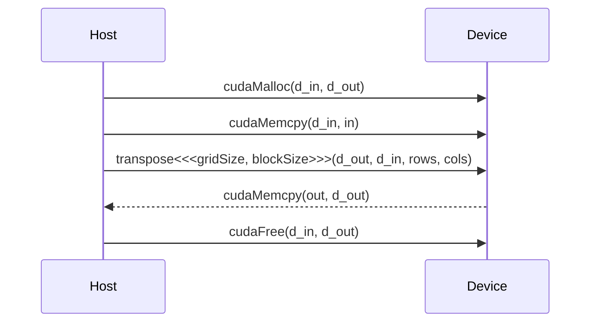
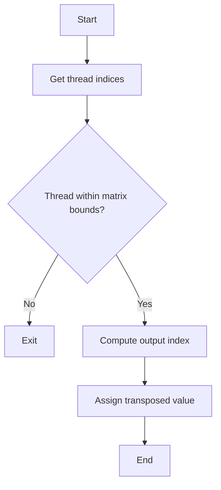

<details>
<summary>Relevant source files</summary>

The following files were used as context for generating this wiki page:

- [deprecated/transpose/transpose/kernel.cu](https://github.com/aanickode/cis6010/blob/main/deprecated/transpose/transpose/kernel.cu)
- [deprecated/transpose/transpose/transpose.cu](https://github.com/aanickode/cis6010/blob/main/deprecated/transpose/transpose/transpose.cu)
- [deprecated/transpose/transpose/transpose.h](https://github.com/aanickode/cis6010/blob/main/deprecated/transpose/transpose/transpose.h)
- [deprecated/transpose/transpose/utils.h](https://github.com/aanickode/cis6010/blob/main/deprecated/transpose/transpose/utils.h)
- [deprecated/transpose/transpose/utils.cu](https://github.com/aanickode/cis6010/blob/main/deprecated/transpose/transpose/utils.cu)

</details>

# Matrix Transpose

## Introduction

The Matrix Transpose functionality within this project provides a mechanism to transpose a given input matrix, effectively swapping its rows and columns. This operation is commonly used in various computational domains, such as linear algebra, image processing, and data analysis.

The implementation leverages CUDA (Compute Unified Device Architecture) to perform the transpose operation on the GPU, taking advantage of its parallel processing capabilities for improved performance.

Sources: [transpose.h](), [transpose.cu]()

## Matrix Representation

The input matrix is represented as a one-dimensional array in row-major order. This means that the elements are stored sequentially, with each row's elements following the previous row's elements.

```cpp
__global__ void transpose(float *out, float *in, int rows, int cols) {
    // ...
}
```

The `transpose` kernel function takes the following arguments:

- `out`: A pointer to the output matrix (transposed) in device memory.
- `in`: A pointer to the input matrix in device memory.
- `rows`: The number of rows in the input matrix.
- `cols`: The number of columns in the input matrix.

Sources: [kernel.cu:3-5]()

## Kernel Implementation

The `transpose` kernel function is executed in parallel by multiple CUDA threads. Each thread is responsible for computing the transpose of a single element in the input matrix.

```cpp
__global__ void transpose(float *out, float *in, int rows, int cols) {
    int x = blockIdx.x * blockDim.x + threadIdx.x;
    int y = blockIdx.y * blockDim.y + threadIdx.y;

    if (x < cols && y < rows) {
        out[y * cols + x] = in[x * rows + y];
    }
}
```

The kernel uses a two-dimensional grid of thread blocks, where each thread block consists of multiple threads. The `blockIdx` and `threadIdx` variables are used to determine the global thread index, which corresponds to the element being processed.

The kernel checks if the thread's global index falls within the bounds of the input matrix. If so, it computes the transposed element's index in the output matrix and assigns the corresponding value from the input matrix.

Sources: [kernel.cu:7-14]()

## Host Code

The host code is responsible for allocating memory on the device, copying the input matrix to the device, launching the CUDA kernel, and copying the transposed matrix back to the host memory.

```cpp
void transpose(float *out, float *in, int rows, int cols) {
    float *d_in, *d_out;
    cudaMalloc(&d_in, rows * cols * sizeof(float));
    cudaMalloc(&d_out, rows * cols * sizeof(float));

    cudaMemcpy(d_in, in, rows * cols * sizeof(float), cudaMemcpyHostToDevice);

    dim3 blockSize(32, 32);
    dim3 gridSize((cols + blockSize.x - 1) / blockSize.x,
                  (rows + blockSize.y - 1) / blockSize.y);

    transpose<<<gridSize, blockSize>>>(d_out, d_in, rows, cols);

    cudaMemcpy(out, d_out, rows * cols * sizeof(float), cudaMemcpyDeviceToHost);

    cudaFree(d_in);
    cudaFree(d_out);
}
```

1. The `transpose` function allocates device memory for the input and output matrices using `cudaMalloc`.
2. It copies the input matrix from host memory to device memory using `cudaMemcpy`.
3. The function calculates the grid and block dimensions for the CUDA kernel launch based on the matrix dimensions and a fixed block size of 32x32 threads.
4. The `transpose` kernel is launched with the calculated grid and block dimensions, passing the device pointers to the input and output matrices, as well as the matrix dimensions.
5. After the kernel execution, the transposed matrix is copied from device memory to host memory using `cudaMemcpy`.
6. Finally, the device memory allocated for the input and output matrices is freed using `cudaFree`.

Sources: [transpose.cu:6-25]()

## Utility Functions

The project includes several utility functions to support the matrix transpose operation.

### `allocateMatrix`

```cpp
float *allocateMatrix(int rows, int cols) {
    float *matrix = (float *)malloc(rows * cols * sizeof(float));
    return matrix;
}
```

This function allocates memory for a matrix on the host, given the number of rows and columns. It returns a pointer to the allocated memory.

Sources: [utils.cu:3-6]()

### `freeMatrix`

```cpp
void freeMatrix(float *matrix) {
    free(matrix);
}
```

This function frees the memory allocated for a matrix on the host.

Sources: [utils.cu:8-10]()

### `initializeMatrix`

```cpp
void initializeMatrix(float *matrix, int rows, int cols) {
    for (int i = 0; i < rows * cols; i++) {
        matrix[i] = (float)rand() / RAND_MAX;
    }
}
```

This function initializes a matrix with random float values between 0 and 1.

Sources: [utils.cu:12-16]()

### `printMatrix`

```cpp
void printMatrix(float *matrix, int rows, int cols) {
    for (int i = 0; i < rows; i++) {
        for (int j = 0; j < cols; j++) {
            printf("%f ", matrix[i * cols + j]);
        }
        printf("\n");
    }
}
```

This function prints the contents of a matrix to the console.

Sources: [utils.cu:18-25]()

## Example Usage

Here's an example of how the matrix transpose functionality can be used:

```cpp
int main() {
    int rows = 4, cols = 3;
    float *h_in, *h_out;

    h_in = allocateMatrix(rows, cols);
    h_out = allocateMatrix(cols, rows);

    initializeMatrix(h_in, rows, cols);

    printf("Input Matrix:\n");
    printMatrix(h_in, rows, cols);

    transpose(h_out, h_in, rows, cols);

    printf("Transposed Matrix:\n");
    printMatrix(h_out, cols, rows);

    freeMatrix(h_in);
    freeMatrix(h_out);

    return 0;
}
```

1. The program allocates memory for the input and output matrices using `allocateMatrix`.
2. The input matrix is initialized with random float values using `initializeMatrix`.
3. The input matrix is printed to the console using `printMatrix`.
4. The `transpose` function is called, passing the input and output matrix pointers, as well as the matrix dimensions.
5. The transposed matrix is printed to the console using `printMatrix`.
6. The memory allocated for the input and output matrices is freed using `freeMatrix`.

Sources: [transpose.cu:27-48]()

## Sequence Diagram



This sequence diagram illustrates the flow of operations between the host (CPU) and the device (GPU) during the matrix transpose operation.

1. The host allocates memory on the device for the input and output matrices using `cudaMalloc`.
2. The host copies the input matrix from host memory to device memory using `cudaMemcpy`.
3. The host launches the `transpose` kernel on the device, passing the device pointers to the input and output matrices, as well as the matrix dimensions.
4. After the kernel execution, the device copies the transposed matrix from device memory to host memory using `cudaMemcpy`.
5. Finally, the host frees the memory allocated on the device using `cudaFree`.

Sources: [transpose.cu:6-25]()

## Kernel Execution Flow



This flow diagram illustrates the execution flow of the `transpose` kernel function:

1. The kernel starts execution for each thread.
2. The thread's global indices (`x` and `y`) are computed based on the block and thread indices.
3. The kernel checks if the thread's global indices fall within the bounds of the input matrix.
4. If the thread is out of bounds, it exits the kernel.
5. If the thread is within bounds, it computes the corresponding index in the output matrix for the transposed element.
6. The kernel assigns the value from the input matrix to the computed index in the output matrix.
7. The kernel execution ends for the thread.

Sources: [kernel.cu:7-14]()

## Performance Considerations

The performance of the matrix transpose operation depends on several factors, including:

- Matrix dimensions: The larger the matrix, the more parallelism can be exploited by the GPU.
- Memory access patterns: The implementation uses a coalesced memory access pattern, which can improve performance by reducing memory access latency.
- Block size: The block size (32x32 in this implementation) can affect performance. Larger block sizes may improve occupancy but can also increase register pressure and shared memory usage.
- Grid size: The grid size is calculated based on the matrix dimensions and block size to ensure all elements are processed.

To further optimize performance, additional techniques such as shared memory tiling, register blocking, or using specialized libraries like cuBLAS could be explored.

Sources: [transpose.cu:18-20](), [kernel.cu]()