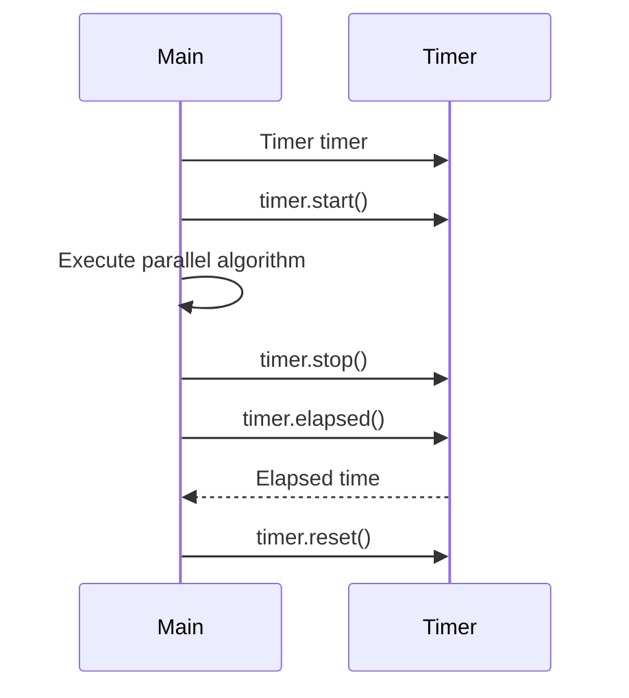
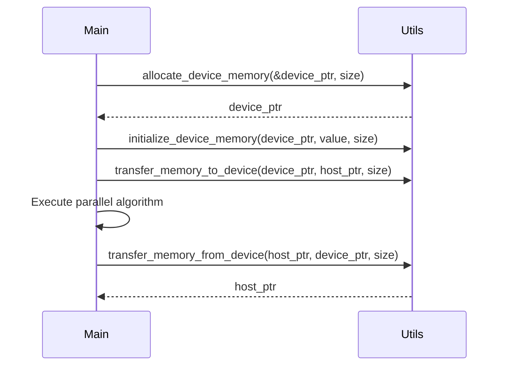

<details>
<summary>Relevant source files</summary>

The following files were used as context for generating this wiki page:

- [deprecated/hw2/hw2/timer.cuh](https://github.com/aanickode/cis6010/blob/main/deprecated/hw2/hw2/timer.cuh)
- [deprecated/hw2/hw2/timer.cu](https://github.com/aanickode/cis6010/blob/main/deprecated/hw2/hw2/timer.cu)
- [deprecated/hw2/hw2/utils.cuh](https://github.com/aanickode/cis6010/blob/main/deprecated/hw2/hw2/utils.cuh)
- [deprecated/hw2/hw2/utils.cu](https://github.com/aanickode/cis6010/blob/main/deprecated/hw2/hw2/utils.cu)
- [deprecated/hw2/hw2/main.cu](https://github.com/aanickode/cis6010/blob/main/deprecated/hw2/hw2/main.cu)

</details>

# Parallel Algorithm Performance

## Introduction

The "Parallel Algorithm Performance" feature within this project focuses on measuring and analyzing the execution time of parallel algorithms running on GPU hardware. It provides a timer utility and related functions to capture the elapsed time of GPU kernel executions and other operations, enabling performance profiling and optimization of parallel code.

This wiki page covers the implementation details, data structures, and usage of the timer utility, as well as related helper functions for memory allocation, initialization, and other utility operations required for benchmarking parallel algorithms.

Sources: [timer.cuh](), [timer.cu](), [utils.cuh](), [utils.cu](), [main.cu]()

## Timer Utility

The timer utility is implemented in the `Timer` class, which provides functionality to measure the elapsed time between two points in the code execution. It is designed to work with both CPU and GPU timers, allowing for accurate timing of GPU kernel executions and related operations.

### Timer Class

The `Timer` class is defined in the `timer.cuh` header file and implemented in `timer.cu`. It provides the following key methods:

#### `void start()`

Starts the timer, recording the current time as the start time.

Sources: [timer.cuh:15](), [timer.cu:8-10]()

#### `void stop()`

Stops the timer, recording the current time as the stop time.

Sources: [timer.cuh:16](), [timer.cu:12-14]()

#### `float elapsed()`

Returns the elapsed time in milliseconds between the start and stop times.

Sources: [timer.cuh:17](), [timer.cu:16-24]()

#### `void reset()`

Resets the timer, clearing the start and stop times.

Sources: [timer.cuh:18](), [timer.cu:26-30]()

The `Timer` class also includes a constructor and destructor for proper initialization and cleanup.

Sources: [timer.cuh:11-13](), [timer.cu:32-41]()

### Timer Usage

The `Timer` class is used in the `main.cu` file to measure the execution time of various parallel algorithms. Here's an example usage:

```cpp
Timer timer;
timer.start();
// Execute parallel algorithm or GPU kernel
timer.stop();
float elapsed_ms = timer.elapsed();
printf("Elapsed time: %.3f ms\n", elapsed_ms);
```

Sources: [main.cu:42-47]()

## Memory Management

The project includes utility functions for allocating and initializing memory on the GPU, as well as for transferring data between the host (CPU) and device (GPU). These functions are defined in the `utils.cuh` header file and implemented in `utils.cu`.

### Memory Allocation

The `allocate_device_memory` function is used to allocate memory on the GPU device:

```cpp
void allocate_device_memory(T** device_ptr, size_t size);
```

It takes a pointer to a device pointer (`T**`) and the size of the memory to be allocated. The allocated memory is stored in the provided device pointer.

Sources: [utils.cuh:9-10](), [utils.cu:8-16]()

### Memory Initialization

The `initialize_device_memory` function is used to initialize the allocated device memory with a specific value:

```cpp
void initialize_device_memory(T* device_ptr, T value, size_t size);
```

It takes a device pointer (`T*`), the value to initialize the memory with (`T`), and the size of the memory to be initialized.

Sources: [utils.cuh:12-13](), [utils.cu:18-29]()

### Memory Transfer

The `transfer_memory_to_device` and `transfer_memory_from_device` functions are used to transfer data between the host (CPU) and device (GPU):

```cpp
void transfer_memory_to_device(T* device_ptr, T* host_ptr, size_t size);
void transfer_memory_from_device(T* host_ptr, T* device_ptr, size_t size);
```

These functions take a device pointer (`T*`), a host pointer (`T*`), and the size of the memory to be transferred.

Sources: [utils.cuh:15-16](), [utils.cu:31-42]()

## Mermaid Diagrams

### Timer Class Sequence Diagram



This sequence diagram illustrates the typical usage of the `Timer` class in the `main.cu` file. The `Timer` object is created, and its `start()` method is called before executing the parallel algorithm. After the algorithm completes, the `stop()` method is called, and the `elapsed()` method returns the elapsed time. Finally, the `reset()` method can be called to reset the timer for the next measurement.

Sources: [main.cu:42-47]()

### Memory Management Sequence Diagram



This sequence diagram illustrates the typical usage of the memory management utility functions in the `utils.cuh` and `utils.cu` files. First, `allocate_device_memory` is called to allocate memory on the GPU device. Then, `initialize_device_memory` is called to initialize the allocated memory with a specific value. Before executing the parallel algorithm, `transfer_memory_to_device` is called to transfer data from the host to the device. After the algorithm completes, `transfer_memory_from_device` is called to transfer the results from the device back to the host.

Sources: [utils.cuh:9-10,12-13,15-16](), [utils.cu:8-16,18-29,31-42]()

## Tables

### Timer Class Methods

| Method | Description |
| --- | --- |
| `void start()` | Starts the timer, recording the current time as the start time. |
| `void stop()` | Stops the timer, recording the current time as the stop time. |
| `float elapsed()` | Returns the elapsed time in milliseconds between the start and stop times. |
| `void reset()` | Resets the timer, clearing the start and stop times. |

Sources: [timer.cuh:15-18](), [timer.cu:8-10,12-14,16-24,26-30]()

### Memory Management Functions

| Function | Description |
| --- | --- |
| `void allocate_device_memory(T** device_ptr, size_t size)` | Allocates memory on the GPU device and stores the pointer in `device_ptr`. |
| `void initialize_device_memory(T* device_ptr, T value, size_t size)` | Initializes the allocated device memory with the specified `value`. |
| `void transfer_memory_to_device(T* device_ptr, T* host_ptr, size_t size)` | Transfers data from the host (`host_ptr`) to the device (`device_ptr`). |
| `void transfer_memory_from_device(T* host_ptr, T* device_ptr, size_t size)` | Transfers data from the device (`device_ptr`) to the host (`host_ptr`). |

Sources: [utils.cuh:9-10,12-13,15-16](), [utils.cu:8-16,18-29,31-42]()