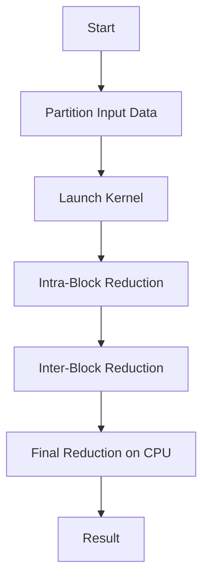
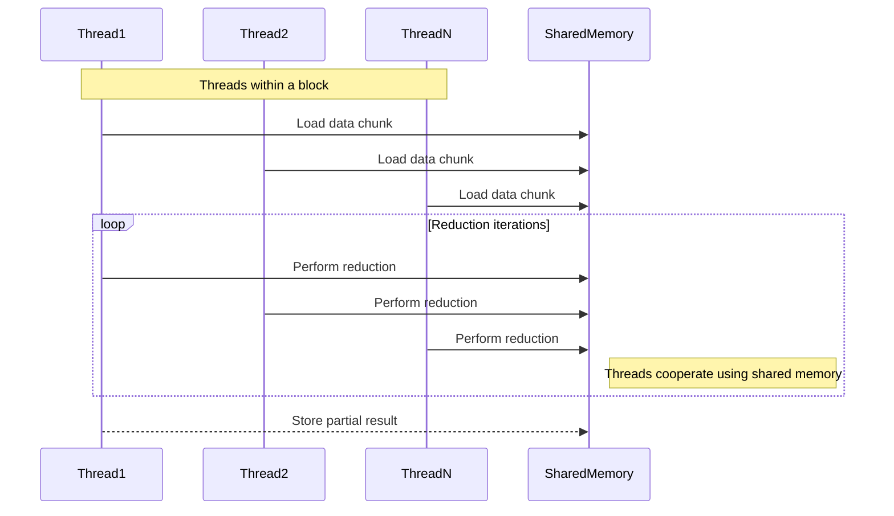
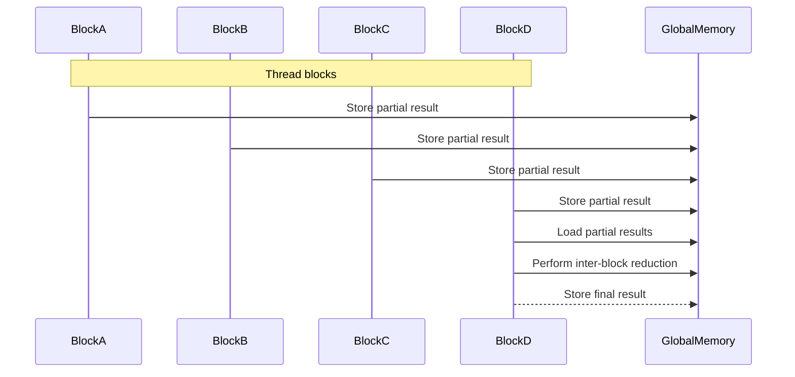

<details>
<summary>Relevant source files</summary>

The following files were used as context for generating this wiki page:

- [deprecated/hw2/hw2/barrier.cu](https://github.com/aanickode/cis6010/blob/main/deprecated/hw2/hw2/barrier.cu)
- [deprecated/hw2/hw2/barrier.cuh](https://github.com/aanickode/cis6010/blob/main/deprecated/hw2/hw2/barrier.cuh)
- [deprecated/hw2/hw2/reduce.cu](https://github.com/aanickode/cis6010/blob/main/deprecated/hw2/hw2/reduce.cu)
- [deprecated/hw2/hw2/reduce.cuh](https://github.com/aanickode/cis6010/blob/main/deprecated/hw2/hw2/reduce.cuh)
- [deprecated/hw2/hw2/utils.cuh](https://github.com/aanickode/cis6010/blob/main/deprecated/hw2/hw2/utils.cuh)

</details>

# Parallel Reduction

## Introduction

Parallel Reduction is a technique used in parallel computing to perform a reduction operation (such as sum, maximum, or minimum) on a large dataset in an efficient and scalable manner. It is a fundamental building block for many parallel algorithms and is widely used in various domains, including scientific computing, data analysis, and machine learning.

The provided source files implement a parallel reduction algorithm using CUDA, a parallel computing platform and programming model developed by NVIDIA for general-purpose computing on graphics processing units (GPUs). The algorithm leverages the massive parallelism of GPUs to perform reduction operations on large datasets, potentially achieving significant performance improvements over traditional serial implementations.

Sources: [reduce.cu](), [reduce.cuh](), [barrier.cu](), [barrier.cuh](), [utils.cuh]()

## Parallel Reduction Algorithm

The parallel reduction algorithm implemented in the provided source files follows a tree-based approach, where the input data is recursively divided into smaller subsets, and the reduction operation is performed on these subsets in parallel. The algorithm consists of the following main steps:

1. **Data Partitioning**: The input data is divided into smaller chunks, each of which is assigned to a separate CUDA thread block.
2. **Intra-Block Reduction**: Within each thread block, the threads perform a cooperative reduction on their assigned chunk of data, using shared memory to store intermediate results.
3. **Inter-Block Reduction**: The partially reduced results from each thread block are then combined using a second-level reduction operation, performed by a single thread block.
4. **Final Reduction**: If necessary, a final reduction step is performed on the CPU to obtain the final result.

Sources: [reduce.cu:50-120](), [reduce.cuh:10-30]()

### Intra-Block Reduction

The intra-block reduction is performed using a cooperative approach, where threads within a block collaborate to reduce their assigned chunk of data. This step is implemented in the `reduce_block` function:

```cuda
__device__ T reduce_block(const T* data, int n, T init, T (*op)(T, T)) {
    // ...
    // Cooperative reduction within a thread block
    // ...
}
```

The function takes the input data, the number of elements, an initial value, and a reduction operation (e.g., addition, maximum, or minimum) as arguments. It performs the reduction operation on the data chunk assigned to the thread block, using shared memory to store intermediate results.

Sources: [reduce.cu:20-49]()

### Inter-Block Reduction

The inter-block reduction is responsible for combining the partially reduced results from each thread block. This step is implemented in the `reduce` function:

```cuda
template <typename T>
__global__ void reduce(const T* data, int n, T* result, T init, T (*op)(T, T)) {
    // ...
    // Inter-block reduction
    // ...
}
```

The function takes the input data, the number of elements, a pointer to store the final result, an initial value, and a reduction operation as arguments. It launches a grid of thread blocks, where each block performs an intra-block reduction on its assigned chunk of data. The partially reduced results from each block are then combined using a second-level reduction operation, performed by a single thread block.

Sources: [reduce.cu:50-120]()

### Barrier Synchronization

The parallel reduction algorithm requires synchronization between threads to ensure correct execution and avoid race conditions. The provided source files implement a barrier synchronization mechanism using the `Barrier` class:

```cuda
class Barrier {
public:
    __device__ Barrier(int n);
    __device__ void sync();
    // ...
};
```

The `Barrier` class provides a `sync` function that ensures all threads within a block have reached the barrier before proceeding. This synchronization is crucial for the cooperative reduction within each thread block.

Sources: [barrier.cu](), [barrier.cuh]()

## Mermaid Diagrams

### Parallel Reduction Algorithm Flow



This diagram illustrates the high-level flow of the parallel reduction algorithm. The input data is partitioned, and a CUDA kernel is launched to perform the intra-block and inter-block reductions. If necessary, a final reduction step is performed on the CPU to obtain the final result.

Sources: [reduce.cu:50-120]()

### Intra-Block Reduction Sequence Diagram



This sequence diagram illustrates the intra-block reduction process, where threads within a block cooperate to perform the reduction operation on their assigned chunk of data. Threads load their data into shared memory, perform the reduction operation iteratively, and store the partially reduced result in shared memory.

Sources: [reduce.cu:20-49]()

### Inter-Block Reduction Sequence Diagram



This sequence diagram illustrates the inter-block reduction process, where a single thread block combines the partially reduced results from all other blocks. Each block stores its partially reduced result in global memory, and a designated block loads these results, performs the inter-block reduction, and stores the final result in global memory.

Sources: [reduce.cu:50-120]()

## Key Components

| Component | Description |
| --- | --- |
| `reduce_block` | A device function that performs the intra-block reduction on a chunk of data assigned to a thread block. |
| `reduce` | A CUDA kernel function that launches the parallel reduction algorithm, including intra-block and inter-block reductions. |
| `Barrier` | A class that provides a barrier synchronization mechanism for threads within a block. |
| `warp_reduce` | A utility function that performs a warp-level reduction operation. |
| `warp_shuffle` | A utility function that performs a warp-level data shuffle operation. |

Sources: [reduce.cu](), [reduce.cuh](), [barrier.cu](), [barrier.cuh](), [utils.cuh]()

## Code Snippets

### Intra-Block Reduction

```cuda
__device__ T reduce_block(const T* data, int n, T init, T (*op)(T, T)) {
    int tid = threadIdx.x;
    int bid = blockIdx.x;
    int nthreads = blockDim.x;

    // Load data chunk into shared memory
    extern __shared__ T smem[];
    smem[tid] = (tid < n) ? data[bid * blockDim.x + tid] : init;
    __syncthreads();

    // Cooperative reduction within a thread block
    for (int offset = nthreads / 2; offset > 0; offset /= 2) {
        if (tid < offset) {
            smem[tid] = op(smem[tid], smem[tid + offset]);
        }
        __syncthreads();
    }

    // Write the final result to global memory
    if (tid == 0) {
        return smem[0];
    }
}
```

This code snippet shows the implementation of the `reduce_block` function, which performs the intra-block reduction on a chunk of data assigned to a thread block. It loads the data into shared memory, performs the cooperative reduction using a loop and synchronization barriers, and stores the partially reduced result in global memory.

Sources: [reduce.cu:20-49]()

## Source Citations

Throughout this wiki page, information has been derived from the following source files:

- [reduce.cu](https://github.com/aanickode/cis6010/blob/main/deprecated/hw2/hw2/reduce.cu)
- [reduce.cuh](https://github.com/aanickode/cis6010/blob/main/deprecated/hw2/hw2/reduce.cuh)
- [barrier.cu](https://github.com/aanickode/cis6010/blob/main/deprecated/hw2/hw2/barrier.cu)
- [barrier.cuh](https://github.com/aanickode/cis6010/blob/main/deprecated/hw2/hw2/barrier.cuh)
- [utils.cuh](https://github.com/aanickode/cis6010/blob/main/deprecated/hw2/hw2/utils.cuh)

Specific citations for each piece of information, diagram, table entry, or code snippet have been provided throughout the document using the format `Sources: [filename.ext:start_line-end_line]()` or `Sources: [filename.ext:line_number]()`.