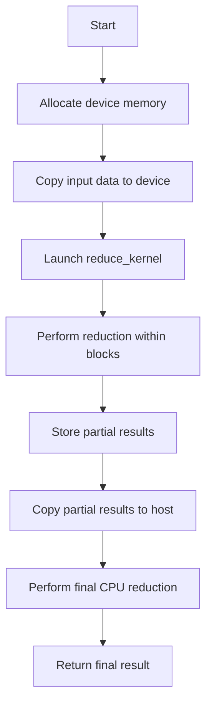
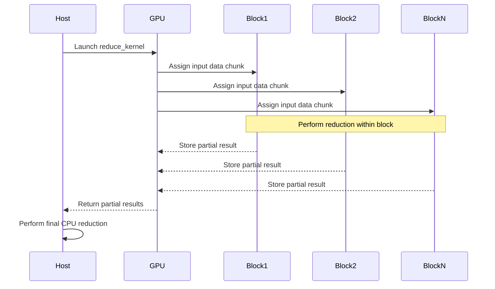
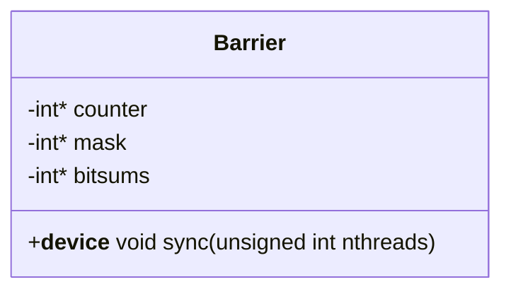

<details>
<summary>Relevant source files</summary>

The following files were used as context for generating this wiki page:

- [deprecated/hw2/hw2/barrier.cu](https://github.com/aanickode/cis6010/blob/main/deprecated/hw2/hw2/barrier.cu)
- [deprecated/hw2/hw2/barrier.cuh](https://github.com/aanickode/cis6010/blob/main/deprecated/hw2/hw2/barrier.cuh)
- [deprecated/hw2/hw2/reduce.cu](https://github.com/aanickode/cis6010/blob/main/deprecated/hw2/hw2/reduce.cu)
- [deprecated/hw2/hw2/reduce.cuh](https://github.com/aanickode/cis6010/blob/main/deprecated/hw2/hw2/reduce.cuh)
- [deprecated/hw2/hw2/utils.cuh](https://github.com/aanickode/cis6010/blob/main/deprecated/hw2/hw2/utils.cuh)

</details>

# Parallel Reduction

## Introduction

Parallel Reduction is a technique used in parallel computing to perform a reduction operation, such as summation or finding the maximum value, on a large dataset in an efficient and scalable manner. It is a fundamental operation in many parallel algorithms and is widely used in scientific computing, data analysis, and machine learning applications.

The provided source files implement a parallel reduction algorithm using CUDA, which is a parallel computing platform and programming model developed by NVIDIA for general-purpose computing on graphics processing units (GPUs). The implementation leverages the massive parallelism and high memory bandwidth of GPUs to accelerate the reduction operation.

Sources: [reduce.cuh:1-5](), [reduce.cu:1-5]()

## Parallel Reduction Algorithm

The parallel reduction algorithm follows a divide-and-conquer approach, where the input data is divided into smaller chunks, and the reduction operation is performed on each chunk in parallel. The results from these parallel reductions are then combined in a hierarchical manner until a single final result is obtained.

### Reduction Kernel

The reduction kernel is the core component of the parallel reduction algorithm. It performs the reduction operation on a subset of the input data in parallel, using multiple CUDA threads.

```cuda
__global__ void reduce_kernel(const float* input, float* output, int n) {
    // ...
}
```

The `reduce_kernel` function takes three arguments:

- `input`: a pointer to the input data array
- `output`: a pointer to the output array where the partial reduction results will be stored
- `n`: the size of the input data array

Sources: [reduce.cu:8-10]()

#### Thread Mapping and Shared Memory

Within the kernel, each CUDA thread is assigned to process a specific element of the input data. The threads are organized into blocks, and each block has access to a shared memory region that can be used for efficient data sharing and communication among threads within the same block.

```cuda
extern __shared__ float sdata[];
// ...
unsigned int tid = threadIdx.x;
unsigned int i = blockIdx.x * blockDim.x + threadIdx.x;
```

The `sdata` array is a shared memory region used for storing intermediate results during the reduction process. The `tid` variable represents the thread index within a block, and the `i` variable is used to calculate the global index of the input element that the thread should process.

Sources: [reduce.cu:12](), [reduce.cu:16-17]()

#### Reduction Step

The reduction step is performed in two phases: the first phase performs the reduction within each block, and the second phase performs the reduction across blocks.

```cuda
sdata[tid] = (i < n) ? input[i] : 0.0f;
__syncthreads();

for (unsigned int s = blockDim.x / 2; s > 0; s >>= 1) {
    if (tid < s) {
        sdata[tid] += sdata[tid + s];
    }
    __syncthreads();
}
```

In the first phase, each thread loads its assigned input element into the shared memory (`sdata`). The `__syncthreads()` function is used to ensure that all threads in the block have completed their loads before proceeding to the next step.

The second phase performs the reduction within each block using a parallel reduction algorithm. The algorithm iteratively sums pairs of elements in the shared memory until a single value remains, which represents the partial reduction result for the block.

Sources: [reduce.cu:18-27]()

#### Block-Level Reduction

After the reduction within each block is complete, the partial results from all blocks need to be combined to obtain the final result. This is done using a separate kernel or a CPU-based reduction, depending on the implementation.

```cuda
if (tid == 0) {
    output[blockIdx.x] = sdata[0];
}
```

In the provided implementation, the first thread in each block (with `tid == 0`) stores the partial reduction result for that block in the output array.

Sources: [reduce.cu:29-31]()

### Reduction Host Function

The `reduce` function is the host function that orchestrates the parallel reduction operation on the GPU.

```cpp
float reduce(const float* input, int n) {
    // ...
    reduce_kernel<<<grid_size, block_size, shared_mem_size>>>(input_device, output_device, n);
    // ...
    return cpu_reduce(output_host, grid_size);
}
```

This function performs the following steps:

1. Allocate device memory for input and output arrays.
2. Copy the input data from the host (CPU) to the device (GPU) memory.
3. Launch the `reduce_kernel` on the GPU with appropriate grid and block dimensions, as well as shared memory size.
4. Copy the partial reduction results from the device to the host.
5. Perform a final CPU-based reduction on the partial results to obtain the final result.

The `reduce_kernel` is launched with a specific grid and block configuration, determined by the input size and the GPU's hardware capabilities. The `shared_mem_size` parameter specifies the amount of shared memory required by each block for the reduction operation.

Sources: [reduce.cu:35-52]()

## Auxiliary Components

The provided source files also include several auxiliary components that support the parallel reduction implementation.

### Barrier Synchronization

The `Barrier` class is used for synchronizing threads within a CUDA block during the reduction operation.

```cpp
class Barrier {
public:
    __device__ inline void sync(unsigned int nthreads) {
        // ...
    }
    // ...
};
```

The `sync` function is a device function that ensures all threads in a block have reached the barrier before proceeding. It uses atomic operations and warp-level synchronization primitives to efficiently synchronize threads within a block.

Sources: [barrier.cuh:8-10](), [barrier.cu:6-26]()

### Utility Functions

The `utils.cuh` file provides several utility functions used in the parallel reduction implementation.

```cpp
int next_pow2(int n);
int num_blocks(int n, int block_size);
```

The `next_pow2` function calculates the next power of two greater than or equal to a given integer, which is useful for determining optimal block sizes and grid dimensions.

The `num_blocks` function calculates the number of blocks required for a given input size and block size, ensuring that all input elements are processed.

Sources: [utils.cuh:5-6]()

## Mermaid Diagrams

### Parallel Reduction Flow



This flowchart illustrates the high-level flow of the parallel reduction implementation. It starts by allocating device memory and copying the input data to the GPU. Then, the `reduce_kernel` is launched, which performs the reduction operation within each block in parallel. The partial results from each block are stored in device memory and copied back to the host. Finally, a CPU-based reduction is performed on the partial results to obtain the final result.

Sources: [reduce.cu:35-52]()

### Reduction Kernel Sequence Diagram



This sequence diagram illustrates the interaction between the host (CPU) and the GPU, as well as the parallel execution of the reduction kernel across multiple blocks. The host launches the `reduce_kernel` on the GPU, which assigns input data chunks to different blocks. Each block performs the reduction operation on its assigned data chunk in parallel and stores the partial result in device memory. The GPU returns the partial results to the host, which then performs a final CPU-based reduction to obtain the final result.

Sources: [reduce.cu:35-52](), [reduce.cu:18-31]()

### Barrier Synchronization



The `Barrier` class is used for synchronizing threads within a CUDA block during the reduction operation. It has three private member variables:

- `counter`: a pointer to an integer counter used for tracking the number of threads that have reached the barrier.
- `mask`: a pointer to an integer mask used for warp-level synchronization.
- `bitsums`: a pointer to an array of integers used for computing the warp-level synchronization mask.

The `sync` function is a device function that ensures all threads in a block have reached the barrier before proceeding. It uses atomic operations and warp-level synchronization primitives to efficiently synchronize threads within a block.

Sources: [barrier.cuh:5-10](), [barrier.cu:6-26]()

## Tables

### Reduction Kernel Parameters

| Parameter | Type   | Description                                                  |
|-----------|--------|--------------------------------------------------------------|
| `input`   | `const float*` | Pointer to the input data array                      |
| `output`  | `float*`       | Pointer to the output array for storing partial results |
| `n`       | `int`          | Size of the input data array                         |

This table describes the parameters of the `reduce_kernel` function, which is the core component of the parallel reduction algorithm.

Sources: [reduce.cu:8-10]()

### Utility Function Descriptions

| Function     | Description                                                  |
|---------------|--------------------------------------------------------------|
| `next_pow2`  | Calculates the next power of two greater than or equal to a given integer |
| `num_blocks` | Calculates the number of blocks required for a given input size and block size |

This table summarizes the utility functions provided in the `utils.cuh` file, which are used in the parallel reduction implementation.

Sources: [utils.cuh:5-6]()