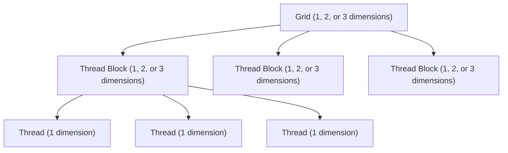
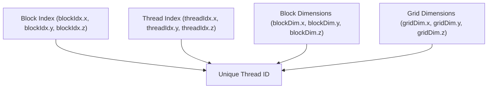
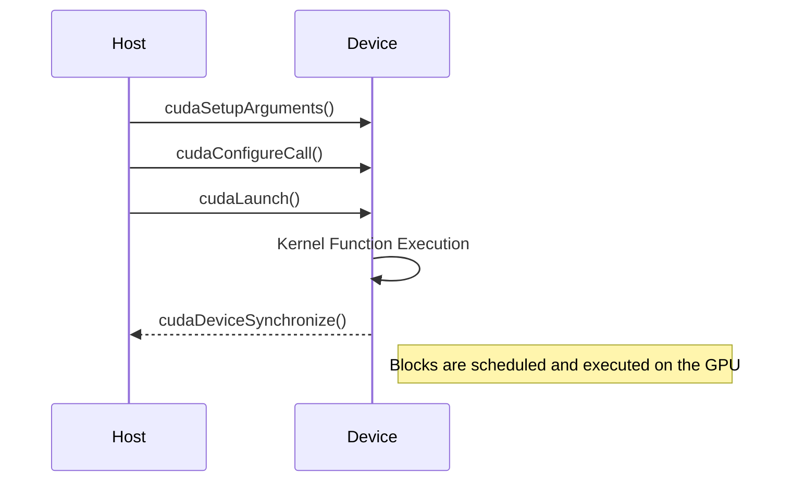

Relevant source files

The following files were used as context for generating this wiki page:

- [deprecated/hw0/helper_cuda.h](https://github.com/aanickode/cis6010/blob/main/deprecated/hw0/helper_cuda.h)
- [deprecated/hw0/helper_string.h](https://github.com/aanickode/cis6010/blob/main/deprecated/hw0/helper_string.h)
- [deprecated/hw0/helper_timer.h](https://github.com/aanickode/cis6010/blob/main/deprecated/hw0/helper_timer.h)
- [deprecated/hw0/hw0.cu](https://github.com/aanickode/cis6010/blob/main/deprecated/hw0/hw0.cu)
- [deprecated/hw0/hw0.h](https://github.com/aanickode/cis6010/blob/main/deprecated/hw0/hw0.h)

# CUDA Thread Hierarchy

## Introduction

The CUDA Thread Hierarchy is a fundamental concept in NVIDIA's CUDA programming model, which enables parallel execution of code on CUDA-enabled GPUs. It defines the organization and mapping of threads to the underlying hardware architecture, allowing efficient utilization of the GPU's massive parallelism. This hierarchy is crucial for achieving high performance in data-parallel computations by leveraging the GPU's computational resources effectively.

Within the context of the provided project, the CUDA Thread Hierarchy plays a vital role in executing parallel operations on the GPU, potentially for tasks such as image processing, scientific simulations, or other computationally intensive workloads.

Sources: [deprecated/hw0/helper_cuda.h](), [deprecated/hw0/hw0.cu](), [deprecated/hw0/hw0.h]()

## Thread Organization

### Grid and Blocks

The CUDA Thread Hierarchy is organized into a grid of thread blocks, where each block consists of multiple threads. This structure allows for efficient mapping of threads to the GPU's hardware resources.

A grid is a collection of thread blocks that execute the same kernel function on the GPU. Each thread block is further divided into individual threads, which are the smallest units of execution.

Sources: [deprecated/hw0/helper_cuda.h:36-44](), [deprecated/hw0/hw0.cu:22-24]()

### Thread Indexing

Each thread within a block is identified by a unique thread index, which can be one-, two-, or three-dimensional, depending on the block's configuration. Similarly, each block within a grid has a unique block index, also with one, two, or three dimensions.

These indices are accessible within the CUDA kernel code and can be used to determine the specific data elements or computations that each thread should handle.

Sources: [deprecated/hw0/helper_cuda.h:36-44](), [deprecated/hw0/hw0.cu:22-24]()

## Memory Hierarchy

The CUDA Thread Hierarchy is closely tied to the GPU's memory hierarchy, which includes different types of memory with varying scopes, access patterns, and performance characteristics.

| Memory Type | Scope | Access | Description |
| --- | --- | --- | --- |
| Global Memory | Grid | Read/Write | Large, high-latency, accessible by all threads |
| Shared Memory | Block | Read/Write | Low-latency, shared by threads within a block |
| Registers | Thread | Read/Write | Low-latency, private to each thread |
| Constant Memory | Grid | Read-only | Cached, accessible by all threads |
| Texture Memory | Grid | Read-only | Cached, optimized for spatial locality |

Proper utilization of the memory hierarchy is crucial for achieving high performance in CUDA applications. Shared memory, for example, can be used to facilitate data sharing and reduce global memory access among threads within a block.

Sources: [deprecated/hw0/helper_cuda.h:46-62]()

## Kernel Execution

To execute a CUDA kernel function on the GPU, the host code (running on the CPU) must launch the kernel and specify the grid and block dimensions, along with any necessary kernel arguments.

The kernel function is executed in parallel by all threads within the specified grid and block dimensions. The host code can synchronize with the GPU and retrieve the results of the kernel execution.

Sources: [deprecated/hw0/hw0.cu:22-24, 40-44](), [deprecated/hw0/helper_cuda.h:36-44]()

## Performance Considerations

To achieve optimal performance with the CUDA Thread Hierarchy, several factors should be considered:

- **Thread Divergence**: Threads within a warp (a group of 32 threads) should follow the same execution path to avoid divergence and serialization.
- **Memory Access Patterns**: Coalesced memory access patterns, where threads within a warp access contiguous memory locations, can significantly improve performance.
- **Occupancy**: The number of active warps per multiprocessor should be maximized to fully utilize the GPU's resources.
- **Shared Memory Usage**: Shared memory can be used to reduce global memory access and facilitate data sharing among threads within a block.
- **Kernel Launch Configuration**: Choosing appropriate grid and block dimensions based on the problem size and GPU architecture can improve performance and resource utilization.

Sources: [deprecated/hw0/helper_cuda.h:36-44](), [deprecated/hw0/hw0.cu:22-24]()

By understanding and effectively leveraging the CUDA Thread Hierarchy, developers can harness the massive parallelism of GPUs and achieve significant performance improvements for data-parallel computations.