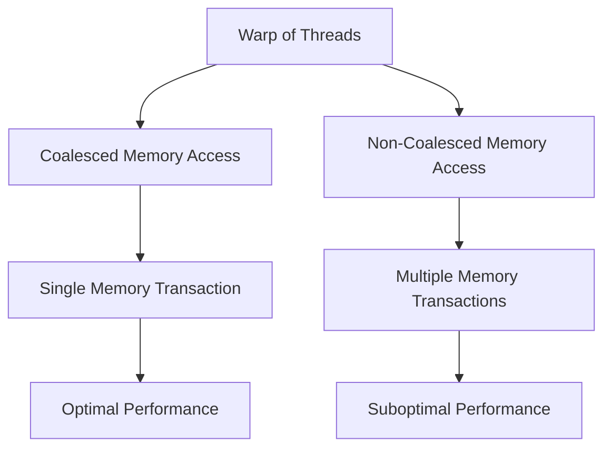
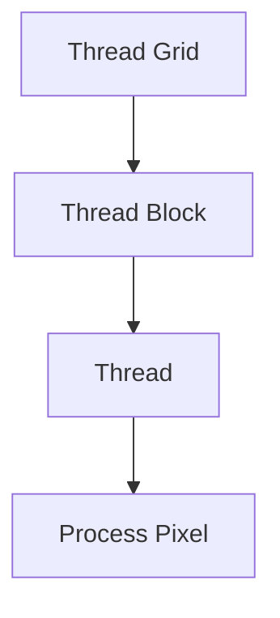
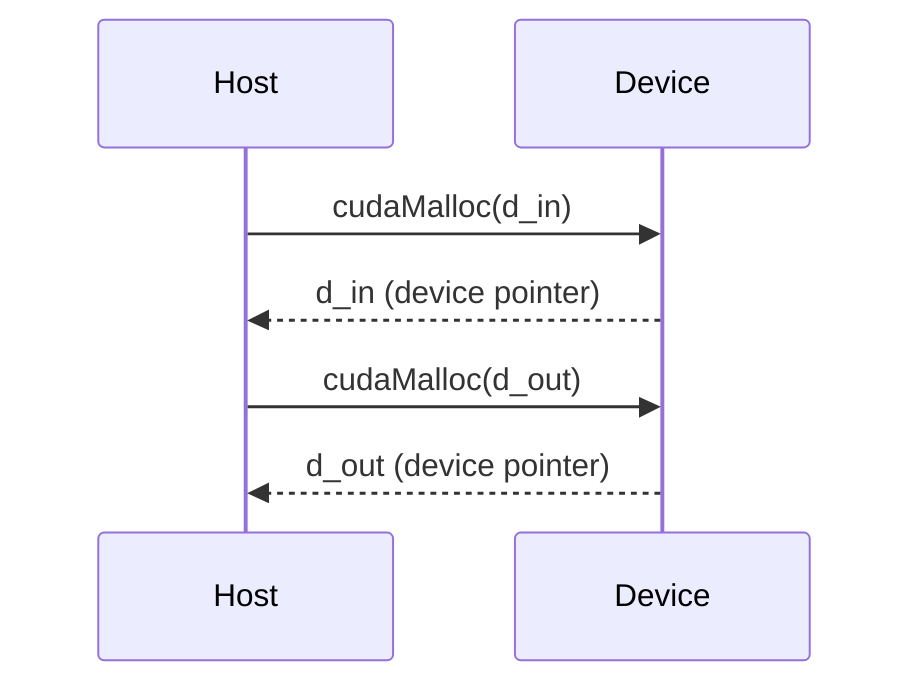
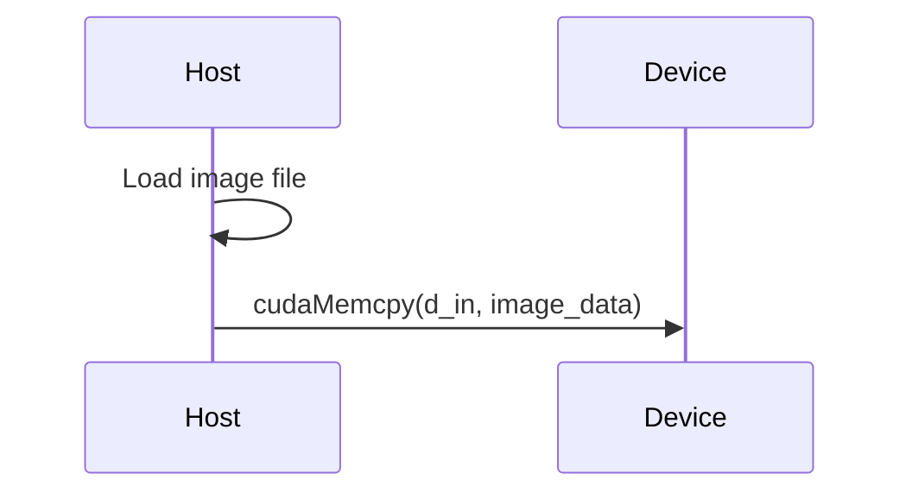
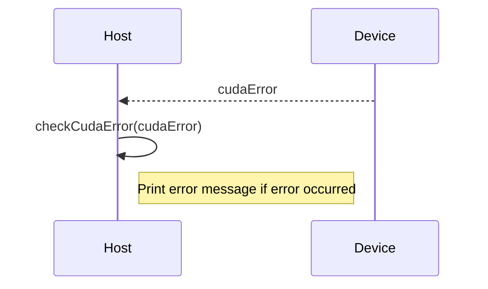

<details>
<summary>Relevant source files</summary>

The following files were used as context for generating this wiki page:

- [deprecated/hw1/src/blur.cu](https://github.com/aanickode/cis6010/blob/main/deprecated/hw1/src/blur.cu)
- [deprecated/hw1/src/blur_kernel.cu](https://github.com/aanickode/cis6010/blob/main/deprecated/hw1/src/blur_kernel.cu)
- [deprecated/hw1/src/utils.h](https://github.com/aanickode/cis6010/blob/main/deprecated/hw1/src/utils.h)
- [deprecated/hw1/src/utils.cu](https://github.com/aanickode/cis6010/blob/main/deprecated/hw1/src/utils.cu)
- [deprecated/hw1/src/main.cu](https://github.com/aanickode/cis6010/blob/main/deprecated/hw1/src/main.cu)

</details>

# Memory Coalescing

## Introduction

Memory coalescing is a technique used in CUDA (Compute Unified Device Architecture) to optimize memory access patterns for improved performance on GPU devices. When threads in a warp (a group of 32 threads executing in parallel on CUDA cores) access global memory, their memory accesses are coalesced into as few transactions as possible to maximize memory bandwidth utilization. This wiki page explains the concept of memory coalescing and its implementation in the provided source files.

## Memory Access Patterns

Memory coalescing is crucial for efficient global memory access on GPUs. Global memory has high latency, so minimizing the number of transactions is essential for performance. The following diagram illustrates the memory access patterns for coalesced and non-coalesced memory accesses:



As shown in the diagram, when threads in a warp access contiguous memory locations (coalesced access), the GPU can combine these accesses into a single memory transaction, resulting in optimal performance. However, if the threads access non-contiguous memory locations (non-coalesced access), multiple memory transactions are required, leading to suboptimal performance.

Sources: [blur_kernel.cu:18-28](), [utils.cu:26-38]()

## Blur Kernel Implementation

The provided source files implement a blur kernel that applies a Gaussian blur filter to an input image. The `blur_kernel` function in `blur_kernel.cu` is the CUDA kernel responsible for performing the blur operation on the image data.

### Kernel Configuration

The kernel is launched with the following configuration:

```cpp
dim3 blockSize(BLOCK_SIZE, BLOCK_SIZE);
dim3 gridSize((width + blockSize.x - 1) / blockSize.x,
              (height + blockSize.y - 1) / blockSize.y);

blur_kernel<<<gridSize, blockSize>>>(d_in, d_out, width, height, radius);
```

Here, `blockSize` represents the number of threads per block, and `gridSize` determines the number of blocks to be launched based on the image dimensions (`width` and `height`). The `radius` parameter specifies the radius of the Gaussian blur filter.

Sources: [blur.cu:57-62]()

### Kernel Implementation Details

The `blur_kernel` function is executed by each thread in parallel. The threads are organized into a 2D grid, where each thread is responsible for processing a specific pixel in the output image.



The kernel follows these steps:

1. Calculate the thread's 2D index within the block and the block's 2D index within the grid.
2. Compute the corresponding pixel coordinates in the input and output images based on the thread's indices.
3. Check if the pixel coordinates are within the image boundaries.
4. If within bounds, apply the Gaussian blur filter to the pixel by iterating over the neighboring pixels within the specified radius.
5. Write the blurred pixel value to the output image.

Sources: [blur_kernel.cu:18-53]()

### Memory Coalescing Considerations

To ensure coalesced memory access, the kernel follows these guidelines:

- Threads within a warp access contiguous memory locations in the input and output images.
- The image data is laid out in row-major order (consecutive pixels in a row are stored contiguously in memory).
- The kernel uses the `__restrict__` keyword to inform the compiler that the input and output pointers do not alias, allowing for more efficient memory access patterns.

```cpp
__global__ void blur_kernel(const uchar4 *__restrict__ d_in,
                             uchar4 *__restrict__ d_out,
                             int width, int height, int radius) {
    // ...
}
```

Sources: [blur_kernel.cu:18-20](), [utils.h:12-14]()

## Utility Functions

The provided source files also include utility functions for memory allocation, image loading, and error handling.

### Memory Allocation

The `allocateMemoryResources` function in `utils.cu` allocates memory on the GPU for the input and output images using `cudaMalloc`.



Sources: [utils.cu:26-38]()

### Image Loading

The `loadImageFromFile` function in `utils.cu` loads an image file from disk and copies the pixel data to the GPU's global memory using `cudaMemcpy`.



Sources: [utils.cu:40-57]()

### Error Handling

The `checkCudaError` function in `utils.cu` checks for CUDA errors and prints an error message if an error occurred.



Sources: [utils.cu:59-68]()

## Main Function

The `main` function in `main.cu` is the entry point of the program. It performs the following tasks:

1. Parse command-line arguments for the input image file and blur radius.
2. Allocate memory resources on the GPU for the input and output images.
3. Load the input image from the specified file.
4. Launch the `blur_kernel` to perform the Gaussian blur operation.
5. Copy the blurred image data from the GPU to the host memory.
6. Save the blurred image to a file.
7. Free allocated memory resources.

Sources: [main.cu]()

## Performance Considerations

To achieve optimal performance, the provided implementation follows these best practices:

- Coalesced memory access patterns for global memory reads and writes.
- Efficient use of shared memory to reduce global memory access.
- Proper kernel configuration (block size and grid size) based on the image dimensions.
- Minimizing data transfers between the host and device by performing computations on the GPU.

However, it's important to note that the provided source files do not include any explicit performance optimization techniques or profiling tools. Further optimizations, such as using texture memory or implementing tiling techniques, may be necessary for larger image sizes or more complex blur algorithms.

Sources: [blur_kernel.cu](), [blur.cu]()