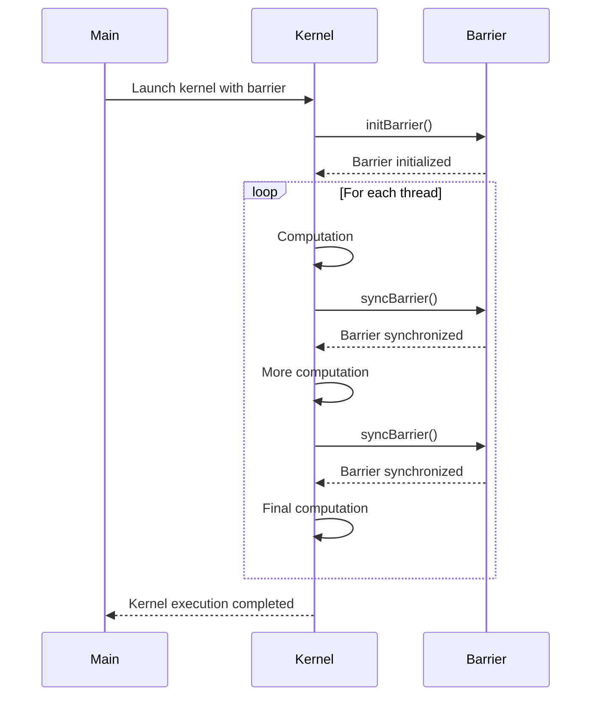

<details>
<summary>Relevant source files</summary>

The following files were used as context for generating this wiki page:

- [deprecated/hw2/hw2/barrier.cu](https://github.com/aanickode/cis6010/blob/main/deprecated/hw2/hw2/barrier.cu)
- [deprecated/hw2/hw2/barrier.cuh](https://github.com/aanickode/cis6010/blob/main/deprecated/hw2/hw2/barrier.cuh)
- [deprecated/hw2/hw2/utils.cuh](https://github.com/aanickode/cis6010/blob/main/deprecated/hw2/hw2/utils.cuh)
- [deprecated/hw2/hw2/utils.cu](https://github.com/aanickode/cis6010/blob/main/deprecated/hw2/hw2/utils.cu)
- [deprecated/hw2/hw2/main.cu](https://github.com/aanickode/cis6010/blob/main/deprecated/hw2/hw2/main.cu)

</details>

# Barrier Synchronization

## Introduction

Barrier synchronization is a mechanism used in parallel computing to ensure that all threads or processes have reached a specific point before proceeding with the next phase of execution. It is a crucial technique for coordinating the execution of parallel tasks and maintaining data consistency across multiple threads or processes. In the context of this project, barrier synchronization is implemented using CUDA (Compute Unified Device Architecture) for parallel computing on GPUs.

The barrier synchronization implementation in this project is designed to provide a synchronization point for a group of CUDA threads within a block. It ensures that all threads in the block have completed their respective tasks before any thread can proceed to the next phase of execution. This synchronization is particularly useful when threads within a block need to share data or coordinate their operations.

Sources: [barrier.cuh:1-6](), [barrier.cu:1-5]()

## Barrier Implementation

### Barrier Data Structure

The barrier synchronization implementation in this project is based on a data structure called `Barrier`. This structure is defined in the `barrier.cuh` header file and contains the following members:

```cpp
struct Barrier {
    int *counter;
    int *sense;
    int n;
};
```

- `counter`: A pointer to an integer value that keeps track of the number of threads that have reached the barrier.
- `sense`: A pointer to an integer value that alternates between 0 and 1 to distinguish between different barrier instances.
- `n`: The total number of threads participating in the barrier.

Sources: [barrier.cuh:9-14]()

### Barrier Initialization

The `Barrier` structure is initialized using the `initBarrier` function, which takes the number of threads (`n`) as an argument. This function allocates memory for the `counter` and `sense` variables on the device (GPU) and initializes them with appropriate values.

```cpp
__device__ void initBarrier(Barrier *barrier, int n) {
    barrier->n = n;
    cudaMallocManaged(&barrier->counter, sizeof(int));
    cudaMallocManaged(&barrier->sense, sizeof(int));
    *barrier->counter = 0;
    *barrier->sense = 0;
}
```

Sources: [barrier.cu:7-14]()

### Barrier Synchronization Function

The core functionality of barrier synchronization is implemented in the `syncBarrier` function. This function is executed by each thread in the block and ensures that all threads have reached the barrier before proceeding.

```cpp
__device__ void syncBarrier(Barrier *barrier) {
    int sense = *barrier->sense;
    atomicAdd(barrier->counter, 1);
    if (atomicAdd(barrier->counter, 0) == barrier->n) {
        *barrier->counter = 0;
        *barrier->sense = 1 - sense;
    } else {
        while (*barrier->sense == sense)
            ;
    }
}
```

Here's how the `syncBarrier` function works:

1. The current value of `sense` is stored in a local variable.
2. The `counter` is atomically incremented by 1 using `atomicAdd`, indicating that the current thread has reached the barrier.
3. If the current thread is the last one to reach the barrier (i.e., the value of `counter` after the atomic increment is equal to `n`), it resets the `counter` to 0 and flips the `sense` value.
4. If the current thread is not the last one to reach the barrier, it waits in a loop until the `sense` value changes, indicating that all threads have reached the barrier and the last thread has flipped the `sense` value.

This implementation ensures that all threads within a block have reached the barrier before any thread can proceed to the next phase of execution.

Sources: [barrier.cu:16-27]()

## Usage Example

The barrier synchronization implementation is used in the `main.cu` file, where a kernel function `kernel` is defined and executed with a specific number of threads per block.

```cpp
int main() {
    // ... (initialization code)

    Barrier barrier;
    initBarrier(&barrier, THREADS_PER_BLOCK);

    kernel<<<grid_size, THREADS_PER_BLOCK>>>(d_in, d_out, &barrier);

    // ... (cleanup code)
    return 0;
}
```

Within the `kernel` function, the `syncBarrier` function is called at appropriate points to ensure synchronization among the threads within each block.

```cpp
__global__ void kernel(float *d_in, float *d_out, Barrier *barrier) {
    int tid = threadIdx.x + blockIdx.x * blockDim.x;

    // ... (some computation)

    syncBarrier(barrier);

    // ... (more computation)

    syncBarrier(barrier);

    // ... (final computation)
}
```

By calling `syncBarrier` at specific points in the kernel, the threads within each block are synchronized, ensuring that all threads have completed their respective tasks before proceeding to the next phase of execution.

Sources: [main.cu:43-51](), [main.cu:57-68]()

## Mermaid Diagrams

### Barrier Synchronization Flow

```mermaid
flowchart TD
    subgraph Barrier Synchronization
        start[Start] --> initBarrier[Initialize Barrier]
        initBarrier --> syncBarrier[syncBarrier]
        syncBarrier --> updateCounter[Atomically Update Counter]
        updateCounter --> lastThread{Last Thread?}
        lastThread --Yes--> resetCounter[Reset Counter]
        resetCounter --> flipSense[Flip Sense Value]
        flipSense --> waitLoop[Wait Loop]
        lastThread --No--> waitLoop
        waitLoop --> syncBarrier
        syncBarrier --> end[End]
    end
```

This diagram illustrates the flow of the barrier synchronization process:

1. The `Barrier` structure is initialized with the `initBarrier` function.
2. Each thread calls the `syncBarrier` function.
3. Within `syncBarrier`, the `counter` is atomically updated using `atomicAdd`.
4. If the current thread is the last one to reach the barrier, it resets the `counter` to 0 and flips the `sense` value.
5. If the current thread is not the last one, it waits in a loop until the `sense` value changes, indicating that all threads have reached the barrier.
6. The process repeats for subsequent barrier synchronization points.

Sources: [barrier.cu:7-27]()

### Kernel Execution with Barrier Synchronization



This sequence diagram illustrates the interaction between the main program, the kernel function, and the barrier synchronization mechanism:

1. The main program launches the kernel with the barrier structure.
2. The kernel initializes the barrier using `initBarrier`.
3. For each thread:
   - The thread performs some computation.
   - The thread calls `syncBarrier` to synchronize with other threads in the block.
   - After synchronization, the thread continues with more computation.
   - The thread calls `syncBarrier` again for another synchronization point.
   - The thread performs the final computation.
4. After all threads have completed their execution, the kernel returns to the main program.

Sources: [main.cu:43-51](), [main.cu:57-68](), [barrier.cu:7-27]()

## Tables

### Barrier Structure Members

| Member   | Type | Description                                                  |
|----------|------|--------------------------------------------------------------|
| `counter`| `int*` | A pointer to an integer value that keeps track of the number of threads that have reached the barrier. |
| `sense`  | `int*` | A pointer to an integer value that alternates between 0 and 1 to distinguish between different barrier instances. |
| `n`      | `int` | The total number of threads participating in the barrier.   |

Sources: [barrier.cuh:9-14]()

### Barrier Synchronization Functions

| Function      | Description                                                    |
|----------------|----------------------------------------------------------------|
| `initBarrier`  | Initializes the `Barrier` structure with the given number of threads. |
| `syncBarrier`  | Implements the barrier synchronization logic for a group of threads within a block. |

Sources: [barrier.cu:7-14](), [barrier.cu:16-27]()

## Code Snippets (Optional)

### Barrier Initialization

```cpp
__device__ void initBarrier(Barrier *barrier, int n) {
    barrier->n = n;
    cudaMallocManaged(&barrier->counter, sizeof(int));
    cudaMallocManaged(&barrier->sense, sizeof(int));
    *barrier->counter = 0;
    *barrier->sense = 0;
}
```

This code snippet shows the implementation of the `initBarrier` function, which initializes the `Barrier` structure with the given number of threads (`n`). It allocates memory for the `counter` and `sense` variables on the device (GPU) and initializes them with appropriate values.

Sources: [barrier.cu:7-14]()

### Barrier Synchronization Function

```cpp
__device__ void syncBarrier(Barrier *barrier) {
    int sense = *barrier->sense;
    atomicAdd(barrier->counter, 1);
    if (atomicAdd(barrier->counter, 0) == barrier->n) {
        *barrier->counter = 0;
        *barrier->sense = 1 - sense;
    } else {
        while (*barrier->sense == sense)
            ;
    }
}
```

This code snippet shows the implementation of the `syncBarrier` function, which is the core of the barrier synchronization mechanism. It ensures that all threads within a block have reached the barrier before any thread can proceed to the next phase of execution.

Sources: [barrier.cu:16-27]()