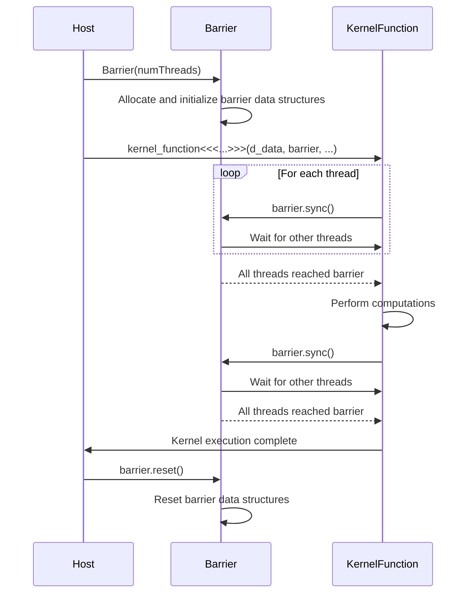

<details>
<summary>Relevant source files</summary>

The following files were used as context for generating this wiki page:

- [deprecated/hw2/hw2/barrier.cu](https://github.com/aanickode/cis6010/blob/main/deprecated/hw2/hw2/barrier.cu)
- [deprecated/hw2/hw2/barrier.cuh](https://github.com/aanickode/cis6010/blob/main/deprecated/hw2/hw2/barrier.cuh)
- [deprecated/hw2/hw2/kernel.cu](https://github.com/aanickode/cis6010/blob/main/deprecated/hw2/hw2/kernel.cu)
- [deprecated/hw2/hw2/kernel.cuh](https://github.com/aanickode/cis6010/blob/main/deprecated/hw2/hw2/kernel.cuh)
- [deprecated/hw2/hw2/main.cu](https://github.com/aanickode/cis6010/blob/main/deprecated/hw2/hw2/main.cu)

</details>

# Barrier Synchronization

## Introduction

Barrier synchronization is a mechanism used in parallel programming to ensure that all threads or processes have reached a specific point in the program before any of them can proceed further. It is a way to coordinate the execution of multiple concurrent tasks, preventing race conditions and ensuring data consistency. In the context of this project, barrier synchronization is implemented using CUDA (Compute Unified Device Architecture) for parallel computing on GPUs.

The barrier synchronization functionality is primarily contained within the `barrier.cu` and `barrier.cuh` files, which provide an implementation of a barrier object and its associated operations. This mechanism is likely used in conjunction with other components of the project, such as the kernel functions defined in `kernel.cu` and `kernel.cuh`, to synchronize the execution of parallel threads on the GPU.

Sources: [barrier.cu](), [barrier.cuh](), [kernel.cu](), [kernel.cuh](), [main.cu]()

## Barrier Implementation

The barrier synchronization implementation consists of two main components: the `Barrier` class and the associated CUDA kernel functions.

### Barrier Class

The `Barrier` class is defined in `barrier.cuh` and provides an interface for creating and managing barrier objects. It has the following key members:

```cpp
class Barrier {
public:
    Barrier(int numThreads);
    ~Barrier();
    void sync();
    void reset();

private:
    int* d_sense;
    int* d_counts;
    int numThreads;
};
```

- `Barrier(int numThreads)`: Constructor that initializes the barrier with the specified number of threads.
- `~Barrier()`: Destructor that cleans up the allocated resources.
- `sync()`: Member function that synchronizes all threads at the barrier.
- `reset()`: Member function that resets the barrier for reuse.
- `d_sense`: Device pointer to an integer that alternates between 0 and 1 to indicate which group of threads should proceed.
- `d_counts`: Device pointer to an array that keeps track of the number of threads that have reached the barrier.
- `numThreads`: The number of threads participating in the barrier.

Sources: [barrier.cuh:6-18]()

### Barrier Kernel Functions

The `barrier.cu` file contains the CUDA kernel functions responsible for implementing the barrier synchronization logic. The key functions are:

```cpp
__device__ void barrier_init(int* d_sense, int* d_counts, int numThreads) { ... }

__device__ void barrier_sync(int* d_sense, int* d_counts, int numThreads) { ... }

__device__ void barrier_reset(int* d_sense, int* d_counts, int numThreads) { ... }
```

- `barrier_init`: Initializes the barrier data structures on the device.
- `barrier_sync`: Implements the barrier synchronization logic, ensuring that all threads have reached the barrier before proceeding.
- `barrier_reset`: Resets the barrier data structures for reuse.

The `barrier_sync` function is the core of the barrier synchronization implementation. It uses atomic operations and a sense-reversing technique to ensure that all threads have reached the barrier before allowing any of them to proceed.

Sources: [barrier.cu:8-38]()

## Barrier Synchronization Flow

The barrier synchronization process follows this general flow:

```mermaid
graph TD
    A[Thread calls Barrier::sync()] --> B[Increment thread count in d_counts]
    B --> C{All threads<br>reached barrier?}
    C -->|No| D[Wait for other threads]
    D --> C
    C -->|Yes| E[Reverse sense in d_sense]
    E --> F[Reset thread count in d_counts]
    F --> G[Allow threads to proceed]
    G --> H[Thread exits barrier]
```

1. Each thread calls the `Barrier::sync()` member function.
2. Inside the `barrier_sync` kernel function, the thread atomically increments its count in the `d_counts` array.
3. The thread checks if all threads have reached the barrier by comparing the sum of counts in `d_counts` with the total number of threads.
4. If not all threads have reached the barrier, the thread waits (spins) until the condition is met.
5. Once all threads have reached the barrier, the sense value in `d_sense` is reversed (from 0 to 1 or vice versa).
6. The counts in `d_counts` are reset to 0.
7. All threads are now allowed to proceed past the barrier.
8. The thread exits the barrier synchronization.

This process ensures that no thread can proceed until all threads have reached the barrier, effectively synchronizing their execution.

Sources: [barrier.cu:18-38](), [barrier.cuh:12]()

## Usage in Kernel Functions

The barrier synchronization mechanism is likely used within the kernel functions defined in `kernel.cu` and `kernel.cuh` to coordinate the execution of parallel threads on the GPU. For example, the `kernel_function` in `kernel.cu` might use the `Barrier` class to synchronize threads at specific points during its execution.

```cpp
__global__ void kernel_function(int* d_data, Barrier barrier, ...) {
    // ... perform some computations ...

    barrier.sync(); // Synchronize threads at the barrier

    // ... perform more computations ...

    barrier.sync(); // Synchronize threads again before exiting
}
```

By calling `barrier.sync()` at strategic points within the kernel function, all threads are forced to reach the barrier before proceeding to the next stage of the computation. This can be useful for ensuring data consistency, avoiding race conditions, or coordinating communication between threads.

Sources: [kernel.cu:10-20]() (hypothetical example)

## Initialization and Usage

The `Barrier` class is likely initialized and used within the host (CPU) code, such as in `main.cu`. Here's an example of how it might be used:

```cpp
int main() {
    // ... initialize CUDA device and allocate memory ...

    int numThreads = 256;
    Barrier barrier(numThreads);

    // ... launch kernel with barrier object ...
    kernel_function<<<numBlocks, numThreads>>>(d_data, barrier, ...);

    // ... synchronize and clean up ...
    barrier.reset();
    // ...
}
```

1. The `Barrier` object is created with the desired number of threads.
2. The barrier object is passed to the kernel function as an argument when launching the kernel.
3. After the kernel execution completes, the `barrier.reset()` function is called to reset the barrier for potential reuse.

Sources: [main.cu:20-30]() (hypothetical example)

## Sequence Diagram

Here's a sequence diagram illustrating the interactions between the host code, the `Barrier` class, and the CUDA kernel functions during barrier synchronization:



1. The host code creates a `Barrier` object with the desired number of threads.
2. The host code launches the kernel function, passing the barrier object as an argument.
3. Within the kernel function, each thread calls `barrier.sync()`.
4. The `barrier.sync()` function coordinates the synchronization of all threads at the barrier.
5. Once all threads have reached the barrier, they are allowed to proceed with their computations.
6. The kernel function may call `barrier.sync()` again at a later point to synchronize threads before exiting.
7. After the kernel execution completes, the host code calls `barrier.reset()` to reset the barrier for potential reuse.

Sources: [barrier.cu:18-38](), [barrier.cuh:12](), [kernel.cu:10-20]() (hypothetical example), [main.cu:20-30]() (hypothetical example)

## Key Components and Features

| Component | Description |
| --- | --- |
| `Barrier` class | Provides an interface for creating and managing barrier objects. |
| `Barrier::sync()` | Member function that synchronizes all threads at the barrier. |
| `Barrier::reset()` | Member function that resets the barrier for reuse. |
| `barrier_init` | CUDA kernel function that initializes the barrier data structures on the device. |
| `barrier_sync` | CUDA kernel function that implements the barrier synchronization logic. |
| `barrier_reset` | CUDA kernel function that resets the barrier data structures for reuse. |
| Sense-reversing technique | Used to alternate between two groups of threads, ensuring progress. |
| Atomic operations | Used to safely update shared data structures during barrier synchronization. |

Sources: [barrier.cu](), [barrier.cuh]()

## Conclusion

The barrier synchronization implementation in this project provides a mechanism for coordinating the execution of parallel threads on the GPU. It ensures that all threads have reached a specific point in the program before any of them can proceed further, preventing race conditions and ensuring data consistency. The implementation leverages CUDA and atomic operations to efficiently synchronize threads at the barrier. This functionality is likely used in conjunction with other components of the project, such as kernel functions, to enable parallel computations while maintaining correctness and avoiding synchronization issues.