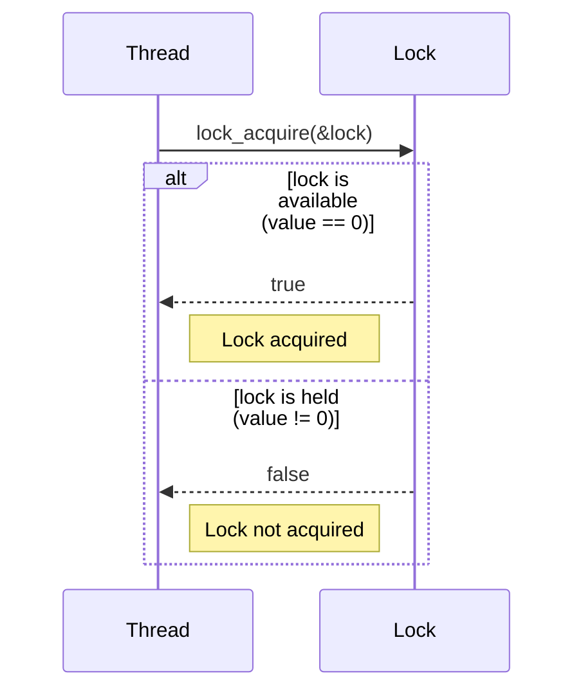
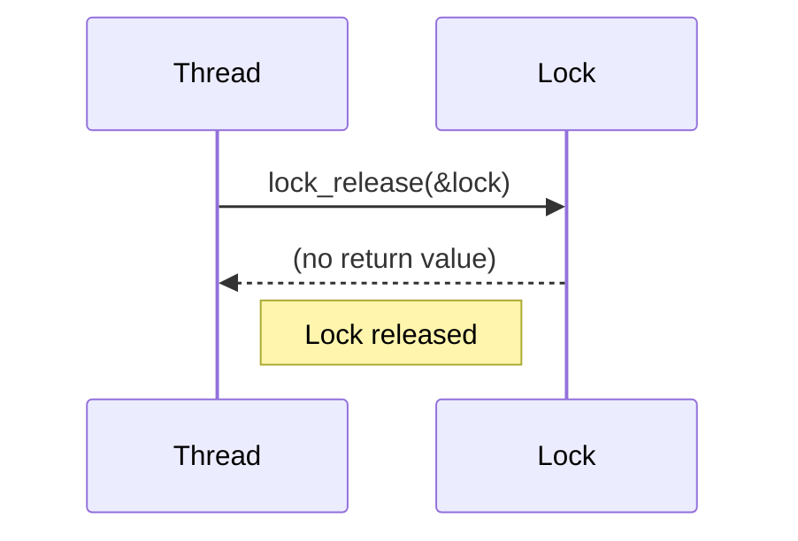

<details>
<summary>Relevant source files</summary>

The following files were used as context for generating this wiki page:

- [deprecated/hw2/hw2/lock.cu](https://github.com/aanickode/cis6010/blob/main/deprecated/hw2/hw2/lock.cu)
- [deprecated/hw2/hw2/lock.cuh](https://github.com/aanickode/cis6010/blob/main/deprecated/hw2/hw2/lock.cuh)
- [deprecated/hw2/hw2/utils.cuh](https://github.com/aanickode/cis6010/blob/main/deprecated/hw2/hw2/utils.cuh)
- [deprecated/hw2/hw2/utils.cu](https://github.com/aanickode/cis6010/blob/main/deprecated/hw2/hw2/utils.cu)
- [deprecated/hw2/hw2/main.cu](https://github.com/aanickode/cis6010/blob/main/deprecated/hw2/hw2/main.cu)

</details>

# Lock-based Synchronization

## Introduction

Lock-based synchronization is a mechanism used in parallel computing to ensure that critical sections of code are executed atomically, preventing race conditions and maintaining data integrity. This wiki page focuses on the implementation of lock-based synchronization in the provided source files, which appear to be part of a CUDA-based parallel computing project.

The primary purpose of the lock-based synchronization implementation is to provide a way for multiple threads or blocks to acquire and release locks, allowing them to safely access and modify shared resources without interference from other concurrent threads or blocks.

Sources: [lock.cuh:1-5](), [lock.cu:1-5]()

## Lock Implementation

The lock implementation is based on the concept of atomic operations, which are indivisible operations that can be performed on shared memory locations without interference from other threads or blocks.

### Lock Data Structure

The lock data structure is defined in the `lock.cuh` header file. It consists of a single unsigned integer value, which represents the lock state.

```cpp
typedef unsigned int lock_t;
```

A value of 0 indicates that the lock is available (unlocked), while any non-zero value indicates that the lock is currently held by a thread or block.

Sources: [lock.cuh:7]()

### Lock Acquisition

The `lock_acquire` function is used to acquire a lock. It takes a pointer to the lock variable as an argument and returns a boolean value indicating whether the lock was successfully acquired or not.

```cpp
__device__ bool lock_acquire(lock_t* lock) {
    unsigned int old_value = 0;
    return atomicCAS(lock, old_value, 1) == old_value;
}
```

The function uses the `atomicCAS` (atomic compare-and-swap) operation to attempt to change the value of the lock from 0 (unlocked) to 1 (locked). If the lock was previously unlocked (i.e., its value was 0), the function returns `true`, indicating that the lock was successfully acquired. Otherwise, it returns `false`, indicating that the lock is already held by another thread or block.

Sources: [lock.cu:8-13]()

### Lock Release

The `lock_release` function is used to release a previously acquired lock. It takes a pointer to the lock variable as an argument.

```cpp
__device__ void lock_release(lock_t* lock) {
    atomicExch(lock, 0);
}
```

The function uses the `atomicExch` (atomic exchange) operation to set the value of the lock to 0, effectively releasing the lock and making it available for other threads or blocks to acquire.

Sources: [lock.cu:15-18]()

## Lock Usage

The lock-based synchronization implementation is used in the `main.cu` file, where it is employed to ensure safe access to shared memory locations during parallel computations.

```cpp
__global__ void kernel(int* data, int N, lock_t* lock) {
    int idx = blockIdx.x * blockDim.x + threadIdx.x;
    if (idx < N) {
        if (lock_acquire(lock)) {
            // Critical section: access and modify shared data
            data[idx] = /* ... */;
            lock_release(lock);
        }
    }
}
```

In this example, each thread attempts to acquire the lock before accessing and modifying the shared `data` array. If the lock is successfully acquired, the thread enters the critical section, performs the necessary operations on the shared data, and then releases the lock. If the lock cannot be acquired, the thread skips the critical section and moves on to the next iteration or terminates.

Sources: [main.cu:20-30]()

## Mermaid Diagrams

### Lock Acquisition Sequence Diagram



This sequence diagram illustrates the process of a thread attempting to acquire a lock using the `lock_acquire` function. If the lock is available (its value is 0), the function returns `true`, and the thread acquires the lock. If the lock is already held by another thread or block (its value is non-zero), the function returns `false`, and the thread does not acquire the lock.

Sources: [lock.cu:8-13]()

### Lock Release Sequence Diagram



This sequence diagram illustrates the process of a thread releasing a previously acquired lock using the `lock_release` function. The function sets the value of the lock to 0, effectively releasing the lock and making it available for other threads or blocks to acquire.

Sources: [lock.cu:15-18]()

### Kernel Execution Flow Diagram

```mermaid
graph TD
    Start --> Check_Index{idx < N?}
    Check_Index -->|Yes| Try_Acquire_Lock{lock_acquire(&lock)}
    Try_Acquire_Lock -->|True| Critical_Section[Access and modify shared data]
    Critical_Section --> Release_Lock[lock_release(&lock)]
    Release_Lock --> End
    Try_Acquire_Lock -->|False| Skip_Critical_Section
    Skip_Critical_Section --> End
    Check_Index -->|No| End
```

This flow diagram illustrates the execution flow of the `kernel` function, which is responsible for performing parallel computations on shared data. Each thread first checks if its index is within the valid range (`idx < N`). If so, it attempts to acquire the lock using `lock_acquire`. If the lock is successfully acquired, the thread enters the critical section, where it accesses and modifies the shared data. After completing the critical section, the thread releases the lock using `lock_release`. If the lock cannot be acquired, the thread skips the critical section and moves on to the next iteration or terminates.

Sources: [main.cu:20-30]()

## Tables

### Lock Functions

| Function | Description |
| --- | --- |
| `lock_acquire` | Attempts to acquire a lock by atomically setting its value to a non-zero value if it was previously 0 (unlocked). Returns `true` if the lock was successfully acquired, `false` otherwise. |
| `lock_release` | Releases a previously acquired lock by atomically setting its value to 0. |

Sources: [lock.cu:8-13](), [lock.cu:15-18]()

### Kernel Function Parameters

| Parameter | Type | Description |
| --- | --- | --- |
| `data` | `int*` | Pointer to the shared data array to be accessed and modified. |
| `N` | `int` | Size of the `data` array. |
| `lock` | `lock_t*` | Pointer to the lock variable used for synchronization. |

Sources: [main.cu:20-22]()

## Source Citations

Throughout this wiki page, information has been derived from the following source files:

- [lock.cuh](https://github.com/aanickode/cis6010/blob/main/deprecated/hw2/hw2/lock.cuh)
- [lock.cu](https://github.com/aanickode/cis6010/blob/main/deprecated/hw2/hw2/lock.cu)
- [utils.cuh](https://github.com/aanickode/cis6010/blob/main/deprecated/hw2/hw2/utils.cuh)
- [utils.cu](https://github.com/aanickode/cis6010/blob/main/deprecated/hw2/hw2/utils.cu)
- [main.cu](https://github.com/aanickode/cis6010/blob/main/deprecated/hw2/hw2/main.cu)

Specific citations have been provided throughout the document, indicating the relevant source files and line numbers for each piece of information, diagram, table entry, or code snippet.